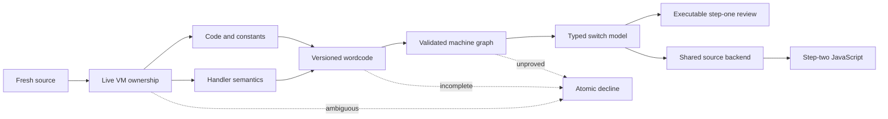

# Source-derived VM recovery for an independent benchmark

## 1. Target

This is a **future transform contract** for an independent VM-2 benchmark. Its earlier private
exact-inner implementation and frozen trial evidence were removed during housekeeping. The
active numeric `jsconfuser-vm` frontend covers only its visible numeric contract. A benchmark
must not supply recognition constants, a prebuilt answer, or a shortcut around source-derived proof.

The transform accepts fresh JavaScript after the conventional outer decode and should produce
an executable typed switch model. Its review rendering preserves observable behavior while
replacing the custom interpreter with JavaScript operations and explicit register storage.
The shared backend then structures that model and removes only proven redundant state.
Original names and lexical scopes are not generally recoverable.

## 2. Algorithm

| Stage | Required evidence | Output |
|---|---|---|
| Ownership | Live entry, interpreter, code storage, constant storage, register/frame storage, dispatch aliases and outside effects are linked by binding and call relationships. | One machine identity and entry, or decline. |
| Static data | Decode only proven pure source dependencies. Account for byte order, widths, pool values, bounds, and initialization order. | Immutable initial code and constant records. |
| Handler semantics | Derive each live selector's operand reads, widths, evaluation order, writes, native operations, effects, throws, and completion. | Typed operation templates with source provenance. |
| Versioned instructions | Walk reachable code and patch states together; distinguish instructions from data and validate every target and operand interval. | Instructions keyed by machine, function, PC and code version. |
| Machine graph | Verify frame/closure ownership, call and return continuation, normal and exceptional edges, catches/finally, and ambient operations. | Complete graph with explicit unresolved-state decline. |
| Switch adapter | Project validated operations and storage into a versioned extension of the shared switch model. | Executable review form and backend input from the same model. |
| Publication | Parse output freshly, check machine residue, compare bounded behavior under ordinary Node/browser hosts, and preserve exact input on decline. | One frozen success or failure result. |

The producer can mutate code. An instruction identity therefore includes its code version;
PC alone is insufficient. Patches and instruction discovery may form a bounded fixed point.
A changed handler, helper, constant pool or patch invalidates all descendants that consumed it.
Do not derive meaning from an opcode number, case label, identifier spelling, or a reference
output. Every operation needs its own source relationship.

## 3. Implementation contract

The frontend must preserve the source's observable operation order, including ambient reads,
writes, calls, receiver binding, thrown exceptions and completed prefixes. Ordinary Node and
browser execution with standard built-ins at entry is the supported runtime scope. A recorded
historical host environment is not a prerequisite. If an ambient operation cannot be
represented as a runtime operation, decline rather than bake in the value observed during
analysis.

A machine record needs stable structural IDs, input/model identity, predecessor IDs, code
version, function and frame identities, register allocation and typed operation records. The
[proposed machine-IR contract](../../../vm2-machine-ir-contract.md) expands these fields. A
schema tag alone is insufficient: validate complete instruction and edge ownership, source
operation order, effects, exceptions, and all completion routes before projection.

The current shared [switch boundary](../../vm-switch-boundary.md) models immutable code and
simple register state. It cannot yet express versioned code, multiple active contexts or all
ambient effects required by this benchmark. Extend the typed contract when evidence shows
those states are needed. Never reparse an illustrative switch rendering as the semantic input.
The typed model is the source of both review output and step-two emission.

Step two can replace register operations with local variables only when reaching definitions,
uses, lifetime and effects prove the substitution. It may keep registers or PC dispatch where
structuring is unproved. Dead branches require a complete rooted graph and effect-safe removal.
A benchmark-specific simplification cannot widen the public numeric decoder's claim.

## 4. Acceptance and limits

- Generate fresh encoder outputs across source features, options and seeds for general plugin
  coverage. Evaluate VM-2 separately as an independent benchmark.
- Compare executable step-one output and encoded input under the same ordinary host bindings,
  including return, throw and visible global effects.
- Compare step-two output for behavior, residue, and readability. Check exact input rollback on
  ambiguous ownership, mutation, unsupported semantics and incomplete graph relations.
- The removed private audit and its trial fixtures provide no active proof or runnable decoder.

## Source

No source-derived VM-2 frontend is implemented. The current reusable backend is
[vm-switch-model.js](../../../../decoder/decode-js/src/vm/switch/vm-switch-model.js),
[vm-switch-control.js](../../../../decoder/decode-js/src/vm/switch/vm-switch-control.js), and
[vm-switch-to-source.js](../../../../decoder/decode-js/src/vm/switch/vm-switch-to-source.js).

## Fixtures

No benchmark fixture currently proves this transform. Generate an input with its source,
expected behavior and provenance alongside a decoder test. The
[sequential integration test](../../../../decoder/decode-js/test/vm/jsconfuser-vm/integration/sequential.test.js)
checks outer-to-VM handoff and exact rollback; it does not prove this transform.
