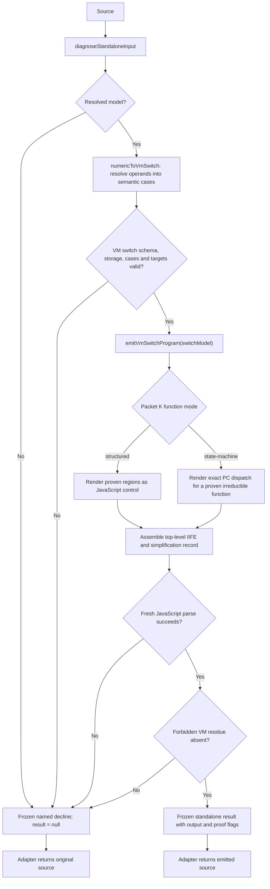

# jsconfuser-vm standalone decode

## 1. Target

`decodeStandalone(source)` returns fresh JavaScript for the supported visible numeric-u32,
visible-constant VM baseline, or `null` on decline. The result-aware public entry point,
`diagnoseStandalone(source)`, combines [standalone diagnosis](standalone-diagnosis.md) with
emission and returns a frozen success or a structured decline. The integrated adapter preserves
the exact input bytes when either stage declines.

| Boundary | Success | Decline |
|---|---|---|
| Internal `diagnoseStandaloneInput` | Resolved model; no `output` | Named diagnostic; `model: null` |
| Public `diagnoseStandalone` | `{ ok: true, result, diagnostic: null }` | `{ ok: false, result: null, diagnostic }` |
| Public `decodeStandalone` | `result.output` | `null` |
| Integrated `decodeJsconfuserVm` | Output plus result | Original source plus diagnostic |

Success is source-oriented decompilation, not reconstruction of the original source or proof of
universal runtime equivalence.

## 2. Algorithm

The public operation first admits the input through the diagnosis contract. The numeric adapter
then lowers every instruction to a [typed VM switch case](../../vm-switch-boundary.md), and the
shared backend renders one generated function per VM function inside a top-level IIFE. Fresh
parse and the target-specific residue scan precede publication. Nothing partially rendered
escapes a failing call.

Structured mode renders proven linear, conditional and natural-loop regions, plus the narrow
handler forms that the control renderer can express. State-machine mode is restricted to a
Packet K function with exact-block-graph and required-irreducible proof. The emitter does not
convert an opaque or incomplete reducible shape into guessed JavaScript.

Output retains explicit registers where recovered operations need them. It emits native
expressions for scalar and property operations, correct receiver/constructor call forms,
closures with capture cells where needed, and completion/handler flow. The final parse and
VM-residue scan establish an emitted JavaScript artifact; they do not execute it.

## 3. Implementation

### Numeric-to-switch handoff and rendering path

`numericToVmSwitch` resolves constant references and call forms before emission. Each case
contains `pc`, `nextPc`, and a typed `operation`; the backend sees no numeric opcode or raw
operand words. `code` and `storage` identify the immutable word stream and per-function
register/capture frames. The shared validator checks schema, case inventory, register range,
native operator allowlist, targets, fallthrough, and structured-control leaf/edge consistency.
This handoff is internal and follows the source-derived A-M admission; the validator alone
does not prove the encoder source implements a supplied model.

| Input or shape | Renderer action | Guard or retained evidence |
|---|---|---|
| Function partition and ordered instructions | Emit `__recovered_function_<id>`; call function 0 inside an IIFE. | Root capture argument appears only when needed. |
| Parameters, registers and captures | Declare registers referenced by structured output; add argument and capture parameters or local cells when used. | State-machine output retains its full register and handler scaffolding. |
| Loads, arithmetic, comparisons, unary operations | Render literals, `globalThis` access, `this`, capture reads and JavaScript operators. | The adapter resolves zero-key constants; the shared validator checks typed operands/operators. |
| Property, array, object and accessor operations | Render property reads, `Reflect.set`/`Reflect.deleteProperty`, array/object construction and property descriptors. | Numeric width belongs to the adapter; the backend sees ordered semantic fields. |
| Plain, method and constructor calls | The adapter consumes the L call record and normalizes fixed/spread argument forms; the backend renders `Reflect.apply` or `Reflect.construct`. | Receiver identity and one spread-array register remain explicit. |
| `MAKE_CLOSURE`, upvalues and `FOR_IN_*` | Render closure shells and capture cells; include the enumerable-key helper only when some function needs it. | Child function entry, capture kinds/width and iterator labels are checked. |
| Packet K `structured` | Render regions, `if`, loops, transfers and supported handler forms through `StructuredFunctionEmitter`. | Reachable blocks must be fully emitted and the path must have a complete natural exit. |
| Packet K `state-machine` | Render exact instruction cases, PC transitions and handler routing. | Diagnosis already required irreducible proof; unknown function modes decline. |

For structured functions, `effectiveStructuredInstructions` may coalesce an adjacent
producer/`MOVE` pair. It runs a reaching-definition analysis, requires the producer's destination
to have one use at that move, excludes local capture registers, and checks adjacency within a
block or across a single-predecessor fallthrough. The producer is retargeted, the redundant move
is removed, and the result records a `safely-eliminated` proof. If that analysis cannot converge,
emission declines; state-machine functions do not use this simplification.

The structured renderer also accounts for unreachable blocks: it emits their non-control leaves
inside an unreachable `if (false)` branch and declines if a reachable block was left uncovered.
This keeps instruction coverage explicit without inventing a path into dead code.

### Final validation and result

The shared emitter parses the generated string afresh as a script with error recovery
disabled. The numeric wrapper then scans the AST for target VM machinery identifiers such as
`BYTECODE`, `CONSTANTS`, `VM`, `Closure`, `Upvalue` and `decodeBytecode`, plus direct `vm.run`. A parse failure
produces `emitted-parse-failed`; detected residue produces `emitted-residue`. Both discard the
generated string. Other typed `StandaloneDecline` errors keep their codes; unexpected exceptions
become `standalone-emission-error`.

| Result field | What it records |
|---|---|
| `schemaVersion: jsconfuser-vm-standalone.v1`, `packet: N` | Public numeric result shape and its position after A-M. |
| `output`, `wordCount`, `instructionCount`, `functionCount` | Emitted text and the source-derived input census. |
| `simplification` | Per-function copy proofs and an emitted/safely-eliminated/proven-unreachable summary. |
| `coverage`, `control` | Instruction/function counts and the admitted Packet K plan. |
| `proof` | Predecessor reconstruction, no target execution, no VM runtime emission, fresh emission, disjoint simplification dispositions, final parse and residue checks. |
| `parseOnly: true`, `targetExecution: false`, `vmExecuted: false` | The production decoder constructs and parses output; it does not run the target or its VM. |
| `emittedJavaScript: true`, `finalJavaScriptSemantics: false` | JavaScript was emitted, while full semantic equivalence remains unclaimed. |

`diagnoseStandalone` calls preflight once, constructs this record only after validation, and
deep-freezes the success or decline. `decodeStandalone` projects the result's `output` or
`null`. The adapter calls `diagnoseStandalone` once and returns either its emitted output or
the exact source string with the same diagnostic; the CLI's additive registry and result sidecar
expose that result without routing through the legacy decode path.

### Readability gate

The tracked benchmark recomputes fresh output for arithmetic, closure/loop and repeated-call
scale cases, compares it with committed goldens and records hashes for source, encoded and
decoded files. Its measurements are durable *axes*, not fixed figures:

| Axis | Acceptance question |
|---|---|
| Bytes and decoded/source, decoded/encoded ratios | Did output shrink against the recorded baseline for the same frozen input? |
| AST statements, declarations and generated identifiers | Did generated machinery decrease without losing executable structure? |
| Registers, captures, cells and enumerable helper | Does output retain only the setup that the recovered operations need? |
| Semantic operation counts | Did call, property, closure, handler and control forms remain present where expected? |
| Fresh parse, consistent derived state and bounded execution | Does the golden parse cleanly, keep parser state consistent and match the source fixture's observed `TEST_OUTPUT`? |

The oracle in this benchmark is a bounded regression check on committed fixtures. It is not a
production admission step and cannot establish general equivalence.

## 4. Upstream Effects

| Earlier decoder output | Effect on emission |
|---|---|
| [standalone diagnosis](standalone-diagnosis.md) decline | Return its named diagnostic without building or emitting switch cases. |
| Resolved diagnosis model | Lower function/wordcode ownership, constants, instructions, calls and control plan into the shared switch input. |
| [structured control](structured-control.md) | Select proven structured or required irreducible state-machine mode; stale or opaque plans cannot be promoted here. |
| [call/completion](call-completion.md) and [closure/exception](closure-exception.md) | Require their prior complete coverage; the call records and proven handler/control information shape the output. |

The output is target-local and additive. This stage does not modify shared visitors or the
ordinary decoder plugin path.

## 5. Known Gaps

Earlier encoder eras, hardening/`PATCH`, encoded or randomized/concealed bytecode, mixed or
repeated encoders, arbitrary host behavior and source replacement remain outside this baseline.
Unsupported reducible control shapes may decline or remain opaque; only proven irreducible
regions use the state machine. `finalJavaScriptSemantics` stays false: the pinned runtime's
`EXP` uses `Math.pow` while emission preserves operator spelling, so no stronger arithmetic
equivalence claim follows.

## Source

- [numeric-to-vm-switch.js](../../../../decoder/decode-js/src/vm/jsconfuser-vm/numeric-to-vm-switch.js) — resolves numeric operands into semantic cases.
- [vm-switch-model.js](../../../../decoder/decode-js/src/vm/switch/vm-switch-model.js) and [vm-switch-to-source.js](../../../../decoder/decode-js/src/vm/switch/vm-switch-to-source.js) — validate and emit the shared switch model.
- [decode-standalone.js](../../../../decoder/decode-js/src/vm/jsconfuser-vm/decode-standalone.js) — public numeric result and residue boundary.
- [diagnose-standalone.js](../../../../decoder/decode-js/src/vm/jsconfuser-vm/diagnose-standalone.js) — supplies the preflight result consumed in section 1.
- [jsconfuser-vm.js](../../../../decoder/decode-js/src/plugin/jsconfuser-vm.js) and [main.js](../../../../decoder/decode-js/src/main.js) — wire the adapter and CLI result described in section 3.
- [instruction-set.md](../../../js-confuser-vm/instruction-set.md) and [container-wordcode.md](../../../js-confuser-vm/container-wordcode.md) — define the visible baseline.

## Fixtures

| Committed fixture or test | Claim pinned |
|---|---|
| [f-literals-order](../../../../decoder/decode-js/test/vm/jsconfuser-vm/fixtures/corpus/raw/f-literals-order/encoded.js) | Visible-constant input and generated-function output shape. |
| [f-branching](../../../../decoder/decode-js/test/vm/jsconfuser-vm/fixtures/corpus/raw/f-branching/encoded.js) and [f-loop-forms](../../../../decoder/decode-js/test/vm/jsconfuser-vm/fixtures/corpus/raw/f-loop-forms/encoded.js) | Structured conditional and loop output. |
| [arithmetic input](../../../../decoder/decode-js/test/vm/jsconfuser-vm/fixtures/readability/arithmetic/encoded.js) and [decoded golden](../../../../decoder/decode-js/test/vm/jsconfuser-vm/fixtures/readability/arithmetic/decoded.js) | Source-oriented output and readability comparison. |
| [closure-loop input](../../../../decoder/decode-js/test/vm/jsconfuser-vm/fixtures/readability/closure-loop/encoded.js) and [decoded golden](../../../../decoder/decode-js/test/vm/jsconfuser-vm/fixtures/readability/closure-loop/decoded.js) | Bounded behavior and required capture scaffolding. |
| [decode-standalone.test.js](../../../../decoder/decode-js/test/vm/jsconfuser-vm/decode-standalone.test.js) | Emitted structure, named success/decline shapes and unchanged-input behavior. |
| [vm-switch-to-source.test.js](../../../../decoder/decode-js/test/vm/switch/vm-switch-to-source.test.js) | Direct source-switch producer model, generic emission, and malformed handoff declines. |
| [readability.test.js](../../../../decoder/decode-js/test/vm/jsconfuser-vm/integration/readability.test.js) | Fresh output, bounded behavior, derived state and scaffolding reduction. |
| [plugin.test.js](../../../../decoder/decode-js/test/vm/jsconfuser-vm/integration/plugin.test.js), [cli.test.js](../../../../decoder/decode-js/test/vm/jsconfuser-vm/integration/cli.test.js), and [integration.test.js](../../../../decoder/decode-js/test/vm/jsconfuser-vm/integration/integration.test.js) | Single-call adapter, sidecar and registered-path agreement with standalone output on a branch control. |
