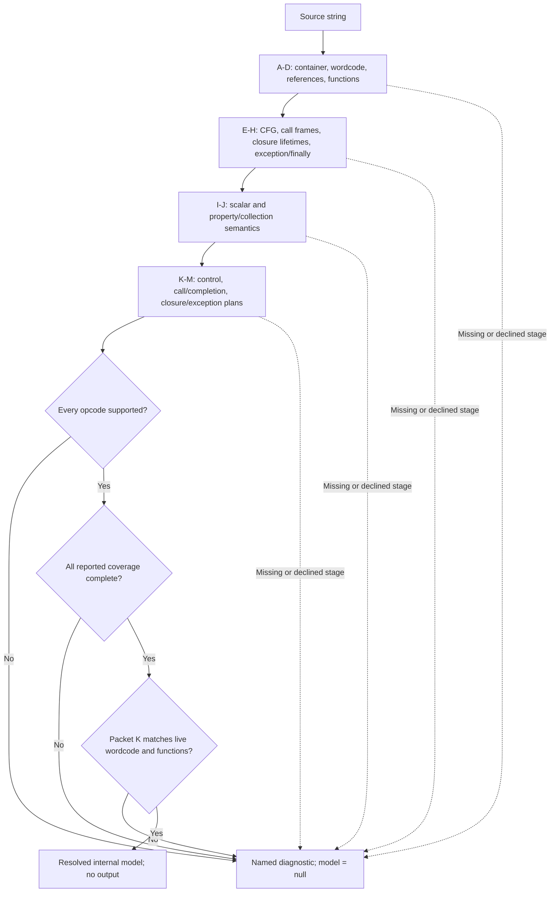

# jsconfuser-vm standalone diagnosis

## 1. Target

`diagnoseStandaloneInput(source)` decides whether one source string contains a complete,
statically recoverable instance of the visible numeric-u32, visible-constant VM baseline. It is
the internal boundary between source-derived analyses and
[standalone decoding](standalone-decode.md). It emits no JavaScript and executes neither the
target program nor the VM.

| Outcome | Internal return value | Meaning for the decoder |
|---|---|---|
| Resolved | `{ ok: true, model, diagnostic: null }` | The predecessor records and control plan passed admission; emission may start. |
| Recognized decline | `{ ok: false, model: null, diagnostic: { code, message } }` | A named gate refused the input; there is no model to emit. |
| Unexpected exception | Throws to the public boundary | The public wrapper turns it into one atomic `standalone-emission-error` decline. |

A resolved model is an **emission input**, not a decoded program or a claim of universal
behavioral equivalence.

## 2. Algorithm

The analyses run in dependency order on the supplied source. Packet letters identify the
decoder's own records; each stage must resolve before the next can use it.

The opcode gate accepts only instruction names implemented by the standalone emitter. The
coverage gate requires Packet K's instructions and edges, Packet L's instructions, completions
and completion routes, and Packet M's instructions, completions and routes to be complete; Packet
M must also report `allPredecessorsReconstructed`. These are positive proof flags.

Packet K's structured-control plan is then checked against the current Packet B wordcode and
Packet D function partition. The plan cannot be reused if function metadata, ordered leaves,
block boundaries, edge ownership or region references have drifted. A `state-machine` function
requires an exact block graph, explicit leaves and proof that an irreducible fallback is
required. A failing plan declines; no branch or instruction is guessed.

## 3. Implementation

### Predecessor chain

`reconstruct` calls these functions in order. A falsy stage result becomes the listed
`*-declined` diagnostic. A stage-specific typed decline may provide a more precise code.

| Packet | Function and record | Main inputs | Missing-result code |
|---|---|---|---|
| A | `extractContainerFromSource` -> container | source | `container-declined` |
| B | `readWordcode` -> wordcode | container | `wordcode-declined` |
| C | `validateReferences` -> references and constants | container, wordcode | `references-declined` |
| D | `partitionFunctions` -> function ownership | container, wordcode, references | `functions-declined` |
| E | `buildControlFlow` -> CFG | wordcode, references, functions | `cfg-declined` |
| F | `buildCallFrames` -> call/frame model | wordcode, references, functions, CFG | `call-frames-declined` |
| G | `analyzeClosureLifetimes` -> closure model | F and its predecessors | `closure-lifetimes-declined` |
| H | `analyzeExceptionFinally` -> exception/finally model | F and its predecessors | `exception-finally-declined` |
| I | `analyzeScalarValues` -> scalar operations | wordcode, references, functions, CFG | `scalar-values-declined` |
| J | `analyzePropertyCollections` -> property/collection operations | F and its predecessors | `property-collections-declined` |
| K | `emitStructuredControl` -> control plan | wordcode, CFG, H | `structured-control-declined` |
| L | `emitCallCompletion` -> calls and completion routes | G and its predecessors | `call-completion-declined` |
| M | `emitClosureException` -> closure/exception routes | G, H and their predecessors | `closure-exception-declined` |

### Plan and coverage checks

| Check | Evidence compared | Failure code |
|---|---|---|
| Input and opcode admission | Source is a string; each Packet B instruction name belongs to `SUPPORTED_INSTRUCTIONS`. | `invalid-input`, `unsupported-opcode` |
| Cross-packet coverage | K, L and M completeness flags and M's predecessor proof. | `incomplete-predecessor-coverage` |
| Plan header | K schema/encoding, function count, function list and edge list agree with D. | `stale-structured-control` |
| Instructions and blocks | Every block leaf is an owned Packet B instruction with the same name and `nextPc`; block bounds, order and total instruction coverage match. | `stale-structured-control` |
| Edges and regions | Edge IDs are unique, owned by the right function, sourced from the block terminator and referenced exactly once; region block and edge references exist. | `stale-structured-control` |
| Structured mode | Control and region kinds are recognized; conditional tests/merges and natural-loop headers point into the same function. | `invalid-structured-control` or `stale-structured-control` |
| State-machine mode | Exact-graph, explicit-leaf and required-irreducible fallback proof is present. | `invalid-irreducible-fallback` |

K's own instruction/edge coverage counts are compared with the live wordcode and edge list.
The final projection checks that each wordcode PC appears once across the functions and that
the structured/state-machine mode counts agree with K's summary. This prevents a plausible
plan from silently omitting or duplicating instructions.

### Handoff model

| Model field | Origin | Use after diagnosis |
|---|---|---|
| `constants`, `wordcode`, `functions` | C, B, D | Literal values, instruction counts, function signatures and ownership. |
| `instructionsByFunction` | B PCs joined to D's ordered `instructionPcs` | Ordered emitter input for each recovered function. |
| `controlByFunction`, `structuredControl` | Validated K plan | Select structured or proven state-machine rendering; publish control evidence. |
| `calls` | L rows indexed by `functionId:pc` | Recover call, method-call and constructor grammar. |
| `scalarValues`, `propertyCollections` | I, J | Retain analyzed operation semantics in the resolved record. |
| `closureException` | M | Retain closure/exception coverage and route evidence. |

The emitter reads needed fields from this model rather than recalculating the predecessor chain.
Some semantic and proof records are retained for admission even where rendering reads wordcode
and validated lookup maps directly. A missing instruction while joining B and D declines as
`missing-instruction`. `StandaloneDecline` becomes a structured diagnostic here; any other
exception propagates to the public wrapper.

## 4. Upstream Effects

| Earlier decoder output | Effect at this boundary |
|---|---|
| [container](extract-container.md), [wordcode](read-wordcode.md), [references](validate-references.md), and [functions](partition-functions.md) | Establish the visible baseline and PC/function ownership. Records are rebuilt from source on each call. |
| [CFG](build-cfg.md), [call frames](build-call-frames.md), [closure lifetimes](closure-lifetimes.md), and [exception/finally](exception-finally.md) | Supply control, call, lifetime and handler facts to K-M; an earlier decline stops admission. |
| [scalar values](scalar-values.md) and [property/collections](property-collections.md) | Supply typed operation records for the supported subset. |
| [structured control](structured-control.md), [call/completion](call-completion.md), and [closure/exception](closure-exception.md) | Their completeness and exact plan references are checked before any source is rendered. |
| [standalone decode](standalone-decode.md) | Receives the validated model or diagnostic; a decline never enters emission. |

## 5. Known Gaps

Encoded or concealed bytecode, randomized/hardened modes, `PATCH`, unknown opcodes, stale
predecessors and incomplete or unsafe control/completion shapes remain outside admission. A
resolved diagnosis proves the supported static records are available; output rendering, fresh
parse, VM-residue rejection and readability belong to the decoder boundary.

## Source

- [diagnose-standalone.js](../../../../decoder/decode-js/src/vm/jsconfuser-vm/diagnose-standalone.js) — `reconstruct` and `diagnoseStandaloneInput` implement the chain and gates in sections 2-3.
- [validate-structured-control.js](../../../../decoder/decode-js/src/vm/jsconfuser-vm/validate-structured-control.js) — checks the Packet K plan.
- [standalone-contract.js](../../../../decoder/decode-js/src/vm/jsconfuser-vm/standalone-contract.js) — frozen records and typed declines.
- [decode-standalone.js](../../../../decoder/decode-js/src/vm/jsconfuser-vm/decode-standalone.js) — public `diagnoseStandalone` consumes the section 1 outcome.

## Fixtures

| Committed fixture or test | Claim pinned |
|---|---|
| [f-literals-order](../../../../decoder/decode-js/test/vm/jsconfuser-vm/fixtures/corpus/raw/f-literals-order/encoded.js) | Visible baseline input resolves to a model without emitted output. |
| [encoded-bytecode-mode](../../../../decoder/decode-js/test/vm/jsconfuser-vm/fixtures/corpus/negative/encoded-bytecode-mode/encoded.js) | Unsupported encoded-bytecode mode declines at container admission with no model. |
| [diagnose-standalone.test.js](../../../../decoder/decode-js/test/vm/jsconfuser-vm/diagnose-standalone.test.js) | Positive model and named negative diagnostic remain distinct before emission. |
| [decode-standalone.test.js](../../../../decoder/decode-js/test/vm/jsconfuser-vm/decode-standalone.test.js) | Public decline shape and successful continuation from preflight to emission. |
