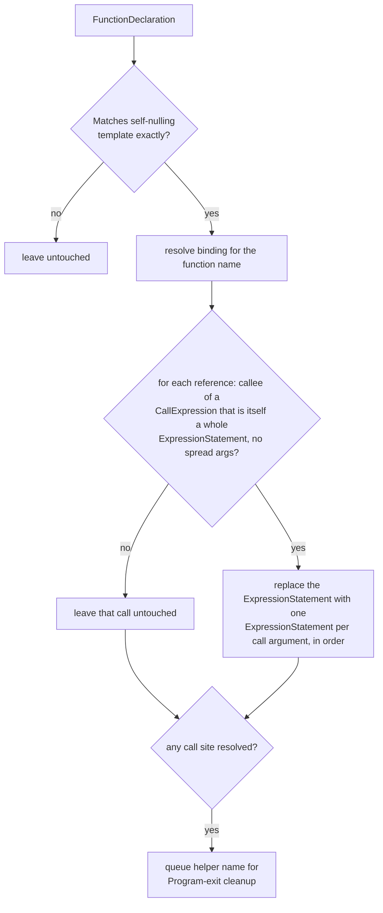

# jsconfuser/ast-scrambler.js

## 1. Target

Reverses js-confuser's [AstScrambler](../../../js-confuser/transforms/ast-scrambler.md):
splits a merged `{ph}_ast(expr1, expr2, ...)` call back into one `ExpressionStatement` per
argument, in the same order, then deletes the now-unreferenced no-op helper function.

## 2. Algorithm

Matched structurally (`isAstScramblerHelper`), never by name — the helper's name is
placeholder-prefixed and gets renamed away by `RenameVariables` in every real sample, but
the self-nulling template it matches is exact and never produced any other way. Each
matched call site that is itself a whole `ExpressionStatement` (not nested inside some
other expression — the only shape the encoder ever emits) is split into one
`ExpressionStatement` per argument, in order; argument order is preserved exactly as
collected, and left-to-right evaluation means the split statements are behaviorally
identical to the merged call — nothing to compute, a direct AST reshape.

**One statement per argument is a *choice*, not a restoration.** The encode step is a
many-to-one map on statement partitioning — `a; b; c;`, `(a, b); c;`, and `(a, b, c);` all
produce the identical `{ph}_ast(a, b, c);`, and nothing in the output says which it was.
"One `ExpressionStatement` per argument" is the most readable rendering and what user
code most often was — but it is **wrong** whenever the merged expressions came from
another *encoder stage* that emitted them as a single `SequenceExpression`, because that
stage's own decoder then pattern-matches against a shape this visitor just dissolved. **The
invariant this forces: any matcher downstream of this visitor must be partition-agnostic**
— the information needed to distinguish the cases is destroyed on the encode side, so a
matcher that accepts only one partition will fail on the other. This is the same family of
rule as [encoder-decoder-method.md](../../../encoder-decoder-method.md)'s
[W1](../../../encoder-decoder-method.md#t1--w1--w4-order-the-work-from-the-stage-order--not-by-byte-share-and-not-by-probing):
don't key on a structural detail a later stage is free to rewrite. It cost a real CFF
cliff once — see [control-flow.md](control-flow.md)'s "Reading a goto whose partition
`AstScrambler` dissolved."

Converting the other way (merging a statement run back into a `SequenceExpression`) is
equally safe and available as a normalization primitive: it preserves evaluation order
and, per the encoder's own `sensitivityRegex` (which strips both `;` and `,`), is even
neutral with respect to `Lock.integrity`'s hash — not that this decoder needs to preserve
that hash at all, since decoding happens well after any runtime integrity check would
already have run. Its limits are the same ones the encoder observes:
`ExpressionStatement`s only (not directives, declarations, or control flow), and never the
trailing `Program` statement, whose completion value is observable.

## 3. Implementation

`isAstScramblerHelper`, on a `FunctionDeclaration`, requires the exact self-nulling
template the encoder always emits:

- Zero params.
- Body is exactly one statement: an `ExpressionStatement` whose expression is a plain
  `=` `AssignmentExpression`.
- The assignment's `left` is an `Identifier` matching the function's own name (the
  self-reassignment) — compared against the `FunctionDeclaration`'s own id, never a
  hardcoded string, so it holds regardless of what `RenameVariables` renames the
  placeholder to.
- The assignment's `right` is a `FunctionExpression` with zero params and an empty body.

Spread arguments are rejected defensively (the encoder never produces one here, but a
spread can't be split into a standalone statement 1:1).

**Must run before every other jsconfuser decoder.** `AstScrambler` is one of the very last
encoder stages, running after nearly every other optional transform — its whole-program
statement-merging sweeps up their inserted statements too, hiding the standalone shapes
those other decoders pattern-match against. Confirmed empirically:
`{ dispatcher: true, controlFlowFlattening: true, stringConcealing: true, astScrambler:
true }` merges CFF's state-hash loop body (seven separate assignment statements) into
`{ph}_ast(a = ..., a = ..., ...)` calls two levels deep, and running the decode pipeline
without this visitor first left the hash function, its sequence array, and the
string-concealing blob completely undecoded. Wired right after `Integrity`/`AntiTooling`,
before every other jsconfuser-specific decode step — the earliest point in the pipeline
other than undoing `Pack`/`Integrity` themselves.

**Cleanup.** The helper is always Program-level, so no per-candidate scope capture is
needed — every matched helper name is cleaned up from `Program: exit`'s own scope via
`safeDeleteNode`. Match-gated (only queued when at least one call site was actually
unwrapped), so a declaration that matched the structural shape but had no unwrappable call
sites (user code that merely resembles the template) is left in place rather than deleted
out from under a still-live reference.

**Verified safe under `RenameVariables`.** Beyond the self-nulling check above, the
`FunctionDeclaration(path)` visitor's `path.scope.getBinding(name)` uses the same "a
Function path's `.scope` is its own inner scope, including params" convention that broke
[calculator.js](calculator.md) and required hardening
[global-concealing.js](global-concealing.md) — but the shape match requires zero params
and a single-statement body with no declarations, so the helper's own inner scope can
never hold a competing binding for `RenameVariables` to coincidentally reuse. Call-site
rewriting walks `binding.referencePaths` (identity-based, not name text), and the
Program-level cleanup resolves the helper from Program's own scope, which can't legally
hold two independent bindings under the same renamed text.

## 4. Upstream Effects

Three passes run ahead of this one; each is listed with what it actually does to this
matcher's input, not merely that it precedes it.

| producing pass | what it puts in this pass's input | does it matter here |
|---|---|---|
| [Pack](pack.md) | the whole program re-parsed from a string, so `node.start`/`node.end` are payload-relative | no — this visitor reads only node shape and `binding.referencePaths`, never source positions |
| [Integrity](integrity.md) | a hashed function's params/body *cloned* onto the original name | no — an `{ph}_ast(…)` call inside such a body survives into the clone and matches normally |
| `anti-tooling.js` | statement runs split out of a **different** helper's call sites | see below |

**`anti-tooling.js` is the one worth reading.** It runs immediately before this pass and
performs the *identical* unwrap — split a whole-statement call into one `ExpressionStatement`
per argument, then delete the helper once unreferenced — but gates on a
`FunctionDeclaration` with zero params and a **strictly empty** body. The self-nulling helper
this visitor matches has a one-statement body, so the two never compete for the same
declaration and neither can consume the other's shape.

They do share the consequence: item 2's rule that **any matcher downstream of this visitor
must be partition-agnostic** applies to AntiTooling's output on exactly the same argument,
since both passes choose a statement partition that the encoder's own many-to-one map had
already destroyed. Recorded here rather than twice because the two arrive at the same
invariant, and `anti-tooling.js` targets legacy 1.x output that the pinned encoder no longer
produces.

## 5. Known Gaps

None currently open.

## Source

[`src/visitor/jsconfuser/ast-scrambler.js`](https://github.com/echo094/decode-js/blob/6c974fb5720518fac9c6b3d4cf558ba90ef9f8e7/src/visitor/jsconfuser/ast-scrambler.js), wired into
[plugin/jsconfuser.js](../../plugins/jsconfuser.md) right after `AntiTooling`, before the
`Minify`/`MovedDeclarations` step.

## Fixtures

`test/visitor/jsconfuser/ast-scrambler/`:

| fixture | what it pins |
|---|---|
| `simple` | a multi-argument merge at `Program` level — the base template |
| `nested-function` | call sites inside a nested function *and* inside a `SwitchCase` consequent, sharing one Program-level helper |
| `not-a-wrapper` | fails closed — a user-written function resembling the self-nulling template but with an extra body statement |

`test/jsconfuser/rename-variables/ast-scrambler.{js,fix.js,src.js}` — Program-, if-block- and
switch-case-level scrambling together against the one shared Program-level helper, under
`renameVariables`.
