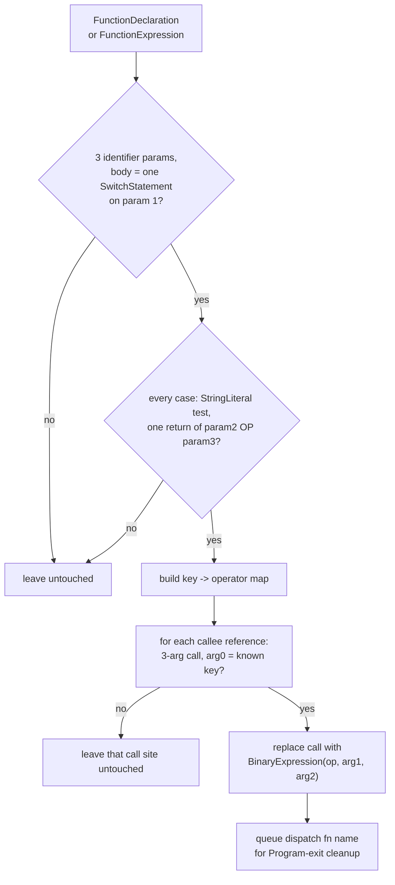

# jsconfuser/calculator.js

## 1. Target

Reverses js-confuser's [Calculator](../../../js-confuser/transforms/calculator.md):
unwraps the `{ph}_calc(operatorKey, a, b)` dispatch call back to a plain
`BinaryExpression`, relying on the already-existing, generic
[`calculate-constant-exp.js`](../calculate-constant-exp.md) to fold the result to a
literal.

## 2. Algorithm

Recognize the dispatch function's exact switch-on-first-param shape, build a
`key -> operator` map from its cases, then for each 3-arg call site whose first argument
is a known key, replace the call with a plain `BinaryExpression` using the second/third
arguments. This file only implements that half — recognizing and unwrapping the
jsconfuser-specific dispatch shape — and does **zero** modification to
`calculate-constant-exp.js`: since both operands are numeric literals by the encoder's own
construction, the plain `BinaryExpression` this produces is immediately foldable by that
already-existing, generic constant-expression folder (shared across every plugin —
`jsconfuser`, `obfuscator`, `sojson`, ... — and already wired into the pipeline for
unrelated reasons). Teaching it Calculator-specific logic would cost it that generality for
no benefit.

**Must run after `StringConcealing` and after `DuplicateLiteralsRemoval`'s late pass** —
both later encoder stages can reshape the operator-key strings this decoder needs to read
as plain literals (see the encoder doc's Downstream Effects). Wired accordingly: right
after `StringConcealing`'s two passes, so every switch case's `test` is already a plain
`StringLiteral` again by the time this visitor runs.

**Resolve this function's binding from `fnPath.scope.parent`, never `fnPath.scope`** — the
shadowing-parameter collision under `RenameVariables` (see Downstream Effects), and the
invisible total non-decode it produces, are [babel.md](../../babel.md)'s first section. **This
pass is where that bug was confirmed**, which is why the requirement is stated at algorithm
level here rather than left to item 3.

## 3. Implementation

`matchCalculatorSwitch`, on **any** function — declaration or expression, see item 4 —
requires:

- Exactly 3 identifier params (matched *positionally* — the encoder's own source names
  don't survive `RenameVariables`).
- A single-statement body: one `SwitchStatement` whose discriminant is the first param.
- Every `SwitchCase`: `test` is a `StringLiteral` (the key), `consequent` is exactly one
  `ReturnStatement` wrapping a `BinaryExpression` with operator in `+ - * /`, whose
  `left`/`right` are the second/third params respectively.

**Holder resolution.** The name is read from whichever of the three spellings holds the
function (`readHolderName`), and then has to resolve *back* to the matched function via
`resolveBindingFunction`, looked up from `fnPath.scope.parent`. Both the three spellings and
the fail-closed-on-a-second-write rule are [babel.md](../../babel.md)'s; what this pass adds is
that a re-assigned holder means the call sites are not all reading what the match was built
from, so substituting them would be wrong rather than incomplete.

**Cleanup.** The dispatch function is always Program-level, so no per-candidate scope
capture is needed — every matched function name is cleaned up from `Program: exit`'s own
scope via `safeDeleteNode`, gated on `resolveBindingFunction` rather than on the declaration
form.

## 4. Upstream Effects

**This pass needs two visits, and for a `high` sample only the second one does anything.**
At its early slot the dispatch function is still inside the ControlFlowFlattening
interpreter, so the population there is zero — not a declining matcher, no candidate at all.
Identical in kind to [global-concealing.md](global-concealing.md) item 4, and it stayed open
much longer for a reason worth recording: **GlobalConcealing's version was visible as a
residual `switch` and this one was not.** A surviving Calculator layer is an ordinary
three-parameter function with ordinary-looking call sites; nothing about it reads as
obfuscation residue, and no structural count this project keeps moves when it survives. It
was found by reading the top of the ranked decode output, where three encodes of one source
sat together — a *shape repeated across entries*, not a spike.

**What the CFF decode hands back is `f = function (…) {…}` under a merged hoisted `var`,**
not the `FunctionDeclaration` the encoder emitted (see
[control-flow.md](control-flow.md) item 4). Keyed on `FunctionDeclaration` this visitor did
not decline on that spelling — it never ran — so the two causes are independent and fixing
either alone measures as no change at all.

**The second visit must sit after the constant fold, not before it.** StringSplitting leaves
every case test as a concatenation (`"X6lQ1n" + "\x74"`) and the matcher requires a
`StringLiteral`, so a slot one pass earlier was *measured* decoding nothing. The
`BinaryExpression` this pass emits is then folded by the next constant-fold pass further
down, which is the same before/after sandwich the early slot has.

**This pass had both failures at once**, which is the case
[encoder-decoder-method.md](../../../encoder-decoder-method.md) T6 records: "no candidates here"
and "cannot match what is here" look identical, neither is visible in output, and a fix for one
reads as a fix that did nothing.

## 5. Known Gaps

None currently open.

## Source

[`src/visitor/jsconfuser/calculator.js`](https://github.com/echo094/decode-js/blob/6c974fb5720518fac9c6b3d4cf558ba90ef9f8e7/src/visitor/jsconfuser/calculator.js), wired into
[plugin/jsconfuser.js](../../plugins/jsconfuser.md) **twice**. The early slot is right after
[StringConcealing](string-concealing.md)'s two passes, immediately before the
"StringSplitting" `calculate-constant-exp.js` pass that finishes the fold; the second is
after the control-flow decode and after *that* leg's constant fold — item 4 has why both
positions are forced.

## Fixtures

`test/visitor/jsconfuser/calculator/`:

| fixture | what it pins |
|---|---|
| `all-operators` | the `key -> operator` map across `+ - * /` |
| `unrecognized-key` | a call site whose key is absent from the map is left untouched, not guessed |
| `assigned-holder` | item 4's holder dependency — the CFF decode's spelling |
| `reassigned-holder` | fails closed, via `resolveBindingFunction` |
| `not-a-dispatch-fn` | fails closed |

**The scheduling half of item 4 is not testable at this level** — a visitor-only test invokes
the pass directly and so cannot observe which slot it ran from. Whole-pipeline fixtures cover
what needs more than this visitor:

- `test/jsconfuser/high-calculator-post-cff.*` — pins that the second slot, after the CFF
  decode, is the one that does the work on a `high` sample.
- `test/jsconfuser/calculator-string-concealing.js` — the StringConcealing interaction.
- `test/jsconfuser/duplicate-literal-calculator.js` — the DuplicateLiteralsRemoval interaction.
- `test/jsconfuser/rename-variables/calculator.*` — the name-collision regression behind
  item 2's parent-scope binding lookup.
