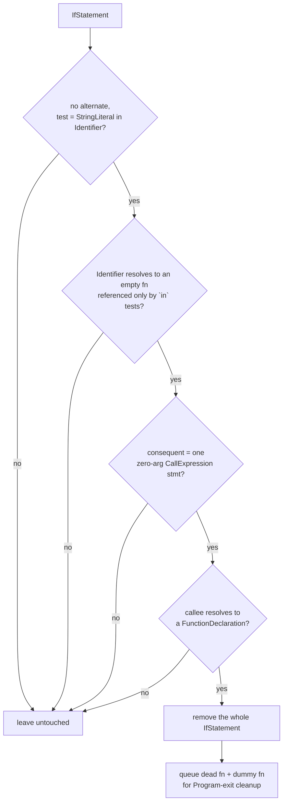

# jsconfuser/dead-code.js

## 1. Target

Reverses js-confuser's [DeadCode](../../../js-confuser/transforms/dead-code.md): removes
the never-taken `if ("randomProp" in dummyFn) { deadFnName() }` guard outright, along with
the now-unreferenced dead function it calls.

## 2. Algorithm

Recognizes the *whole guard* (predicate + the specific hoisted function it calls) as one
self-contained structural unit and removes both together, rather than folding the boolean
and leaving generic constant-folding/if-pruning passes to finish the job — this file
doesn't need `calculate-constant-exp.js`/`prune-if-branch.js` to have already run. The
predicate fold itself (`"x" in dummyFn` → `false`) is conceptually shared with
[OpaquePredicates](opaque-predicates.md), but the two files' actual reversal
responsibility differs enough to stay independent.

**Must run after `OpaquePredicates`.** `OpaquePredicates`'s own `if`-wrapping fires on
*every* `if` it visits on the encode side, including ones this transform already inserted
(`Order.DeadCode = 8` < `Order.OpaquePredicates = 13`) — so real combined output can look
like `if (!(x1 in dummy1) && (x2 in dummy2)) { deadFn() }`, a `LogicalExpression` test, not
the bare `BinaryExpression` this matcher expects. Fixed by decoder pipeline ordering, not
by teaching this matcher a second shape: `opaque-predicates.js`'s own decode plus the
shared `calculate-constant-exp` fold run first and unwrap `true && (x2 in dummy2)` back
down to bare `x2 in dummy2`, so by the time this visitor runs, the guard is bare again
regardless of whether `OpaquePredicates` touched it.

## 3. Implementation

`matchDeadCodeGuard` requires, on one `IfStatement`, all of:

- No `alternate`.
- `test` is `BinaryExpression{in, StringLiteral, Identifier}`, where the identifier
  resolves to an **empty-bodied function whose every reference is an `in` test's own right
  operand** (`isDummyPredicateFn` — same test as
  [opaque-predicates.js](opaque-predicates.md)'s, which carries the reasoning, kept
  independent rather than shared since each file matches and disposes of the whole thing on
  its own terms). Neither the declaration spelling nor the arity is consulted; both were
  conditions on the encoder's output that this decoder's own reconstruction breaks.
- `consequent` is exactly one `ExpressionStatement` wrapping a zero-argument
  `CallExpression` on a bare `Identifier`, and that identifier resolves to a
  `FunctionDeclaration` (guards against a coincidental structural match whose callee is
  some unrelated, unresolvable global call).

**Cleanup.** Unlike `OpaquePredicates`'s dummy function (always Program-level), this
transform's own dead function is hoisted into whichever block the encoder was currently
processing — Program or any function body, at any nesting depth. A single Program-scope
cleanup pass would miss anything nested, since `Scope.getBinding` only walks *up* the
parent chain, never down into a child scope it doesn't already have a path into — fixed by
capturing each candidate's own governing `scope` (via `Binding.scope`) at match time,
alongside its name, and crawling+deleting from that exact scope at `Program: exit`.

**Verified safe under `RenameVariables`.** `matchDeadCodeGuard` never compares an
identifier against a hardcoded/fixed name string — its two name reads (the dummy predicate
function, the dead function) are only ever used as a key into `path.scope.getBinding(...)`,
resolving to whatever binding that identifier's *current* spelling points to. Cleanup
deletes by captured `Binding`/`scope`, not by re-deriving identity from name text later.
There's also no cross-scope splice of the kind that broke [flatten.md](flatten.md) under
renaming — the dead function and its guard are deleted outright, never merged into another
scope.

## 4. Upstream Effects

Two shapes this matcher has to read reach it from the
[ControlFlowFlattening decode](control-flow.md), not from the encoder — this pass is
scheduled after it for the first reason and reads a spelling it invents for the second.

- **The guard does not exist as a statement until the CFF decode has run.** On a `high`
  sample the whole program is still inside the interpreter when the early passes run, so
  there is no `if (…) { … }` in the tree to visit and this pass removes nothing at all —
  silently, since a fail-closed pass with no input looks exactly like one with nothing to
  do. It is therefore scheduled **twice**, the second visit after the CFF decode and before
  `Dispatcher`; see the ordering note in `plugin/jsconfuser.js`. The early visit still earns
  its place on whatever is already at Program level.
- **`(1, f)()` around a bare identifier is ours.** The encoder wraps a call whose callee it
  rewrote into a *member* expression, `X.Y.Z()` → `(1, X.Y.Z)()`, so the member call keeps
  its receiver. The CFF decode then resolves that member expression back to a plain
  identifier and leaves the wrapper standing, producing `(1, f)()` — a shape no encoder
  stage emits. A matcher reading only for `f()` misses every one of them, which on a `high`
  corpus was almost the entire population.

**A third, and it is the one that closed this pass's last gap without any work here.** A
guard whose dead helper is packed into a parameter of a function that is an object-property
value is unreachable from this pass: nothing here can resolve the owner's call sites to
retire the slot, and the helper stays alive
([moved-declarations.md](moved-declarations.md) carries the arity half). Those functions are
[Dispatcher](dispatcher.md) `fns` entries, so the Dispatcher decode reconstructs them and
the guard goes with them — which is why this pass is scheduled *before* Dispatcher and the
residue still disappears. The dependency is real and worth keeping even though the symptom
is gone: if a dispatcher ever declines again, this shape comes back, and it will look like a
defect in this matcher rather than in the pass that owns it.

Distinct from all three, and *not* an upstream effect: the dead helper is as often `var X;` +
`X = function () {…}` as the `FunctionDeclaration` the encoder emitted. That split is the
encoder's own MovedDeclarations (Order 25, later than
[DeadCode](../../../js-confuser/transforms/dead-code.md)'s Order 8), whose variable half
this decoder deliberately does not reverse. It is handled the same way regardless — by
resolving the binding rather than reading one declaration shape, via
[`utility/binding-def.js`](../../decode-js.md#source-layout-decoderdecode-jssrc)'s
`resolveBindingFunction` — but it is encoder residue, and filing it here would attach the
fix to the wrong dependency.

## 5. Known Gaps

None currently open.

## Source

[`src/visitor/jsconfuser/dead-code.js`](https://github.com/echo094/decode-js/blob/6c974fb5720518fac9c6b3d4cf558ba90ef9f8e7/src/visitor/jsconfuser/dead-code.js), wired into
[plugin/jsconfuser.js](../../plugins/jsconfuser.md) right after
[OpaquePredicates](opaque-predicates.md) — item 2 has why that order is forced.

## Fixtures

`test/visitor/jsconfuser/dead-code/`:

| fixture | what it pins |
|---|---|
| `program-level` | the base shape |
| `nested-in-function` | the scope-cleanup regression — the dead function can live in any block, so cleanup runs from the captured `Binding.scope` |
| `not-a-guard-real-call` | fails closed — a real property check on a genuinely-used function |
| `not-a-guard-nonempty-dummy` | fails closed — the empty-body requirement |
| `not-a-guard-args` | fails closed — the consequent's call must be zero-argument |
| `not-a-guard-unresolvable-callee` | fails closed — the callee must resolve to a `FunctionDeclaration` |

`test/jsconfuser/dead-code-opaque-predicates.js` — the `OpaquePredicates`-wrapped composed
shape, whole-pipeline because it needs both visitors together.
`test/jsconfuser/rename-variables/dead-code.*` — the `renameVariables` proof of safety: two
dead-code-guarded functions in one sample, with and without renaming.
