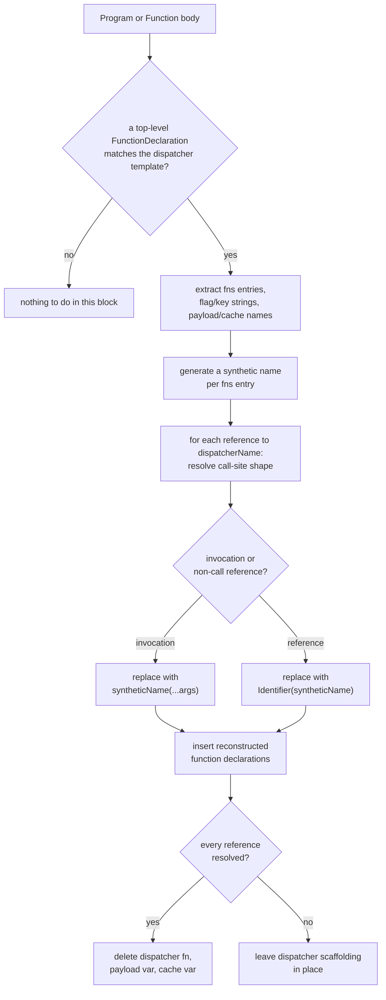

# jsconfuser/dispatcher.js

## 1. Target

Reverses js-confuser's [Dispatcher](../../../js-confuser/transforms/dispatcher.md)
transform: per block (`Program` or any function body), parses the shared closure holding
every dispatched function, rebuilds each as a plain named function declaration, and
rewrites every call site back to a direct call or reference.

## 2. Algorithm

Structural matching throughout — no identifier-name assumptions, and **no fixed
positions either**. `matchDispatcherFn` reads the template by the role each part plays,
because under js-confuser's `high` preset **two** later encoder stages rewrite the shape this
transform emits before the decoder ever sees it: `MovedDeclarations` (Order 25) packs
`var output` / `var fns` onto the
parameter list or merges their declarations into one leading `var`, leaving bare
assignments behind, and `Minify` (Order 28) folds the trailing return if/else into a
single conditional return. So the three branch roles are addressed **from the end** of the
body, `output` and `fns` are named from the non-call branch's else arm (`output =
fns[name]()`) — the one place both appear in a fixed relationship — and whatever declaration
prologue precedes them is read for the `fns` object rather than counted. Matching by index
recognised only the template as emitted, and fired on nothing at all across a `high` corpus.
The four secret flag/key strings (`clearPayloadKey`, `nonCallKey`,
`returnAsObjectKey`, `returnAsObjectPropertyKey`) are extracted directly from the matched
dispatcher body, then used to disambiguate call sites unambiguously — no guessing needed,
since decoding and encoding share the exact same string values.

For each `fns` entry, `parseFnsEntry` recognizes a masked entry structurally — a single
`RestElement` param where the unmasked shape always has zero — and calls
[variable-masking.js](variable-masking.md)'s exported `processStackParam(entryPath, 0)`
directly, bypassing its normal arity inference entirely: Dispatcher's own template always
builds this entry with zero declared params (even when the original function had its own
rest param, it becomes `var [a, ...rest] = payload` *inside* a zero-param wrapper), a
structural fact rather than a guess.

**Reconstruction takes the entry's signature from its unpack pattern, which is why the
entry has to be unmasked completely or not at all.** The pattern's own identifiers become
the rebuilt function's parameter list, so the rest param the mask stack lived in is
*dropped* by the same step — a slot still addressed through that param would survive into a
function where nothing declares it. Being unmasked is therefore not an optimisation here
but a precondition of reconstructing anything, and an entry only partway there is worse
than one still fully masked, which is merely unrecognised (item 4).

**The unpack line is located by scanning, in either spelling, never by reading `body[0]`.**
Both degrees of freedom are forced (item 4): the encoder's own masking turns the
declaration into a bare assignment, and our earlier passes push statements in front of it.
`findUnpackLine` walks the body accepting `var [a, b] = payload` and `[a, b] = payload`
alike. Two things it refuses outright, since both would be rebuilt into output that does not
parse: a top-level hole, and any element that is not a legal parameter — an assignment
target is a wider grammar than a parameter list, and `[stk["a"], stk["b"]] = payload` is
exactly what an entry whose unmasking declined still carries.

**What it may skip on the way is decided by execution order, not declaration order.** The
hazard is a *read* of one of the promoted names reaching the program ahead of the unpack
line: today it sees `undefined`, and after the rewrite — which drops the line and binds
those names as parameters instead — it would see the argument. So the test is whether a
statement evaluates anything, not how much it declares. Three shapes are inert and skipped:
an initializer-less declaration, a hoisted `FunctionDeclaration`, and an
`X = function (...) {...}` / `X = (...) => {...}` assignment — declaring a function reads
nothing, and building a closure evaluates neither its body nor its parameter defaults, so a
read of a promoted slot *inside* one happens when it is called, which nothing above the line
does. A `ClassExpression` is deliberately not on that list (its computed keys and `extends`
clause do evaluate), and an `if` or a call is refused outright.

**Inertness is only half the test**: a skipped statement that *binds or writes* a promoted
name is refused as well. Those statements survive the rewrite while the unpack line does
not, so a `function a(){}` or `a = function(){}` above it would become the last word on `a`
rather than being overwritten by the payload, silently losing the incoming argument.
Declarations are exempt and have to be — the assignment form *requires* its names to be
declared in the statements just skipped, and `stripPromotedDeclarators` is what removes
those declarators so they shadow nothing.

Reading this condition as `unmaskDestructuredRest`'s and reusing it verbatim was the earlier
choice, and it cost a run of dispatchers: the sibling's rule is about *its* rewrite, and copying a
guard is not the same as copying the reason for it
([encoder-decoder-method.md](../../../encoder-decoder-method.md) T3).

**Because reconstruction *rebuilds* the entry rather than editing it, none of this mutates
the tree.** The rebuilt function is a fresh `FunctionDeclaration` built from the collected
params and statement array, and the original entry is discarded with the dispatcher — so
dropping a promoted name's now-redundant declarator is a filter on the emitted array, and
nothing has to be undone when a later entry declines and takes the whole match down with it.
That is what keeps the all-or-nothing contract cheap here; the one genuinely mutating step
is the unmasking, which item 4 addresses on its own terms.

**The dispatcher is found by statement shape and only *validated* by its binding — the
distinction matters, because the accepted set is finite and a spelling outside it is not a
decline but a pass that never runs.** `readDispatcherCandidate` scans a block's statements
and takes a candidate from exactly three forms:

| accepted statement | produced by |
|---|---|
| `function d(…) {…}` | the encoder, where nothing later swallowed it |
| `d = function (…) {…}` | **ours** — the [CFF decode](control-flow.md) reconstructing a flattened function, whose declaration it emits separately |
| `var d = function (…) {…}` | **ours** — the same reconstruction where nothing afterwards split it, and the spelling an ordinary source would use |

Only then is `utility/binding-def.js`'s `resolveBindingFunction` consulted, to confirm the
name defines *this* function. Its fail-closed-on-a-second-write rule is
[babel.md](../../babel.md)'s; **what is specific here is that the decline is required rather
than conservative** — reconstruction deletes the holder, so a second write would mean deleting
some other definition along with it. **The binding is the identity
check, not the lookup**, so it cannot rescue a spelling the scan never offered. This page
described the scan as binding-driven for several sessions, and the third row was missing from
both the code and the table; what found it was a breadcrumb showing `matchDispatcherFn`
never called at all, not a reading of either.

Every call-site reference to the dispatcher is resolved into a synthetic replacement
function; cleanup is **all-or-nothing per block** — the dispatcher function, payload var,
and cache var are only removed once *every* reference in that block resolved
successfully, since a partially-decoded dispatcher would leave some call sites reading a
scaffold that no longer exists.

**Verified safe under `RenameVariables` for a reason specific to this shape.** The
reconstruction step lifts each `fns` entry's body out to a new sibling
`FunctionDeclaration` — superficially the same "move code between scopes" shape as
[flatten.js](flatten.md)'s bug — but the new declaration always gets a **freshly
generated** name (`block.scope.generateUidIdentifier(name)`, guaranteed non-colliding
against everything already in scope) rather than reusing any existing name text, and it's
reinserted into the *exact same block* the original function lived in before Dispatcher
wrapped it — never a different or independently-renamed scope the way RGF's
recursively-obfuscated sub-program is.

## 3. Implementation

Every string-valued key (`fns`'s per-function keys, the `returnAsObjectProperty` wrap key)
is read through a small `keyName` helper accepting either a plain `Identifier` or a
`StringLiteral` — `Preparation` unconditionally normalizes non-computed keys to
quoted/computed form, and `Minify` can convert a valid-identifier string key back
afterward (see encoder doc's Downstream Effects).

`parseCreateFunction` validates the `nonCall` branch's `createFunction` helper shape. It
was documented here as confirming the template "not because anything here affects
decoding," and that was wrong in a way worth recording: **its strictness was load-bearing
as a gate**. Relaxing it so it reads its own slots by role took matching from nothing to
nearly every application — and produced that same number of *wrong programs*, because it had
been holding shut a fail-open path in `parseFnsEntry` below. A shape check that nothing reads
is still a shape check that something depends on; the only safe reading is that a matcher's
strictness is part of its contract until measured otherwise.

**The spelling it has to read**, observed rather than attributed: the helper arrives as a bare
`createFn = function (){…}` assignment, its two `var`s split into a merged declarator plus
assignments, sometimes with a dead trailing `return;`. It is **not** MovedDeclarations (whose
FunctionDeclaration handling requires a direct child of the packed function and emits a
conditional prologue, neither of which matches). The likeliest producer on current evidence is
the [ControlFlowFlattening decode](control-flow.md), which is exactly the split-declaration
spelling it reconstructs a flattened function into — the dispatcher itself arrives that way —
but that is a resemblance, not a measurement, and it stays unattributed until one is made.
Settling it changes no behaviour: both spellings are accepted.

Beyond confirming the template, nothing it validates affects decoding — the reconstructed
functions are plain declarations, never the always-rest-param cached closure this
produces. Its `fnLengthIf` check accepts two shapes for the same
underlying template: the original single-call statement
(`{ph}_d_fnLength(fn, fnLength)`), or a residue a *different* decoder pass can leave
behind — when `preserveFunctionLength` is off, `{ph}_d_fnLength` is the empty no-op
`function(){}`, and `anti-tooling.js`'s own decoder (a generic "strip calls to any
zero-param/zero-body function" pass that runs earlier in this pipeline) recognizes it and
rewrites the call into two bare-identifier statements (`fn; fnLength;`), splicing the
original arguments in as separate `ExpressionStatement`s. Accepting both shapes closed
what was otherwise a total, not partial, non-decode on any `{ dispatcher: true }` sample
with `preserveFunctionLength` off — Dispatcher's own cleanup being
all-or-nothing per block means one rejected sub-shape took the whole instance down.

`parseFnsEntry` ends in a no-parameter fallback for the genuine "original function took
no parameters" case, where there is no unpack line to strip. That fallback is reached by
*any* first statement it does not recognise, which made it **fail open**: for a spelling
it does not know it returned a zero-parameter function whose body still read the payload
variable that cleanup then deletes — `undefined is not iterable` the moment it runs. The
spelling that reaches it is `VariableMasking`'s (Order 20, after Dispatcher's Order 6):
the entry's `var [a, b] = payload` unpack becomes `[stk["a"], stk["b"]] = payload`. Most
are unmasked back into the recognisable declaration by `variable-masking.js`'s own third
visit before this matcher ever runs; the ones that reach it are the residue that pass
declines (see Known Gaps). It now declines whenever the body still reads the payload after
the unpack line would have been stripped — keyed on the consequence rather than on a list of
spellings, so an unknown fourth one fails closed too. Declining an entry declines the
whole dispatcher, since the match is all-or-nothing.

**Entry parsing is deliberately the last step of `matchDispatcherFn`, and the ordering is
a soundness requirement rather than tidiness.** It is the only step that mutates —
unmasking via `processStackParam(entry, 0)` — and that `0` is not read from the code
anywhere. No truncation statement exists (this transform marks its entries `PREDICTABLE`,
so `VariableMasking` omits one), and the entry is anonymous and never directly called, so
there is no call-site arity to infer either; `variable-masking.js` correctly declines it
outright. The count is purely an invariant of *this* transform's template — entries are
always built with zero declared parameters — so applying it is only justified once the
thing has been confirmed to be that template. Within the loop every entry is still parsed
after one has failed, because parsing an entry is what unmasks it, and this matcher is the
only occasion on which that happens: bailing on the first failure measured worse on both the
size and the residual-array-read axes across a `high` corpus.

**The surviving-stack guard** enforces item 4's precondition, and it has to read the stack
name *before* mutating: `prop.value.params[0].argument.name` is captured up front, since
`processStackParam` may remove the very param it would otherwise be read from. Afterwards
the entry body is traversed and the entry declined if any `isReferencedIdentifier()` still
carries that name. It is deliberately keyed on the surviving *reference* rather than on the
reason a slot went unresolved — the masking pass has several, and an unknown one has to fail
closed the same way — which puts it alongside the payload check above as a consequence-keyed
guard rather than a spelling-keyed one.

`matchFnLengthHelper` independently recognizes the Program-level `{ph}_d_fnLength` helper
by its own two possible shapes (empty no-op, or the real template) — needed because
js-confuser inserts it **unconditionally** on every Program, even when nothing in the file
ends up dispatcher-eligible, so it can be orphaned from the very start rather than only
after cleanup.

`matchCallSite` resolves a reference to `dispatcherName` in three steps: (1) unwrap the
optional `["returnAsObjectProperty"]` member-access round trip (over either a
`CallExpression` or `NewExpression`) — this carries no information, the dispatcher only
wraps `output` in `{"prop": output}` for the call site to immediately unwrap it again; (2)
read the flag argument to distinguish `nonCall` (reference) from `clearPayload` (zero-arg
call) from a bare 1-or-3-arg call; (3) for a non-zero-arg call, find the preceding
`payloadName = [args]` assignment as the second-to-last element of a shared
`SequenceExpression` — the call arguments are copied from that array's elements verbatim,
spreads included, so `TEST_FUNCTION(...[2, 10, 8])`-style calls round-trip without
special-casing.

Since each decoded sub-tree lives entirely within one block and every reconstructed
function/call-site rewrite operates on nodes freshly built or taken directly from the
matched (soon-to-be-deleted) dispatcher — never nodes still reachable from a second path
in the tree — no `t.cloneNode()` is needed here, unlike
[flatten.js](flatten.md)/[integrity.js](integrity.md)'s node-sharing pitfall.

The Program-level `{ph}_d_fnLength` helper is cleaned up separately and unconditionally at
`Program: exit` (fires last, after every nested block's own dispatcher has already been
processed), gated by `matchFnLengthHelper`'s structural check plus `safeDeleteNode`'s own
reference-count guard — not by tracking which specific matched dispatchers happened to
reference it, since the helper can be present and orphaned even when zero dispatching
occurred anywhere in the file.

**`readFnLengthHelper` is what finds it, in either of two spellings, and the second is the
encoder's.** `dispatcher.ts` prepends the helper as a `FunctionDeclaration`, but
ControlFlowFlattening (Order 24, well after Dispatcher's Order 6) outlines that declaration
into its own switch/case table like any other, and what an outlined function reads back as —
[control-flow-graph.js](control-flow.md)'s `matchOutlinedFunctionWrapper` — is a plain
`X = function () {}` assignment against a hoisted `var X`, never a declaration. On a `high`
corpus that is the *only* spelling the helper survives in, so reading solely for a
`FunctionDeclaration` declined on the whole population. The split of labour is what makes
both cheap: `readFnLengthHelper` yields the function to shape-check and the binding name to
delete, and `safeDeleteNode` works from the binding either way, removing the constant
violation (the assignment, and with it the `ExpressionStatement` holding it) and then the
declarator.

**The empty-no-op branch is broader than the helper's name, and should be read that way.**
`params.length === 0 && body.length === 0` cannot tell `{ph}_d_fnLength` from any other
niladic empty function — no provenance is checked, and none is available once the template
that referenced it is gone. That is deliberate rather than sloppy: an empty body has no
semantics to preserve, and `safeDeleteNode`'s reference count is what makes the deletion safe,
so the shape does not need to identify *which* scaffolding it is. It does mean the sweep
collects unrelated empty orphans — a DeadCode-injected wrapper whose guard
[dead-code.js](dead-code.md) removed, leaving nothing behind it, is the case that occurs — and
that is correct S3 cleanup arriving under a narrow name, not a misattribution to guard
against. What it must *not* be widened to is empty *variadic* functions: a surviving rest
parameter means some pass invented one (item 4), and the fix belongs at that pass.

## 4. Upstream Effects

**How completely [variable-masking.js](variable-masking.md) unmasked an entry decides
whether this pass can reconstruct it at all.** An entry's original `var [a, b] = payload`
unpack reaches this pipeline as VariableMasking's `[stk["a"], stk["b"]] = payload`, and
`processArrayPatternAssign` is what turns it back into the declaration `parseFnsEntry`
reads — nested patterns included, so an original parameter list like `(a, [b, c])`, which
masks to an ArrayPattern of ArrayPatterns, resolves the same way a flat one does.

**Folding alone leaves an entry only *partly* unmasked, which is why this file drives the
un-masking step too.** `checkStackInvalid` marks a slot touched by an `UpdateExpression`
invalid, and that marking is scoped to *value substitution* — nothing can be substituted
into `stk[3]++`. It says nothing about un-masking: `unmaskStack` never reads `invalid`,
promoting each remaining slot to a real local instead, which `_local++` satisfies. Reading
the marking as an inherent limit is the trap
([encoder-decoder-method.md](../../../encoder-decoder-method.md) T3 — a guard outlives the
operation it was written for, and `++` updates are its own worked example).

**The missing premise, not a defect, is what kept that step out of reach — so this file
supplies the premise rather than tolerating the residue.** `deVariableMasking` gates
`unmaskStack` on a truncation statement, and Dispatcher marks its entries `PREDICTABLE`, so
one is never emitted; the entry is anonymous, zero-arity and never called, so no arity is
inferable from it either. Nothing upstream is emitting a bad shape for
[doc-conventions.md](../../../doc-conventions.md)'s "fix the pass that produces it" to act on — the pass is correct and
merely uninformed. The template's structural `0` is exactly the exact-length input
`unmaskStack` requires (it refuses *inferred* counts, not exact ones), so `parseFnsEntry`
drives it directly, as it already does with `processStackParam`. **Routing the missing fact
to the pass that owns the reversal is the remedy here; teaching this pass to tolerate the
residue would have been the reflex, and it fixes nothing for any other consumer.**

The surviving-stack guard (item 3) remains a real fail-safe rather than dead code:
`unmaskStack` has its own declines — a body reading `arguments`, a stack still observable as
a value — and a slot surviving one of those is still unreconstructible.

**`unmaskStack` displaces the unpack line, and that is why locating it by position was never
viable.** For every non-parameter slot it promotes it unshifts a bare `var _localA, _localB;`
at `body[0]`, so by the time this pass runs the unpack line is never the first statement. The
same call is why the line's elements are always plain identifiers by then rather than stack
slots — it rewrote them on the way past. Reading `body[0]` therefore declined on the entire
population it had just finished unmasking, which is as self-defeating as it sounds and read
as an encoder-shape gap for as long as the two facts were held apart. The encoder displaces
it too (MovedDeclarations prepending above an assignment-form line), so scanning is required
regardless of what this pipeline does to its own output — there is no version of this fix
that lives in `variable-masking.js`.

**`unmaskDestructuredRest` can hand this pass an entry that already has parameters, and
reconstruction replaces the parameter list outright.** Dispatcher builds every entry with
zero declared parameters — the same template invariant the `unmaskStack(entry, 0)` call rests
on — but that is a fact about the *encoder's* output, not about this pass's input: our own
fully-folded `[a, b] = rest` reversal restores a real parameter list before this file ever
sees the entry. Rebuilding the function from the unpack pattern then drops those names, and
every reference to one goes unbound. They are re-bound as a leading `var` instead of
declining, which is exact rather than conservative: the template only ever calls
`fns[name]()` with no arguments, so such a parameter is always `undefined` on entry, which is
precisely a bare `var` local.

**Three of this pass's reads are only well-defined because [control-flow-graph.js](control-flow.md)
stopped emitting the shapes that displaced them, and all three were fixed there rather than
absorbed here.** They are worth stating together because they are the same mistake in three
positions, and because each looked like an encoder-shape gap until the per-stage count named
the emitter:

- **The body's tail.** Addressing the three branch roles from the *end* of the body is forced
  (item 2), so a trailing statement that is not a role breaks every application at once. The
  reconstruction used to close each body with a `return;` / `return undefined;` — the graph's
  own record of "and then it ends" — which put the roles one slot from where this matcher
  reads them.
- **The call site's callee.** `matchCallSite` starts from a *reference* to the dispatcher in
  callee position. ControlFlowFlattening wraps a rewritten direct call as `(1, scope.a.b)()`
  to keep it non-`this`-bound, and until the flattening decode unwrapped that guard along with
  the member chain it dissolved, the callee held a `SequenceExpression` and every such
  reference resolved to nothing.
- **The `{ph}_d_fnLength` helper's parameter list.** `matchFnLengthHelper`'s empty-no-op
  branch requires zero parameters, which is what `dispatcher.ts` emits. The reconstruction
  used to hand every outlined wrapper the shared dispatcher's rest parameter unconditionally,
  so the helper arrived spelled `X = function (...arg) {}` and the sweep declined on all of
  it. Nothing about the helper had changed; our own pass had re-spelled a niladic function as
  a variadic one.

Fixing any of them here would have been the reflex and would have bought only this matcher;
all three shapes reached every consumer of a reconstructed function
([encoder-decoder-method.md](../../../encoder-decoder-method.md) T9's case 1).

**A fourth belongs with them, and it is the one this file got wrong for longest: the
dispatcher's own holder.** Two of the three statement forms item 3 accepts are emitted by
[control-flow-graph.js](control-flow.md), not by the encoder — it reconstructs a flattened
function as a declaration plus a separate assignment, and the dispatcher is as flattenable
as anything else (encoder Order 24 against Dispatcher's Order 6), so on a `high` sample most
arrive that way. This pass absorbed those spellings instead of the producer dropping them,
which is the *right* call here and the exception worth naming: unlike the three above, the
split is not a wrong shape to stop emitting — a reconstruction has to spell the holder
*somehow*, and every spelling is somebody's input. So the obligation lands on the consumer.

**But enumerating the spellings is the wrong way to discharge it, and this file is its own
counter-example.** The `{ph}_d_fnLength` cleanup was already widened once, from the encoder's
`FunctionDeclaration` to the assignment form — and a third spelling sat one normalization
away, at which point the whole dispatcher decode would have failed closed with the matcher
never called. A list that has to be extended every time an upstream pass changes its mind is
not a contract; **ask what the binding *defines*** ([moved-declarations.md](moved-declarations.md)
item 4's spelling-agnostic list is the pattern), which covers all three spellings and whatever
comes next. Two gates here still read the spelling instead:

- `matchFnLengthHelper`'s cleanup, the one already widened once.
- `isInertAboveUnpack`, which accepts `X = function (…) {…}` and refuses the identical
  closure written as an initialized declarator. **Building a closure evaluates neither body
  nor defaults**, so the two are equally inert and the refusal protects nothing — a guard
  outliving the operation it was written for
  ([encoder-decoder-method.md](../../../encoder-decoder-method.md) T3).

**Censused, and both are latent: `isInertAboveUnpack` refuses none of the sites that have an
unpack line with statements above it** — read over the tree as it stands at the `rgf`
cut, the stage before this pass ([probes.md](../../probes.md)). The count was worth taking rather than reasoned:
the argument that no pass of *ours* emits the joined spelling establishes nothing about an
author's own `var f = function (…) {…}` sitting above an unpack line, which is exactly what
this gate would refuse. Zero today, so the fix is not urgent — but re-count it before
concluding that again, since nothing enforces the property.

**A CFF-flattened dispatcher reaches this pass in the ordinary template spelling, so
CFF+Dispatcher stacking needs no special case here — and a second matcher built for it
matched nothing.** When ControlFlowFlattening (encoder Order 24) flattens the block holding a
dispatcher (Order 6), the template's three branch roles are dissolved into an interpreter and
this pass's tail read finds nothing. That is a scheduling fact, not a shape gap:
[control-flow-graph.js](control-flow.md) runs earlier in our pipeline and restores the
template on its way past, so by the time this pass runs the roles are back where item 2 reads
them. The evidence is that a narrow dispatcher-closure collapse written to catch the residue
this pass supposedly could not reach turned out to match **zero** call sites across a `high`
corpus and zero on the fixture built for it — every application had already
been taken here, including the two call-site spellings that collapse was scoped to grow into
(the 3-arg `asObject`/`new` wrap and the memoized `nonCall` reference, both of which
`matchCallSite` has always handled, the wrap inline via its `wrapCandidate` read). The
general form is
[encoder-decoder-method.md](../../../encoder-decoder-method.md) T8's first in-tree check:
**look for a matcher that already resolves the entity before building a second path to it**;
a fail-closed duplicate leaves no trace at all, so nothing but a census finds it.

**`findUnpackLine`'s refusal to scan past a live statement is only well-defined once the
string layer has resolved every key string, four passes upstream.** The last entry this pass
ever declined had an `if` above its unpack line, and "the condition is working rather than a
gap" was only half true: the condition *is* right to refuse an `if`, but that `if` was
`if (<concealed>(1565, 8) in <dummy>) { … }` — a DeadCode guard whose key string
[string-concealing.js](string-concealing.md) had declined to resolve, so
[dead-code.js](dead-code.md) could not recognise it and remove it. Four layers, each hiding
the next: an unresolved string, an unrecognisable guard, a live statement above the unpack
line, a declined entry, a declined dispatcher. It closed with no change to this file.
**A decline that terminates at a correct guard still has a cause upstream of the guard**, and
"our condition is right" is not the same claim as "there is nothing to fix" — the lesson this
file has now paid for twice. The `live-stmt-above-unpack` fixture pins the guard's behaviour,
which is genuinely correct and stays.

**A `cff-graph` scope anchor can leave an entry capturing the dispatcher's own scope, which
reconstruction cannot preserve.** Entry bodies are lifted out to where the dispatcher stood,
so a reference resolving to the dispatcher's parameters or locals is bound before the rewrite
and unbound after it; the template's own `fnLengths = {}` parameter is the one that occurs,
addressed by a surviving `X.prop = {}` anchor that `deScopeAnchorCleanupInit` did not reach.
This fails closed. **All three of these were invisible while the `body[0]` read was in place**
— those entries declined before anything looked at what they captured or what parameters they
carried, so the preconditions never had to be stated, and making the unpack line locatable is
what surfaced them ([encoder-decoder-method.md](../../../encoder-decoder-method.md) T7's first
multiplicity: an outer bail-out masks everything downstream, and the two it was hiding
appeared as *wrong output*, not as declines).

**Two of this pass's role reads depend on `opaque-predicates.js` and `dead-code.js` having
already run, and the dependency is invisible until they have.** With the block scan reaching
assignment-held dispatchers, a batch of them declined at the three role reads — a role's test
rewritten to `!("s" in fn) && flagArg === "key"`, or its branch body padded with a dead helper
and its guarded call. DeadCode is encoder Order 8 and OpaquePredicates Order 13, both *later*
than Dispatcher's Order 6, so [encoder-decoder-method.md](../../../encoder-decoder-method.md)
W1 said to remove that residue before tuning anything here, and warned the symptom might not
survive it. It did not: teaching [opaque-predicates.js](opaque-predicates.md) and
[dead-code.js](dead-code.md) to recognise their own anchor again raised the match count
substantially with **no change to this file at all**. That is the durable shape of the
dependency — the fix for a decline in this pass belongs in the pass that leaves the residue,
not in a relaxation of the role reads.

## 5. Known Gaps

**No open declines.** The censuses that establish this are the candidate-match count against
the candidates found, the reconstructed-entry count against the entries parsed, and the fire
counts of `entryCapturesDispatcherScope` and the surviving-stack guard — **both of which
should read zero**. The per-entry breakdown
needs a breadcrumb inside `parseFnsEntry`; classifying *what* sits above a declining unpack
line needs only a static read of decoded output, which is the cheaper of the two and shows the
whole population at once where a dump instrument caps its output and costs a corpus decode
([probes.md](../../probes.md) builds either). A decline count answers where, never
what, and this pass has paid for that confusion three times.

## Source

[`src/visitor/jsconfuser/dispatcher.js`](https://github.com/echo094/decode-js/blob/6c974fb5720518fac9c6b3d4cf558ba90ef9f8e7/src/visitor/jsconfuser/dispatcher.js), wired into
[plugin/jsconfuser.js](../../plugins/jsconfuser.md) right after RGF, before Flatten —
needs `variable-masking.js`'s `deVariableMasking` (run twice, earlier in the pipeline) to
have already reversed VariableMasking's rest-param masking on the dispatcher function's
own signature, in the (unblocked) case where VariableMasking only masks original params.
No dependency on `calculate-constant-exp`, unlike RGF — no bare numeric literal appears
anywhere in the call-site shapes this visitor matches.

## Fixtures

`test/visitor/jsconfuser/dispatcher/`:

| fixture | what it pins |
|---|---|
| `simple-call`, `object-wrapped-call`, `new-wrapped-call` | the three call-site spellings |
| `non-call-reference`, `non-call-reference-wrapped` | the `nonCall` branch's two forms |
| `zero-arg-call` | the empty payload |
| `nested-functions` | the per-block scan, not a Program-only one |
| `spread-args`, `spread-params` | both spread positions survive reconstruction |
| `multiple-functions` | per-entry reconstruction off one shared closure |
| `declarator-held` | a dispatcher held in a `var d = function (…)` declarator — the holder spelling item 2's binding read exists for |
| `preserve-function-length-ref` | `preserveFunctionLength` through a non-call reference, the one path where it actually matters |
| `unreferenced-fn-length-helper` | an unreferenced `{ph}_d_fnLength` helper with zero dispatching is retired on its own |
| `masked-fns-entry` | the unmasking fix — item 2's `processStackParam` call |
| `antitooling-stripped-fn-length` | the AntiTooling-residue fix |
| `displaced-unpack`, `assign-unpack` | the two unpack spellings item 4's scanning exists for |
| `inert-above-unpack` | the accepting side of the skip condition — a hoisted declaration and a closure reading the slot it binds evaluate nothing, so the scan may pass them |
| `live-stmt-above-unpack` | **declines** — an `if` above the unpack line does evaluate, so promoting the slots would change what it reads |
| `entry-captures-dispatcher-scope` | a decline case, since the failure it guards is wrong output rather than a missed decode |
| `not-a-wrapper` | fails closed — code with no dispatcher machinery at all |

`test/jsconfuser/rename-variables/dispatcher.{js,fix.js,src.js}` — the pass under
`renameVariables`.
