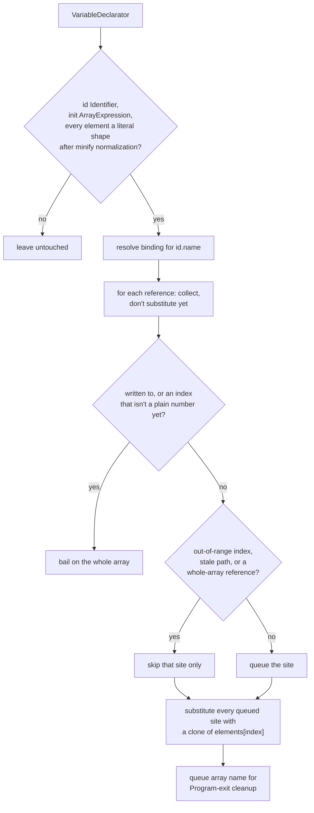

# jsconfuser/duplicate-literal.js

## 1. Target

Reverse js-confuser's
[DuplicateLiteralsRemoval](../../../js-confuser/transforms/duplicate-literals-removal.md):
resolve `const {ph}_dlrArray = [lit, lit, ...]`'s static contents and inline them back at
every `{ph}_dlrArray[i]` read, dropping the array once nothing references it.

## 2. Algorithm

No evaluation needed anywhere: unlike [StringConcealing](string-concealing.md) (whose
decode function is `customStringEncodings`-pluggable), every array element here is already
a literal AST node by construction, so decoding is a direct clone-and-splice.

**Identification is structural, never by name** — `{ph}_dlrArray` is placeholder-prefixed
and gets renamed away by `RenameVariables` in every real sample (same as every other
visitor in this project). The array is matched by shape (an `Identifier` bound to an
`ArrayExpression` of only literal-shaped elements) and every reference resolved through
Babel's own binding tracking, never by comparing name text — safe even under maximal
coincidental-collision pressure (a renamed outer function taking the exact text of its own
local variable), because the array's own `VariableDeclarator` doesn't own a scope with
"params" the way a `FunctionDeclaration` does — the class of bug that hit
[Calculator](calculator.md) and [GlobalConcealing](global-concealing.md) structurally can't
occur here.

**Two spellings are matched, not one**, because `MovedDeclarations` (a later encoder stage
— see the encoder doc's Downstream Effects) can rewrite the array's own declaration into a
hoisted bare declaration plus a separate assignment. Both entry points require the binding
to be assigned at most once — an array whose contents can change has no fixed element for
a read to resolve to, and substituting the initializer's element anyway would be wrong
output, not merely undecoded.

**Substitution is all-or-nothing per declarator**, the project's own T2 contract
([encoder-decoder-method.md](../../../encoder-decoder-method.md#t2--w5-hold-matchers-to-two-contracts--shape-keyed-and-all-or-nothing))
applied here: a reference that can't be resolved (a write, or an index that isn't yet a
resolved number) bails the *whole array*, never just that one site. Substituting only the
readable share is worse than substituting nothing — a half-resolved array manufactures two
spellings of one slot
([W5](../../../encoder-decoder-method.md#t2--w5-hold-matchers-to-two-contracts--shape-keyed-and-all-or-nothing)),
which downstream matchers that key on spelling then read as two unrelated entities.

**Wired twice**, and neither slot is optional — item 4 has why.

## 3. Implementation

`matchLiteralArray` is the shared element scan; two entry points feed it, one per spelling:
the plain `VariableDeclarator` form, and `matchMovedDuplicateLiteralArray` for the
`MovedDeclarations`-rewritten `AssignmentExpression` form. Both require:

- an `Identifier` name and an `ArrayExpression` with at least one element, no holes.
- Every element one of: `StringLiteral`, `NumericLiteral`, `BooleanLiteral`, `NullLiteral`,
  or the bare identifier `undefined` — exactly the four `createLiteral` shapes the encoder
  ever emits into this array.
- …plus the two `Minify`-rewritten forms (`void <number>` for `undefined`, `!0`/`!1` for
  the booleans) — `normalizeLiteralArrayElement` maps them back rather than cloning the
  `UnaryExpression` through to every reference site. Not cosmetic: the scan is
  all-or-nothing, so a single unrecognized element fails the entire array closed.

No position check (the encoder always prepends it to Program, but nothing downstream needs
that enforced).

The remaining cases are skipped site-by-site, since none of them can produce two spellings
of one slot: an out-of-range index (already a plain number, indexes no slot, and no later
pass will resolve it differently), a whole-array reference or `.length` (nothing to
substitute), and a stale reference path.

**Stale reference paths.** `binding.referencePaths` can list a path that is no longer in
the tree — references nest (`literals[literals[3]]` puts one reference inside another's
member expression), so substituting the outer one leaves the inner path detached. A
detached path still reports `removed === false` and has a usable `.node`, but Babel's
`Identifier` validator dereferences a null `.key` on replace, so replacing a stale path
**throws** rather than no-opping. `isAttached` checks the containment invariant directly
(`path.container[path.key] === path.node`) instead, the only test that holds before the
call.

**Negative numbers need no special handling.** Babel parses `-7` as
`UnaryExpression{-, NumericLiteral(7)}`; the encoder's own literal scan only ever visits
the inner (always non-negative) `NumericLiteral`, so `-{ph}_dlrArray[0]` decodes correctly
by replacing just the `MemberExpression`, leaving the wrapping `UnaryExpression` as-is.

**Object/class keys stay computed after decoding** (`{ [{ph}_dlrArray[0]]: 100 }` decodes
to `{ ["myKey"]: 100 }`, not `{ myKey: 100 }`) — the computed-bracket form is
`Preparation`'s doing, unrelated to this transform, and this decoder doesn't attempt to
un-compute it, same as every other decoder in this project.

**Cleanup.** The array is always Program-level, so no per-candidate scope capture is
needed — every matched array name is cleaned up from `Program: exit`'s own scope via
`safeDeleteNode`. Reference-count-gated, so a partially-resolved array (one reference left
alone because it didn't match) is correctly kept rather than deleted out from under its
still-live reference.

## 4. Upstream Effects

**A fraction of this array's own reference sites are unreadable until our CFF decode has run,
which is what forces two slots.** `ControlFlowFlattening` is encoder Order 24 against
DuplicateLiteralsRemoval's 22, so on the encode side it runs *after* this transform and routes
some of the already-placed indexed reads through its own state array. Those indices are opaque
arithmetic until [control-flow.md](control-flow.md)'s decode unwinds the interpreter and the
constant fold behind it collapses them to plain numbers.

| Position | What it can do there |
|---|---|
| Early — right after `MovedDeclarations` | Resolves the array before Calculator, StringConcealing and GlobalConcealing match their own literal shapes against it. **Bails on the array as a unit** if CFF reached any reference site. |
| Late — right after the CFF decode and its `calculateConstantExp` fold | Every index is a plain number by now, so the array resolves completely. Still ahead of `Lock`/`RGF`/`Dispatcher`/`Flatten`, which also match literal keys. |

**The early pass cannot simply move late.** Calculator, StringConcealing and GlobalConcealing
all run before the CFF decode and need these literals already resolved by then, so deleting the
early slot would break three passes to simplify one. The bail-as-a-unit is what makes running
twice safe: a half-substituted array is exactly the W5 hazard item 2 opens with, and it is what
made VariableMasking read one slot under two spellings and split a single object in two.

**One pass downstream is scheduled around this one.** A third `VariableMasking` visit is wired
immediately after the late position, because a mask key held inside this array is unreadable to
`variable-masking.js` until this pass has resolved it — [variable-masking.md](variable-masking.md)
owns that dependency from the affected side.

## 5. Known Gaps

None currently open.

## Source

[`src/visitor/jsconfuser/duplicate-literal.js`](https://github.com/echo094/decode-js/blob/6c974fb5720518fac9c6b3d4cf558ba90ef9f8e7/src/visitor/jsconfuser/duplicate-literal.js), wired into
[plugin/jsconfuser.js](../../plugins/jsconfuser.md) twice: once right after
`MovedDeclarations` (`split-variable-declaration.js`), before the
`VariableMasking`/`FunctionLength` pass, and again right after the CFF decode's
`calculateConstantExp` fold. Each `deDuplicateLiteralInit()` call carries its own closure
state, so the two positions don't interfere.

## Fixtures

`test/visitor/jsconfuser/duplicate-literal/`:

| fixture | what it pins |
|---|---|
| `many-values` | mixed number/string/boolean values at multiple indices — the base substitution |
| `undefined-null` | non-literal-node values still resolve |
| `negative-number` | the unary-wrapper pass-through |
| `object-key` | a substituted literal is valid in a key slot |
| `nested-function` | references resolve at any depth |
| `partial-reference` | one matching index plus an out-of-bounds and a non-member reference — the array is kept while anything still references it |
| `minified-elements` | `void 0` / `!0` / `!1` decode rather than failing the array closed |
| `cff-shaped-index` | an index through a *second* array leaves that array untouched while the first still decodes |
| `moved-declaration` | the split `var arr;` + `arr = [...]` spelling, which is the second of the two forms the array is matched in |
| `moved-declaration-reassigned` | **fails closed** — the split spelling with a second write, so two arrays reach one binding and neither can be resolved |
| `reassigned-declarator` | fails closed — a declarator whose array is overwritten before it is read |
| `no-match` | fails closed — no matching declarator at all |
| `non-literal-element` | fails closed — an array with a non-literal element |
