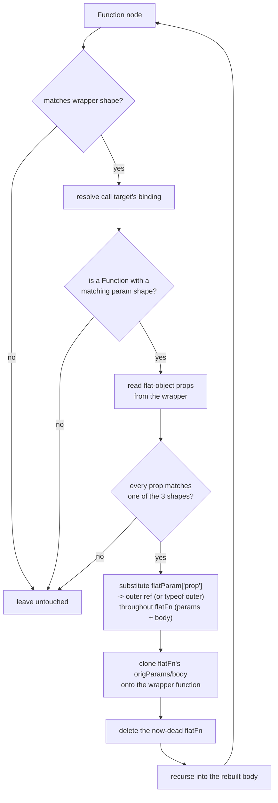

# jsconfuser/flatten.js

## 1. Target

Reverses js-confuser's [Flatten](../../../js-confuser/transforms/flatten.md) transform:
inlines the severed-closure function back into its original position, replacing every
flat-object proxy access with the outer-scope reference it stands in for.

## 2. Algorithm

Structural matching only — no identifier-name assumptions, since `RenameVariables` (which
runs after Flatten on the encode side) destroys any naming convention by the time real
obfuscated code reaches a decoder. Match the wrapper shape at the function's original
position (exactly one rest param, a two-statement body, the call's two arguments must be
the declared object and the rest param by name); resolve the extracted function via the
wrapper's own call-target *binding*, never by name; read each accessor property's tag
(`value`/`typeof`/`call`) from its exact `ObjectMethod` shape — any property that doesn't
match one of the three shapes aborts the whole match, no partial decoding.

Substitute every `flatParam["prop"]` access throughout the extracted function's params and
body — verified by binding identity, not name text, so a same-named-but-different-binding
shadow can't be mismatched — then clone the extracted function's body onto the wrapper and
delete the now-dead extracted function.

**Splicing a resolved outer reference back in needs a hygiene check first.** The name
`substituteFlatAccess` reads for an accessor property is captured as a bare string; with
real source names it can never coincide with a name already bound inside the function
being inlined, but `RenameVariables` (see the encoder doc's Downstream Effects) assigns
names independently per binding and can hand the identical string to both. Before
splicing, the substitution checks whether that name currently resolves (from the
substitution site) to a binding living *inside* the extracted function's own scope tree
rather than above it (`isScopeWithin`) — and if so, renames the colliding local out of the
way (`scope.rename`) before inserting the outer reference, rather than risking the
reference silently resolving to the wrong, in-scope binding.

**Nested functions chain.** Flatten itself runs innermost-first on the encode side, so an
inner function's already-flattened call can itself get swept up as an "outer variable" by
an enclosing function's own flatten pass and proxied *again* through the enclosing flat
object. Decoding undoes this the same way in reverse: each successful inline can expose
another wrapper shape one level in (the just-substituted content), so the visitor recurses
into the rebuilt body before returning, rather than relying on the outer traversal to
redescend.

**What this pass cannot reach, and why it is a bound rather than a shortfall.** When the
source function was *never called*, the encoder severs it anyway and then removes the wrapper
as unreachable (the encoder doc's Known Quirks). The wrapper is the sole holder of the
accessor object, so what arrives here is an extracted body reading `flatObj["k"]` with no
object anywhere defining `"k"` — nothing to match, and nothing to resolve to. Declining is
therefore correct *and* complete: the information was destroyed before the program was
written, so no strategy recovers it.

Measured on the corpus samples that carry it, all with zero references in the output.
The census keys on a `(obj, [pattern])` signature with at least one computed `obj["k"]`
access — a severed function surviving with no wrapper, which a wrapper/inner *pair* census is
blind to by construction. The cause was established by an encode-side A/B: the same source
with the function *called* produces no such residue. Both are rebuildable from
[probes.md](../../probes.md); read the A/B's counts with S5 in hand, since Flatten is
probability-gated under `high`.
**This is [encoder-decoder-method.md](../../../encoder-decoder-method.md) S3's first caveat in
its sharpest form:** the residue is zero-reference scaffolding, it looks exactly like a
cleanup this decoder failed to perform, and the only thing telling them apart is whether it
was ever live in the input. Here it never was.

## 3. Implementation

**Flattened function, two forms** (`extractGShape`), resolved via the wrapper's call-target
binding:

- Normal: `function flatFn(flatObject, [...origParams]) { ... }`
- Strict mode (a non-simple parameter list can't follow a `"use strict"` directive, so the
  encoder falls back to destructuring `arguments`):
  `function flatFn(){ "use strict"; var [flatObject, [...origParams]] = arguments; ... }`

`substituteFlatAccess` walks the flattened function's params *and* body — a default
parameter value can itself reference the flat object.

**Node-sharing pitfall.** The flattened function's body/param nodes are **cloned**
(`t.cloneNode(n, true)`) before being attached to the wrapper, not reused directly. Reusing
them leaves the same node objects reachable from two places at once (the wrapper's new body
and the soon-to-be-deleted flattened function, until it's actually removed) — a later scope
crawl walks both paths and double-counts every reference on them.

A related ordering issue: `safeDeleteNode`'s own internal crawl (to check the flattened
function's name has zero remaining references) runs *before* it actually removes the node,
so at that moment the tree still has both the wrapper's new body and the not-yet-deleted
flattened function present. A final `Program: { exit }` crawl at the end of the whole pass
(after every match, including nested ones, has been resolved) gives a clean,
order-independent final scope state — per-match crawls immediately after each
`safeDeleteNode` call are necessary for resolving the *next* nested match correctly, but
aren't sufficient on their own for two independent (sibling, non-nested) matches that
reference each other.

**`preserveFunctionLength` interaction.** The `{ph}_fnLength(fn, length)` wrapper isn't
unwound by this visitor — that relies on
[`src/visitor/jsconfuser/function-length.js`](https://github.com/echo094/decode-js/blob/6c974fb5720518fac9c6b3d4cf558ba90ef9f8e7/src/visitor/jsconfuser/function-length.js), a shared, cross-cutting pass
also used by Dispatcher/RGF/VariableMasking (see [rgf.md](rgf.md)'s own section for the
specific bugs found in it). Flatten's wrapper function always has exactly one rest param, so
it already satisfies `function-length.js`'s `hasRestParam` guard directly —
`processStackParam` resolves the real param count from the `{ph}_fnLength(fn, length)`
call's second argument.

## 4. Upstream Effects

**`readFlatObjectProps` demands a non-computed key, and an earlier pass of ours guarantees a
computed one.** The gate is `!t.isObjectMethod(prop) || prop.computed || !t.isStringLiteral(
prop.key)` — a decline there fails `matchWrapper`, which fails the whole wrapper, so the entire
scope-object layer survives untouched. **Every corpus sample carrying the layer declines here**,
and the `flatten` stage reports `+0` on all of them.

The spelling reaches this pass through StringConcealing, in two steps neither of which is the
encoder failing to be reversed:

| stage | the key |
|---|---|
| encoder StringConcealing | `[decode(0x73c, 0x9)](…)` — **computed of necessity**, a call cannot sit in a plain key slot |
| our `string-conceal#2` | `["aqOr6y_"](…)` — literal restored, computed spelling kept |
| what this pass accepts | `"aqOr6y_"(…)` only |

See [string-concealing.md](string-concealing.md)'s emitted-shape inventory for the producing
side; the mechanism lives there rather than being restated here.

**Fixed at the producer**, not here: `utility/safe-func.js`'s `safeReplace` now drops the
brackets when the expression it resolves to a string sits in a key position, guarded against
the two keys where that would change meaning (see
[string-concealing.md](string-concealing.md)). Teaching this gate one more spelling would have
been the same fix re-paid at the next matcher
([encoder-decoder-method.md](../../../encoder-decoder-method.md) T9 case 1); `safeReplace` is
shared by six visitors, so every one of them stops emitting the spelling at once.

**`readFlatObjectProps`' `kind: 'method'` branch demands `body.length === 1`, and a cleanup
that failed closed left a second statement in it.** The `var` slot ControlFlowFlattening
declares for its `didReturnVar` flag is swept by `dropDeadHarnessSlot`
([control-flow.md](control-flow.md) item 4) once the harness that read it is gone. That sweep
matched the flag's return wrap at exactly two expressions, so it declined wherever the wrapped
value was a Dispatcher call-site sequence the parser had flattened into the wrap — leaving a
dead bare `var` at the head of the method:

| spelling | produced by | what this pass does with it |
|---|---|---|
| `"k"(...a) { return _inner(...a); }` | the sweep reached the slot | accepted |
| `"k"(...a) { var flag; return _inner(...a); }` | the sweep declined on sequence width | **declined** — and one such method fails the property, the object, and the whole wrapper |

**Fixed at the producer** again, for the same T9 case-1 reason as the computed-key entry: the
sweep now keeps the whole tail of a wrap of any width. Loosening `body.length` here would have
meant deciding, in this matcher, which leading statements are safe to discard — a question the
pass that *created* the dead statement can answer exactly and this one cannot.

**`readFlatObjectProps`' `get` branch reads the proxied variable's *identity*, and a pass that
inlines constants erases it.** The accepted shapes are `return <Identifier>` (kind `value`) and
`return typeof <Identifier>`; the identifier is the only record of which outer binding the
accessor stands for, so nothing weaker can be accepted in its place.
[string-concealing.md](string-concealing.md)'s `<name> = "literal"` visitor inlines an assigned
literal into every forward reference and then deletes the binding, which turns the getter into:

| spelling | produced by | what this pass does with it |
|---|---|---|
| `get "k"(){ return outer }` | the encoder, and what survives when the inliner runs later | accepted |
| `get "k"(){ return "value" }` | the inliner reached the getter first | **declined** — one property fails the object and the whole wrapper |

**Fixed by rescheduling the producer**, not by growing a `literal` kind here (T9 case 2). The
variable is not scaffolding — the affected sources declare it — so a `literal` kind would have
had to substitute a value where the correct decode restores a reference, and it could never be
safe opposite a paired `set "k"(v){ outer = v }`: that setter names the binding, and a getter
reduced to a literal makes one entity read as two
([encoder-decoder-method.md](../../../encoder-decoder-method.md) W5). Deferring the inliner past
this pass keeps both — the layer decodes, and the inlining still happens afterwards.

**`matchWrapper` reads the wrapper's *last statement*, so anything that wraps it is fatal.** The
gate requires `return <call>` at `body[body.length - 1]`.
[prune-if-branch.js](../prune-if-branch.md) used to replace a constant-test `IfStatement` with
its surviving `BlockStatement`, leaving a bare `{ … }` around that return — transparent to
execution, fatal to this match. Fixed at that producer by splicing the block into the parent
statement list. **The general point is worth more than the instance:** a statement-position
gate is defeated by any pass that plants a block where a statement stood, and such a pass
leaves output that runs identically, so nothing but this matcher's decline records it.

## 5. Known Gaps

None currently open — item 4's declines are dependencies with chosen remedies, not
incompleteness in this matcher.

## Source

[`src/visitor/jsconfuser/flatten.js`](https://github.com/echo094/decode-js/blob/6c974fb5720518fac9c6b3d4cf558ba90ef9f8e7/src/visitor/jsconfuser/flatten.js), wired into
[plugin/jsconfuser.js](../../plugins/jsconfuser.md) after the ControlFlowFlattening decode
step — Flatten runs earliest on the encode side (`Order.Flatten = 2`), so its output is
exposed to every later transform; decoding it as late as possible in the pipeline gives the
most-processed, most-representative shape a real sample would show by the time this visitor
sees it.

## Fixtures

`test/visitor/jsconfuser/flatten/`:

| fixture | what it pins |
|---|---|
| `simple-value` | the base `value` accessor tag, get and set |
| `nested-chain` | a 3-level chain — item 2's recursion into the rebuilt body |
| `strict-mode` | the `arguments`-destructure fallback, item 3's second holder form |
| `default-param` | a default parameter value referencing the flat object — substitution walks params, not just the body |
| `typeof-and-call` | the other two accessor tags, under RenameVariables-style name reuse — item 2's hygiene check before splicing |
| `function-expression` | holder spelling does not change the result |
| `object-method` | same, for the method slot |
| `moved-declaration-split` | the split `var w;` + `w = function (…)` holder reaches this matcher too |
| `not-a-wrapper` | fails closed — an unrelated but superficially similar shape |

Whole-pipeline:

- `test/jsconfuser/flatten-function-length.js` — the `preserveFunctionLength` interaction.
- `test/jsconfuser/rename-variables/flatten.{js,fix.js,src.js}` — the
  outer-reference-capture regression guard.
