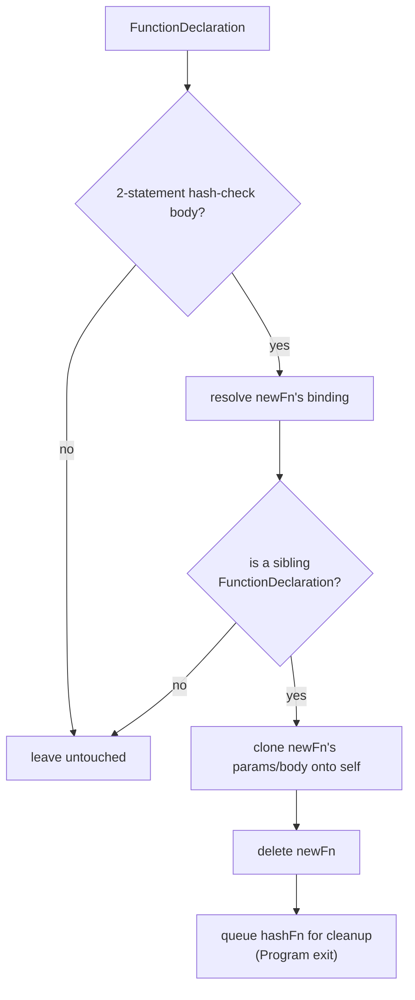

# jsconfuser/integrity.js

## 1. Target

Reverses js-confuser's [Integrity](../../../js-confuser/transforms/lock-integrity.md)
transform (`Order.Integrity = 37`, the encoder's *last* stage): relocates a hashed
function's real params/body back onto its original name and drops the now-dead
hash-check forwarder and hash-utility scaffolding.

## 2. Algorithm

Unlike [Flatten](flatten.md) (encoded earliest, so decoded last, to work on the
most-processed shape a real sample would show), Integrity is encoded **last** — nothing
in the encoder pipeline runs after it, so its output is never reshaped by anything else
on the encode side. Decoding it right after Pack, before any other jsconfuser decode
step, gives it the least-processed input — the mirror-image placement of the same
reasoning.

Structural matching only, no identifier-name assumptions: match the fixed hash-check
wrapper shape, resolve the sibling declaration that still holds the untouched original
params/body via its binding (nothing to reconstruct, only relocate), clone it onto the
original name, and delete the now-dead wrapper. The hash-utility chain it called is
cleaned up transitively, deferred to `Program: exit`, since several hashed functions in
one program commonly share it.

## 3. Implementation

`matchIntegrityWrapper` matches a `FunctionDeclaration` whose body is exactly:

```js
function self() {
  var h = self.cacheSlot || (self.cacheSlot = hashFn(newFn, seed));
  if (h === EXPECTED_HASH) {
    return newFn(...arguments);
  } else {
    {countermeasures}
  }
}
```

- `self.cacheSlot` (`isSelfCacheMember`) must be a plain, non-computed member access on
  the function's *own* name on both sides of the `||`/`=`.
- `hashFn(newFn, seed)`'s first argument must be an `Identifier` — this is `newFn`, the
  sibling declaration built from `self`'s pre-Integrity node before the encoder
  overwrote `self`.
- The consequent must be exactly `return newFn(...arguments)`. The alternate isn't
  matched further — whatever `{countermeasures}` compiled to is discarded wholesale
  along with the rest of the wrapper body.



**Hash-utility cleanup.** `HashTemplate`
([integrity-template.md](../../../js-confuser/templates/integrity-template.md)) inserts
a small chain of top-level helpers once, shared by every hashed function in the program:
the wrapper hash fn (`hashFn` above) calls a low-level cyrb53 fn, which calls an `imul`
var (`Math.imul` or a polyfill fn) internally. Deleting only `hashFn` after relocating
one function would leave the rest of the chain orphaned the moment that was the *last*
hashed function in the program — so cleanup is deferred to `Program: exit` and made
transitive: each candidate name is resolved, its own top-level identifier references are
collected *before* it's removed, and a successful removal enqueues those references as
further candidates. `safeDeleteNode` itself re-checks reference counts at deletion time,
so a name only clears the queue once nothing else in the program still calls it.

## 4. Upstream Effects

**[Pack](pack.md) only**, and that is deliberate rather than incidental — item 2 has why the
least-processed input is the right one here. On a packed sample nothing this matcher looks
for exists in the tree at all until Pack has spliced the payload back in, so the ordering is
forced, not merely conventional.

The shape this pass hands to everything after it: the hashed function's params and body,
**cloned** off the sibling declaration and reattached to the original name, with the wrapper
and its hash-utility chain gone. Every later pass therefore sees an ordinary
`FunctionDeclaration` with no residue of the check — which is what lets the rest of the
pipeline stay ignorant of Integrity entirely.

## 5. Known Gaps

None currently open.

## Source

[`src/visitor/jsconfuser/integrity.js`](https://github.com/echo094/decode-js/blob/6c974fb5720518fac9c6b3d4cf558ba90ef9f8e7/src/visitor/jsconfuser/integrity.js), wired into
[plugin/jsconfuser.js](../../plugins/jsconfuser.md) immediately after Pack, before every
other jsconfuser decode step.

## Fixtures

`test/visitor/jsconfuser/integrity/`:

| fixture | what it pins |
|---|---|
| `simple` | a single hashed function with its full hash-utility chain — the whole transitive cleanup |
| `custom-countermeasures` | the named-countermeasures `invokeCountermeasures()` variant is left alone here; that cleanup is [lock.js](lock.md)'s job, once the alternate branch calling it is gone |
| `shared-hash` | two hashed functions sharing one `hashFn` — the deferred cleanup fires only once both are decoded |
| `not-a-wrapper` | fails closed — a cache slot on a different object |
