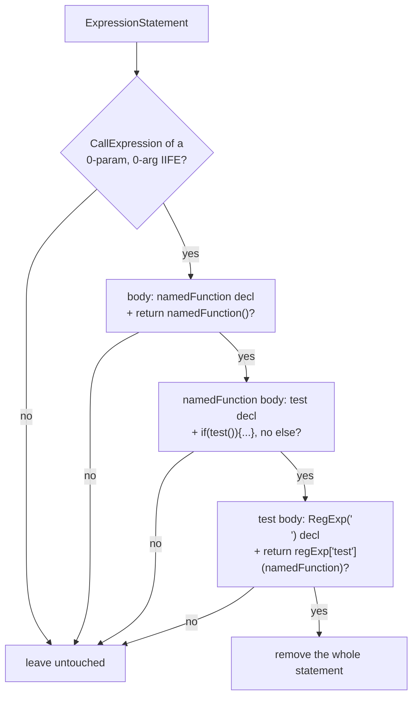
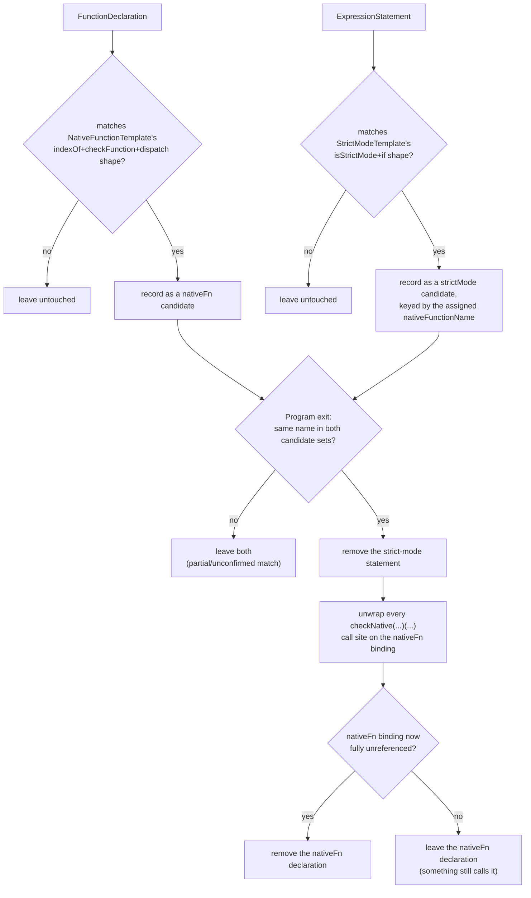

# jsconfuser/lock.js

## 1. Target

Reverses all six [Lock](../../../js-confuser/transforms/lock-integrity.md) sub-features
(`Order.Lock = 3`): antiDebug, selfDefending, dateLock (`startDate`/`endDate`),
domainLock, tamperProtection, and the `invokeCountermeasures` dispatch wrapper's dead-code
cleanup.

## 2. Algorithm

Every sub-feature is matched structurally (no identifier-name assumptions) and, once
matched, removed or unwrapped wholesale — none of the `{countermeasures}` if-bodies are
inspected further, since whatever they compile to is discarded along with the guard
itself.

**antiDebug is the one exception, and it has no shape to confirm at all.** The encoder emits
bare `debugger;` statements, so the reversal is a `DebuggerStatement` visitor that removes
every one it reaches — nothing correlates it to an encoder template, because there is nothing
to correlate. That makes it the only matcher here that would also remove a `debugger` the
original author wrote. Accepted deliberately: a raw `debugger;` at an arbitrary block position
in machine-generated output has no other plausible source, and the alternative is a heuristic
that could miss the encoder's.

**selfDefending is a formatter tripwire, and the whole mechanism is the `\n` test.** The inner
`test` closure builds `new RegExp("\n")` and runs it against *the enclosing named function
itself*, which stringifies that function and asks whether its own source contains a newline.
Minified encoder output has none, so the guard never fires in normal use; run the file through
a formatter and it does, and `{countermeasures}` executes. Reversing it needs the whole
two-level nest confirmed before anything is deleted, because every individual piece — an IIFE,
a closure, a regex test — is ordinary code that any program might contain; only the
combination is the encoder's. What the guard *protects* is nothing, so the statement is
removed outright rather than unwrapped: it carries no runtime effect on the program's own
behaviour.
**Guards can be nested inside each other — match at `exit`, not `enter`.** A real encoder
run with more than one Lock sub-feature enabled produces samples where `customLocks`'
`Block: exit` visitor — which fires on *every* block in the program, including ones this
same pass just inserted — unshifts an unrelated guard onto a block belonging to a
completely different sub-feature (e.g. tamperProtection's `checkFunction` closure
commonly ends up with a stray dateLock or domainLock `if` prepended to one of its own
nested blocks). Every visitor here that matches a multi-statement container shape
therefore runs at that node's `exit`: Babel's traversal visits every descendant (and this
file's own matchers along with them) before calling a container's own exit handler, so by
the time a container's shape is checked, any interloping guard nested inside it has
already been matched and removed by this same pass. Matching at `enter` would see the
*unmodified*, guard-polluted shape and fail to recognize the template at all.

**tamperProtection's three pieces are reversed together, since none is independently
meaningful**: the native-function checker, the strict-mode tripwire, and the
[GlobalConcealing](global-concealing.md)-produced call-site rewrite on every native call.
Correlation is required in both directions before anything is touched — a matched
checker with no matching strict-mode tripwire (or vice versa) is left completely alone,
the same conservative default used everywhere else in this file for a match that's only
partially confirmed.

**`invokeCountermeasures` cleanup is deferred and ordered.** The wrapper is identified at
match time but never deleted immediately — `Program: exit` retries deletion via
`safeDeleteNode`, which re-checks the live reference count, so the wrapper (and, only if
that succeeds, its `hasInvoked` flag) is removed once nothing still calls it.
tamperProtection's own cleanup must run *before* this cleanup within `Program: exit`: its
`checkFunction` and strict-mode IIFE each carry their own `{countermeasures}` call site,
and until those two pieces are actually removed they are live references that make
`invokeCountermeasures` permanently undeletable even after every other guard in the
program is gone.

## 3. Implementation

**antiDebug.** Unconditional: every `DebuggerStatement` anywhere in the tree is removed —
js-confuser's antiDebug produces no other shape, so there's no other reason a raw
`debugger;` would appear at an arbitrary block position in machine-generated output.

**selfDefending.** `matchSelfDefendingIIFE` structurally matches the full nested-closure
IIFE (outer IIFE → `namedFunction` → `test` → the `RegExp('\n')`/`toString()` check),
threading the `namedFunction` binding's name down two closure levels to verify the
innermost `test` closure references the *same* outer closure by identity, not just a
coincidentally matching name.



**dateLock (`startDate`/`endDate`).** `matchDateLockGuard` matches:

```js
if (Date.now() < TIMESTAMP) { {countermeasures} }        // startDate
if ((new Date()).getTime() > TIMESTAMP) { {countermeasures} }  // endDate, or either
                                                                 // date-read form for either option
```

Structural only: the comparator (`<` for startDate, `>` for endDate) and either
randomly-chosen date-read expression (`isDateNowCall`, `isNewDateGetTimeCall`) are checked, but `TIMESTAMP` itself isn't — the
guard's shape alone is unambiguous.

**domainLock.** `matchDomainLockGuard` matches one entry per configured regex:

```js
if (!new RegExp(REGEX).test(window.location.href)) { {countermeasures} }
```

Structural only, same reasoning as dateLock: the fixed `window.location.href` target
(`isWindowLocationHref`) is checked, `REGEX` itself isn't.

**tamperProtection.**

1. **`matchNativeFunctionCheckFn`** matches the `{nativeFunctionName}()` function
   (`NativeFunctionTemplate`) — a 0-param function using `arguments`, with an `indexOf`
   helper (2 params, algorithm not inspected) and a `checkFunction` closure
   (`matchCheckFunctionHelper`, threaded to the `indexOf` helper by identity) as its first
   two statements, then `var args = arguments;`, then an `if (args.length === 1) {...}
   else if (args.length === 2) {...}` dispatch matching the template's `checkFunction(fn)`
   / `fn.bind(object)` bodies exactly. One literal-matching subtlety: the template's
   `=== -1` comparison parses as `UnaryExpression{-, NumericLiteral(1)}`, not a negative
   `NumericLiteral` — `safe-func.js`'s `safeGetLiteral` has the same special case for the
   same reason.
2. **`matchStrictModeIIFE`** matches the `(function(){ ... })()` tripwire
   (`StrictModeTemplate`) — an `isStrictMode()` helper (`try { var arr=[]; delete
   arr["length"] } catch(e) { return true } return false`) followed by `if
   (isStrictMode()) { {countermeasures} {nativeFunctionName} = undefined; }`. Returns the
   assigned-to `{nativeFunctionName}` so the caller can correlate this statement with the
   function it targets.
3. **`unwrapNativeFunctionCallSites`** walks every reference to a confirmed
   `{nativeFunctionName}` binding and unwraps the call site GlobalConcealing produced:
   `{nativeFunctionName}(fn)(...)` → `fn(...)`, `{nativeFunctionName}(obj, "prop")(...)` →
   `obj["prop"](...)` (behaviorally identical to the runtime's `fn.bind(object)` — both
   bind `this` to `obj`). A reference not used as an immediately-invoked call is left
   untouched, which also blocks the cleanup below from firing.



**invokeCountermeasures.** `matchInvokeCountermeasures` structurally identifies the
generated wrapper (a 0-param top-level function: `if(hasInvoked) return; hasInvoked =
true; userFn();`, with `hasInvoked` resolved to a sibling `var ... = false` by binding,
not name text).

## 4. Upstream Effects

**tamperProtection's call sites reach this pass in a shape
[GlobalConcealing](global-concealing.md)'s decode leaves behind, not the encoder's.** When
`lock.tamperProtection` is on, the encoder wraps this transform's own native call sites in a
`checkNative(fn)` / `checkNative(obj, "prop")` guard around the outermost member expression.
The GlobalConcealing decode runs earlier in our pipeline (it is scheduled twice, the second
visit well before this pass) and inlines the `getGlobal("console")` piece *inside* that
wrapper back to a bare identifier, while deliberately leaving the `checkNative(...)` call
standing — `checkNative` is tamperProtection's machinery, not its own. That doc states the
same boundary from its side.

So `unwrapNativeFunctionCallSites` (item 3) is reading a partly-decoded shape by design, and
the ordering is load-bearing in one direction only: running this pass *before* GlobalConcealing
would leave the wrapper's argument as an unresolved `getGlobal` call, which the unwrap has no
reason to recognise. This is the reason behind the placement recorded under Source, stated as
the dependency rather than as a preference.

## 5. Known Gaps

**This pass fires on nothing in the current corpus, so no gate inside it is measurable here.**
The `lock` stage reads a zero delta across its own samples (`lock.0-2`, `domain-lock-string-concealing.0-2`); why a zero delta
cannot discriminate, and why that is a property of the corpus rather than of this pass, is in
[plugins/jsconfuser.md](../../plugins/jsconfuser.md)'s coverage section, which owns it for the
two passes in this state.

The consequence here: **a suspected defect in one of this pass's gates can be closed only as "no
population", never as correct** — a declaration-form gate was investigated on exactly that basis and had to be closed that way.

## Source

[`src/visitor/jsconfuser/lock.js`](https://github.com/echo094/decode-js/blob/6c974fb5720518fac9c6b3d4cf558ba90ef9f8e7/src/visitor/jsconfuser/lock.js), wired into
[plugin/jsconfuser.js](../../plugins/jsconfuser.md) **late**: after
[StringConcealing](string-concealing.md)'s second visit,
[GlobalConcealing](global-concealing.md)'s second visit, the ControlFlowFlattening decode and
its constant folds, and the [OpaquePredicates](opaque-predicates.md)/[DeadCode](dead-code.md)
pair — and *before* [RGF](rgf.md), [Dispatcher](dispatcher.md) and [Flatten](flatten.md), which
follow it.

Running this late is the same rationale as Flatten's own placement: it gives selfDefending's
string- and global-reference-bearing shape, and tamperProtection's `checkNative`-wrapped call
sites, the best chance of having already been simplified back before this matcher sees them.

## Fixtures

`test/visitor/jsconfuser/lock/`:

| fixture | what it pins |
|---|---|
| `anti-debug` | the antiDebug template, at both program and function-body depth |
| `self-defending` | the selfDefending template, at both depths |
| `invoke-countermeasures-cleanup` | the deferred cleanup fires once its only call site is gone |
| `invoke-countermeasures-still-live` | cleanup correctly withholds while an unrecognized call site still references it |
| `date-lock`, `domain-lock` | both date-read forms and both comparators |
| `date-lock-not-a-guard`, `domain-lock-not-a-guard` | fail closed on a near-miss operator or target |
| `tamper-protection` | both one-arg and two-arg `checkNative` call-site forms unwrapped, full prelude removed |
| `tamper-protection-not-a-wrapper` | fails closed — the two-arg dispatch branch missing |
| `tamper-protection-interleaved` | dateLock/domainLock-shaped guards nested three ways inside the templates, still fully unwrapped — the permanent regression fixture for the exit-timing rule above |
| `not-a-wrapper` | fails closed — a selfDefending near-miss on the string literal |

`test/jsconfuser/rename-variables/lock.{js,fix.js,src.js}` — all six sub-features combined.
It is what establishes that this file's `.name ===` comparisons
(`matchSelfDefendingTestFn`, `matchNativeFunctionCheckFn`'s threaded names) are positions
within one rigid, self-contained encoder template, so a `RenameVariables` collision would
require the encoder to reuse a generated name *within* its own template output — unlike
[Flatten](flatten.md)'s equivalent bug, which came from merging code between two
independently-renamed scopes.
