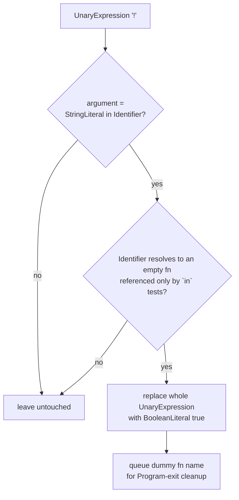

# jsconfuser/opaque-predicates.js

## 1. Target

Reverses js-confuser's [OpaquePredicates](../../../js-confuser/transforms/opaque-predicates.md):
folds the `PREDICATE && test` (or bare `PREDICATE` for the `return` variant) wrapping back
down to just `test`.

## 2. Algorithm

Exports one mechanism, as `{ dePredicateGenInit }`: the `PredicateGen`-based form
(`!("randomProp" in dummyFn)`, always true since the dummy function never gains the
checked-for property — verified against the pinned commit).

`matchPredicateGenTrue` folds a matched predicate to a bare `BooleanLiteral true`. That's
only half the job — it leaves `true && test` (if/ternary/switch wraps) or a bare
`if (true) {real} else {fake}` (the `return` wrap) behind, finished by the shared
[`calculate-constant-exp.js`](../calculate-constant-exp.md)'s `LogicalExpression`
short-circuit fold and the existing [`prune-if-branch.js`](../prune-if-branch.md), both
run immediately after this visitor in the pipeline.

**Provably safe under `RenameVariables`, not just empirically.** The binding lookup for
the dummy function starts from wherever the `!("key" in dummyFn)` test expression itself
sits — not from the dummy function's own scope the way
[calculator.js](calculator.md)'s and [global-concealing.js](global-concealing.md)'s
confirmed/hardened bugs did. `path` is, by construction, always nested inside the scope
that references `dummyFn` (it *is* that reference's location), so every ancestor scope
from `path` up to Program necessarily contains the `dummyFn` reference somewhere in its
own subtree. `RenameVariables`'s own name-reuse algorithm only ever offers an ancestor
scope's already-assigned new name to a descendant's own binding when that old name is
**not** referenced anywhere within the descendant's subtree — so `dummyFn`'s own new name
can never legally become a reuse candidate along the exact chain this matcher walks. This
is the same mechanism that broke Calculator (whose dispatch function's own body never
references itself, making its own new name freely reusable by its own param) — here it's
ruled out by construction instead of needing a defensive fix.

## 3. Implementation

`matchPredicateGenTrue` looks for a `UnaryExpression` with operator `!` whose argument is
`BinaryExpression{in, StringLiteral, Identifier}`, where the identifier resolves to
PredicateGen's dummy function (`isDummyPredicateFn`).

**`isDummyPredicateFn` keys on the binding's *reference set*, not on the encoder's
spelling, because the spelling is a proxy and this decoder's own passes break it.**
`"p" in X` reads false exactly while nothing adds `p` to `X`, so what the check has to
establish is that `X` is never handed anywhere that could write a property to it: every
reference must be an `in` test's own right operand — never a member base, a callee, or a
plain value use. The declaration itself is read through `utility/binding-def.js`'s
`resolveBindingFunction` and required only to have an **empty body**.

Two conditions the encoder's own output satisfies were dropped, both for the same reason —
they describe a shape rather than the invariant, and the
[ControlFlowFlattening decode](control-flow.md) reconstructs the anchor as `var X;` +
`X = function (...r) {}`:

- **`binding.path.isFunctionDeclaration()`** — by the time this pass runs `binding.path` is
  as often an init-less declarator with the real definition in `constantViolations`.
- **Zero parameters** — the rest param is one *we* added, and an empty body's own-property
  set does not depend on its parameter list, so the arity was never load-bearing.

Neither is a relaxation of what makes the fold safe: the reference test is strictly stronger
than the shape it replaces, and it was measured to hold on every anchor in the corpus before
the shape conditions were removed.

**Cleanup.** The dummy function is always inserted at Program level regardless of how
deeply nested the predicate expression itself is, so a single `Program: exit` pass using
the Program's own scope is enough — no per-candidate scope tracking needed here (contrast
with [dead-code.js](dead-code.md), whose dead function can live in any nested block).

## 4. Upstream Effects

**This pass is scheduled twice, and on a `high` sample the early slot has no population.** The
predicate does not exist as a reachable expression until the ControlFlowFlattening decode has
unwound the interpreter around it, so the first visit matches nothing at all — silently, since a
fail-closed pass with no input looks exactly like one with nothing to do. The second visit sits
after the CFF decode and before [Dispatcher](dispatcher.md). This is the same shape
[dead-code.md](dead-code.md) records for itself (it must follow this pass at *both* slots),
[calculator.md](calculator.md) and [global-concealing.md](global-concealing.md) — four passes,
one cause, and [encoder-decoder-method.md](../../../encoder-decoder-method.md) T6 has why a
zero-population slot is invisible in output.

**The anchor arrives in the CFF decode's spelling, not the encoder's.** `opaquePredicates.ts`
emits the dummy as a `FunctionDeclaration` with zero parameters; the
[ControlFlowFlattening decode](control-flow.md) reconstructs it as `var X;` plus
`X = function (...r) {}` — a split declaration whose rest param is *ours*. Both of the gates
item 3 records as dropped were dropped for exactly this: they tested the encoder's spelling
where the invariant is a property of the binding's reference set. This is the general case
[moved-declarations.md](moved-declarations.md) item 4 tabulates, and this pass is one row of it.

**What this pass emits, for the passes scheduled after it.** One consumer depends on the
output shape rather than on this file:

| emitted shape | consumer that must accept it |
|---|---|
| a bare `BooleanLiteral` `true` where the `!(… in …)` test stood, with the `if`/ternary/switch/`return` wrapper still around it | `calculate-constant-exp` and `prune-if-branch`, wired immediately after, finish the collapse this pass only starts |
| a *now-unwrapped* DeadCode guard — DeadCode's own guard can itself have been wrapped by OpaquePredicates | [dead-code.js](dead-code.md), which must run after this pass for that reason; its item 2 owns the dependency and states it from the affected side |

## 5. Known Gaps

None currently open.

## Source

[`src/visitor/jsconfuser/opaque-predicates.js`](https://github.com/echo094/decode-js/blob/6c974fb5720518fac9c6b3d4cf558ba90ef9f8e7/src/visitor/jsconfuser/opaque-predicates.js), wired into
[plugin/jsconfuser.js](../../plugins/jsconfuser.md) ahead of `calculate-constant-exp`,
`prune-if-branch` and [`dead-code.js`](dead-code.md) — item 4 has why that order is forced.

## Fixtures

`test/visitor/jsconfuser/opaque-predicates/`:

| fixture | what it pins |
|---|---|
| `if-wrap` | the `PREDICATE && test` form inside an `if` |
| `conditional-wrap` | the same, in a ternary |
| `switch-wrap` | the same, in a switch case |
| `return-wrap` | the bare-`PREDICATE` variant, which leaves `if (true) {real} else {fake}` for `prune-if-branch` |
| `not-empty-dummy` | fails closed — the empty-body requirement in item 3 |

`test/jsconfuser/rename-variables/opaque-predicates.*` pins item 3's reference-set test
against `RenameVariables`: predicate sites in sibling, nested-closure, and loop-body scopes,
where name collisions are what a spelling-keyed check would trip on.
