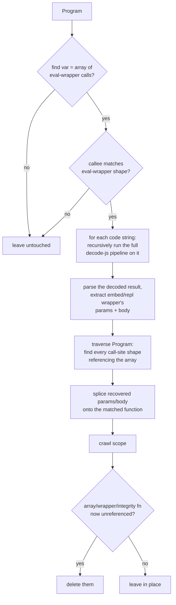

# jsconfuser/rgf.js

## 1. Target

Reverses js-confuser's [RGF](../../../js-confuser/transforms/rgf.md) transform: extracts
the `eval`-wrapped, recursively-obfuscated string a transformed function's real body was
moved into, recursively decodes it with this same pipeline, and splices the recovered
params/body back onto the original function.

## 2. Algorithm

The recursive decode (`decodeJsconfuser`, a direct import of
[plugin/jsconfuser.js](../../plugins/jsconfuser.md)'s own default export, called on each
extracted string) is what makes this tractable: RGF's sub-program was obfuscated by
(almost) the entire encoder pipeline, so reversing it is *exactly* the same problem as
reversing the outer program, just smaller. This also means whatever the sub-program's own
nested transforms produced — including a captured [Flatten](flatten.md) proxy shape, if
the same function was Flatten-eligible before RGF ran — gets reversed for free, with no
RGF-specific logic needed for it.

Structural matching throughout, no identifier-name assumptions: find the Program-level
array of eval-wrapper calls, confirm the callee matches the eval-wrapper shape, recursively
decode each code string, then find every call-site shape referencing the array and splice
the recovered params/body onto the matched function. `extractReplacementFn` pulls the real
params/body out of the decoded sub-program by cross-reference (the destructured array/args
names, the inner function's own name) rather than fixed statement order, since none of
RGF's inserted nodes in the sub-program are `path.skip()`-protected either — later
encode-side passes on the sub-program can reorder or reshape them the same way the outer
program's scaffolding is exposed (see the encoder doc's Downstream Effects).

**Verified safe under `RenameVariables` for a reason specific to RGF.**
`extractReplacementFn` does compare several captured (not hardcoded) names and splices a
decoded sub-program's params/body directly into a different scope — the same general
shape as the bug that hit [flatten.js](flatten.md). But the encoder's own eligibility rule
("does not apply to functions that reference outside variables") guarantees an
RGF-transformed function's body never reads anything from outside its own params/locals in
the first place — unlike Flatten, there's no free-variable proxy/substitution step at all
for a coincidental `RenameVariables` collision to corrupt, since nothing here ever needs to
resolve a spliced-in identifier back to a specific outer binding.

## 3. Implementation

**Eval wrapper** (`matchEvalWrapper`) — a Program-level function:

```js
function {ph}_rgf_eval(code) {
  if (integrityVar) {
    return eval(code);
  }
}
```

One param, a single `if` (no `else`) whose test is a bare identifier (the integrity
variable — never inlined by constant folding since it's a function-call result, not a
literal expression), consequent is a single `return eval(param)`. The integrity variable's
own value is irrelevant to decoding.

**RGF array** (`matchRgfArray`) — a Program-level `var`:

```js
var {ph}_rgf = [{ph}_rgf_eval("code1"), {ph}_rgf_eval("code2"), ...];
```

Every element must be a call to the *same* callee (resolved as the eval wrapper above)
with exactly one string-literal argument. Array position **is** the index the transformed
functions' call sites reference — no separate bookkeeping needed.

**Call site** (`matchRgfCallSite`) — a transformed function's entire body:

```js
function original() {
  return {ph}_rgf[N]["apply"](this, [{ph}_rgf, arguments]);
}
```

Both member accesses are computed in the encoder's own template, so `["apply"]` is matched
via `isPropertyAccess` — a small helper that accepts either the computed bracket-string
form or the plain dot form `Minify` can rewrite it to. The array index must resolve as a
plain `NumericLiteral`, which is a dependency on an earlier pass of ours rather than a
property of the encoder's shape — item 4.



Since each decoded sub-program is parsed into its own throwaway AST (never attached to the
real program's tree), the recovered `params`/`body` nodes are used as-is, no
`t.cloneNode()` needed — unlike [flatten.js](flatten.md)'s or [integrity.js](integrity.md)'s
node-sharing pitfall, there's no second path in the real tree that could still reach these
nodes.

Cleanup (array declaration, eval-wrapper function, integrity variable/function) happens
unconditionally at the end of the same `Program` visit, gated by `safeDeleteNode`'s own
reference-count check — if some array elements failed to decode (parse failure,
unrecognized shape), their call sites are left untouched, which naturally keeps the array
and wrapper alive.

**`preserveFunctionLength` interaction.** The `{ph}_fnLength(fn, length)` wrapper isn't
unwound by this visitor — that's `function-length.js`'s job (a shared, cross-cutting pass
also used by Dispatcher/Flatten/VariableMasking). RGF's own transform independently shrinks
a function to a zero-param stub (`function target(){ return {ph}[0].apply(this, [{ph},
arguments]) }`) with no rest param at all, which `function-length.js` checks for
(`hasRestParam`) before handing off to `variable-masking.js`'s
`processStackParam` — the wrapper still strips cleanly either way, and this visitor's own
call-site match is unaffected regardless, since it matches the function's own body shape,
not how it's referenced.

## 4. Upstream Effects

**The call site's array index reaches this matcher as folded arithmetic, not as a literal.**
RGF is encoder Order 4 and `Calculator` is Order 9, so Calculator runs *later* on the encode
side and can wrap this transform's own array index in its `{ph}_calc(op, a, b)` dispatch. What
arrives is therefore an expression, not the `NumericLiteral` this matcher requires. The
shared `calculateConstantExp` pass folds it back — but only *after*
[calculator.js](calculator.md) has unwrapped the dispatch call into a plain `BinaryExpression`
for it to fold.

That is why this visitor is scheduled as late as it is rather than beside the other
literal-key matchers: it needs both of those passes behind it. The dependency is on our own
schedule, so a decline here would read as a defect in `isPropertyAccess` or the index check
while the actual cause sat two passes upstream — the case
[encoder-decoder-method.md](../../../encoder-decoder-method.md) T9 exists for.

## 5. Known Gaps

**This pass fires on nothing in the current corpus, so no gate inside it is measurable here.**
The `rgf` stage reads a zero delta across its own samples (`rgf.0-2`, `rgf-flatten.0-1`, `rgf-function-length.0`); why a zero delta
cannot discriminate, and why that is a property of the corpus rather than of this pass, is in
[plugins/jsconfuser.md](../../plugins/jsconfuser.md)'s coverage section, which owns it for the
two passes in this state.

The consequence here: **a suspected defect in one of this pass's gates can be closed only as "no
population", never as correct** — the same applies to every shape gate reached only through a live RGF application.

## Source

[`src/visitor/jsconfuser/rgf.js`](https://github.com/echo094/decode-js/blob/6c974fb5720518fac9c6b3d4cf558ba90ef9f8e7/src/visitor/jsconfuser/rgf.js), wired into
[plugin/jsconfuser.js](../../plugins/jsconfuser.md) right after the Lock decode step and
before Flatten — running late lets the earlier `calculateConstantExp` passes fold the call
site's array index back into a plain numeric literal first.

## Fixtures

`test/visitor/jsconfuser/rgf/`:

| fixture | what it pins |
|---|---|
| `function-declaration`, `function-expression`, `global-reference` | the three holder spellings |
| `nested-functions` | only the eligible outer function is affected |
| `multiple-functions` | per-function decode off one shared array |
| `outside-scope-guard` | fails closed — a function with an outside-scope reference is never RGF-eligible to begin with |

Whole-pipeline, each needing more than this visitor:

- `test/jsconfuser/rgf-flatten.js` — RGF's recursive decode and Flatten's own compose
  correctly when one function was transformed by both.
- `test/jsconfuser/rgf-function-length.js` — the `preserveFunctionLength` interaction.
- `test/jsconfuser/rename-variables/rgf.{js,fix.js,src.js}` — two independently RGF'd
  functions in one Program under `renameVariables`.
