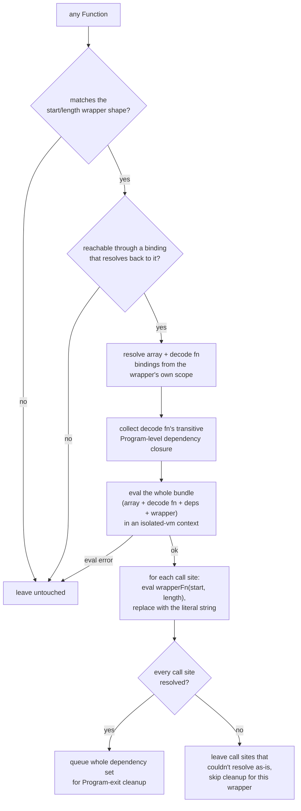

# jsconfuser/string-concealing.js

## 1. Target

Reverses js-confuser's [StringConcealing](../../../js-confuser/transforms/string-concealing.md)
(`deStringConcealingInit`, the main mechanism): evaluates each block's decode function in
an `isolated-vm` sandbox and constant-folds every `{ph}_STR_N(start, length)` call site
back to the literal string it decodes to.

## 2. Algorithm

**Evaluate, don't hand-port the algorithm.** Unlike most jsconfuser visitors, this one
doesn't try to structurally understand what the decode function *does* — it runs it.
`customStringEncodings` makes the algorithm genuinely pluggable (default base91, but
arbitrary user code is allowed), so hand-porting one specific algorithm would only ever
cover the default case and would silently drift the moment the encoder's own
implementation changed.

Resolve the array/decode-function bindings from the matched wrapper's **own** scope, not
a fixed Program scope — a block that earns its own encoder can be *any* block, not just
the Program root, and `array`/`decodeFn` are declared as siblings in whichever block that
is. Collect the decode function's **transitive dependency closure** (every referenced
identifier resolving to a `FunctionDeclaration`/`VariableDeclarator`, recursing into each),
excluding anything declared *inside* the node currently being walked (the decode
function's own internal locals). Bundle the array, decode function, its dependencies, and
the wrapper into one `isolated-vm` context; evaluate each call site's `wrapperFn(start,
length)` and replace with the literal result.

**A bundled declaration's value is a property of its *binding*, not of its declarator.**
Whatever this pass is handed has already been through MovedDeclarations (encoder Order 25,
which splits `var x = <value>` into `var x;` + `x = <value>`) and through this decoder's own
[control-flow](control-flow.md) decode, which reconstructs declarations the same split way.
So every declaration entering the bundle — the string array, the decode function, and each
transitive dependency alike — resolves its value as `init` when present and otherwise as the
binding's single `=` write, and the search for *further* dependencies continues into that
value rather than into the empty declarator. Skipping that leaves a dependency in the bundle
as a bare `var decode;` and the call through it fails with "decode is not a function"; it
also means the decode function itself need not be a `FunctionDeclaration` at all.

**Bundle membership and bundle order are read off the real path ancestry, never off
`node.start`/`node.end`.** Several passes scheduled earlier rebuild whole subtrees —
[variable-masking](variable-masking.md) reparses a function body, the control-flow decode
synthesises statements outright — so a collected declaration's source offsets are routinely
absent, or relative to a fragment instead of to the program. An offset comparison therefore
reports a local declared *inside* the decode function as being outside it, hoists it beside
the function as its own top-level declaration, and the bundle then fails to evaluate at all
(the hoisted copy reads a parameter that is out of scope there). Containment is
`searchPath.isAncestor(binding.path)`; ordering — which matters because `var` initializers
have to run top-to-bottom in the generated bundle — is document order, compared as the trail
of container keys down from the Program root. Everywhere else this file needs relative
position reads it the same way, `deStringConcealingPlaceAssign`'s forward-reference test
included.

**Flattening independently-scoped declarations into one shared eval scope re-introduces
name collisions the real program doesn't have**, whenever `RenameVariables` (see encoder
doc's Downstream Effects) happens to give two unrelated declarations the same generated
name — legitimate and unambiguous in the real program (disambiguated by actual scope
nesting), but a genuine same-scope collision once concatenated into flat bundle text.
Guarded two ways: the dependency-collection step keys by the declaration's own AST node,
not its (possibly colliding) name text, so a later match can never silently overwrite an
earlier one in the collected set; and a second pass (`resolveBundleNameCollisions`)
renames every later-position duplicate through the real Babel scope before the bundle is
generated, which correctly propagates to every reference throughout the whole program —
not just within the bundle's own text. Renaming a `FunctionDeclaration` needs the same
care `Calculator`'s and `GlobalConcealing`'s fixes needed: its own `.scope` is the
function's internal scope, so renaming must start from the *parent* scope where the
function's name is actually bound, not its own body (where a coincidentally-shadowing
local could hijack the rename).

## 3. Implementation

`matchStringConcealingWrapper` matches a function with exactly 2 params (`start`,
`length`) whose body ends in
`return decodeFnName(arrayName["slice"](start, start + length));` — structural only,
`decodeFnName`'s own algorithm is never inspected. Two further spellings of that same shape
are accepted, both of them arriving from our own earlier passes rather than from the encoder
(item 4): leading declaration-only `var`s, and a callee wrapped as `(1, decodeFnName)`. The
same `(1, wrapper)(…)` spelling appears at the *call* sites, where stepping out to the
sequence expression is gated on every discarded expression being a literal — otherwise
replacing the call would drop a side effect.

`resolveWrapperBinding` supplies the wrapper's identity, and it is a **binding, not a
name**: a declaration's own, or the variable a function expression was assigned to
(`var w = function …` and the split `var w;` + `w = function …` alike). The binding has to
resolve back to *this* function, which is what rejects a variable holding the wrapper only
part of the time — its references would not all be call sites of this wrapper, so
substituting them would be wrong rather than merely incomplete.

`evalWrapperCallSites` builds the bundle: `addDependency` records one declaration and hands
back the path to search for its own dependencies (the declaration itself, or the separate
write holding its value — `resolveDeclaredValue`, of which `resolveDeclaredString` is the
array's StringLiteral-only case); `collectProgramDeps` recurses from there, skipping any
binding the searched path is an ancestor of; `compareDocumentOrder` sorts the result.
`declToCode` re-attaches a resolved value to its declarator, since the bundle is evaluated
without the assignment that carried it.

**`deStringConcealingPlaceAssign`**, this file's second export, is a separate and much
smaller mechanism: a string assigned once to a variable is inlined into the references that
read it, and the assignment deleted once nothing reads it. Three things bound it — it declines when any reference is a `["slice"](…)` read, since that
binding is an array the main mechanism above still has to resolve and inlining it destroys
that matcher's input; it declines when inlining a long literal into more than one
reference, which is pure growth; and it inlines only into references that come *after* the
assignment in document order, since an earlier one reads the variable while it is still
undefined.

**Cleanup.** Every matched wrapper's full dependency set (array, decode fn, its
transitive closure, the wrapper itself) accumulates into one pool across the whole
program, since the shared array/`bufferToString` chain is pulled in repeatedly by every
block that uses it. Deletion is deferred to `Program: exit` and retried to a fixpoint
(each pass may make a previously-still-referenced declaration newly deletable), unlike
[integrity.js](integrity.md)'s single-pass queue, since this pool is fully known upfront
rather than discovered incrementally. A wrapper whose call sites weren't *all*
successfully resolved is excluded from the cleanup pool entirely — it's still needed.

## 4. Upstream Effects

The wrapper this pass matches rarely arrives in the shape the encoder emitted. Two of the
three spellings item 3 accepts are produced by passes ahead of this one in our own pipeline,
and neither exists anywhere in encoder output.

- **`(1, wrapper)(…)` around a bare identifier.** The sequence wrapper *is* the encoder's,
  but not in this form: ControlFlowFlattening rewrites a direct call's callee into a member
  expression and wraps it, `X.Y.Z()` → `(1, X.Y.Z)()`, precisely so the member call keeps its
  receiver. It is the only place in the encoder that emits a literal-`1`-prefixed sequence.
  The [CFF decode](control-flow.md) then resolves that member expression back to a plain
  identifier and leaves the wrapper standing, which is what produces `(1, f)()` — a shape the
  encoder has no reason to emit, since a bare identifier call never needed a receiver pinned.
  It appears both at the wrapper's own callee and at its call sites, so both unwrap it.
- **Leading declaration-only `var`s in the wrapper body.**
  [VariableMasking](variable-masking.md)'s un-masking declares the slots it could not turn
  back into parameters, at the top of the body. The wrapper never reads them, so they are
  skipped rather than treated as a body-shape mismatch.

Neither is a defect in the pass that produced it, and neither should be fixed there — the
`(1, …)` wrapper is only removable once something knows the call no longer needs a receiver,
and the declared slots are real locals. Reading for the encoder's spelling alone is what
would be wrong.

**The dependency pool outlives every one of this pass's own visits, because what holds the
last reference to a bundle is not always gone by the time the last of them runs.** The sweep
is reference-count-gated and retried to a fixpoint (item 3), which makes it correct at every
slot and complete at none of them: a dependency still referenced when the sweep runs is left
standing, and the sweep does not run again. Measured case — the `bufferToString` chain (the
`getGlobal` sniffer, `__globalObject`, `__TextDecoder`/`__Uint8Array`/`__Buffer`/`__String`/
`__Array`, `utf8ArrayToStr`) is held alive by the base91 decode function's own
`return bufferToString(…)`, and it is [dead-code.md](dead-code.md)'s **second** visit that
removes that decode function, several passes after this pass's own second slot. The chain then stands
at **zero references** with nothing left to sweep it — and on a small source it is nearly the
whole of the decoded output.

So the pool is created once by the plugin and handed to every slot, plus a cleanup-only slot
after DeadCode's second visit. Two properties of that arrangement are load-bearing:

- **The failure it fixes is invisible on every signal this project uses.** A declining
  *matcher* leaves an obfuscated shape; a declining *sweep* leaves a syntactically ordinary
  helper at zero references, which reads as the encoder's own dead code
  ([encoder-decoder-method.md](../../../encoder-decoder-method.md) S3). Nothing distinguishes
  the two without asking whether it was live in the *input*.
- **A pooled path can outlive its own subtree.** Entries now collected at one slot are
  re-examined many stages later, and `path.removed` only reports a path Babel removed
  directly — a declaration whose *container* went still needs an ancestor-`Program` check, or
  `safeDeleteNode` re-resolves the name from a detached scope and answers about whatever
  binding is reachable there.

The same standalone-late-sweep shape, for the same reason, is
[control-flow.md](control-flow.md) item 4's `deCffHelperCleanupInit`: there the dispatcher
template is the last thing referencing a CFF helper. **When a pass's cleanup is
reference-gated, its schedule is part of its correctness, not a detail of its wiring.**

### What this pass emits that the rest of the pipeline has to read

The inventory [doc-conventions.md](../../../doc-conventions.md)'s item-4 home rule asks a producing pass to keep, so a
consumer links here instead of restating the mechanism.

| emitted shape | why the spelling survives | consumers that must accept it |
|---|---|---|
| `{ ["key"](…){…} }` / `{ ["key"]: v }` — a **computed** key holding a plain `StringLiteral` | the encoder had to write `[decode(…)](…)`, because a call cannot sit in a non-computed key slot; substituting the literal back restores the text but not the spelling | [flatten.md](flatten.md) item 4 — `readFlatObjectProps` rejects `prop.computed` and takes the whole scope-object layer down with it, on every sample carrying the layer |
| a `StringLiteral` **where a reference to a variable used to be**, with the variable's declaration deleted | `deStringConcealingPlaceAssign` inlines an assigned literal into every forward reference of `<name> = "literal"` and then `safeDeleteNode`s the binding | [flatten.md](flatten.md) item 4 — the Flatten accessor records the outer binding it proxies *as an identifier*, so an inlined getter loses the only record of that identity |

**That second row is why the `<name> = "literal"` visitor is a separate export scheduled after
the Flatten decode**, rather than living with its two siblings at the placement slots. It is
the one shape here that is destructive rather than a re-spelling: the binding it removes is
routinely the author's own (`var outsideVar = "Correct Value"` in the affected corpus sources),
not encoder scaffolding, and this pass cannot tell the two apart — it keys only on an
assignment of a literal with a single write. Running it after the consumers that need the
identity costs nothing and keeps the inlining, where suppressing or conditioning it would have
traded one readability win for another. Its siblings stay at the earlier slots because
Dispatcher reads its flag/key strings out of the matched body and needs them as
`StringLiteral`s by then.

**Un-computing such a key is a pure spelling change for every key but two**, unlike the
`(1, …)` wrapper above, which is only removable once something knows the call no longer needs
a receiver. That asymmetry is why this row is a producer-side fix and that one is not. The two
exceptions both change meaning and are excluded by name in `utility/safe-func.js`'s
`uncomputeStringKey`:

- `{ ["__proto__"]: v }` defines an own property; `{ "__proto__": v }` sets the prototype
  instead. Scoped to `PropertyName : AssignmentExpression`, so *method* definitions are exempt.
- `class C { ["constructor"]() {} }` is an ordinary method; without the brackets it becomes
  the constructor. `static ["prototype"]` is likewise left alone.

An earlier draft of this page called the rewrite unconditionally safe. It is not, and the two
counter-examples are the reason the normalisation is a named helper with a guard rather than a
`computed = false` at each substitution site.

## 5. Known Gaps

**`deStringConcealingPlaceAssign` deletes author-declared bindings it cannot distinguish
from encoder scaffolding** (item 4). It keys only on `<name> = "literal"` with a single
write, which an author's own `var s = "text"` matches exactly, and the binding is removed
once its references are inlined. Rescheduling it past the Flatten decode removed the decode
failure that exposed this; whether the inlining is wanted at all is still unanswered.

## Source

[`src/visitor/jsconfuser/string-concealing.js`](https://github.com/echo094/decode-js/blob/6c974fb5720518fac9c6b3d4cf558ba90ef9f8e7/src/visitor/jsconfuser/string-concealing.js), wired into
[plugin/jsconfuser.js](../../plugins/jsconfuser.md) **twice for matching, plus a third
cleanup-only slot** (`deStringConcealingCleanupInit`, after DeadCode's second visit — item 4
has why): once after Stack's first
pass, before StringSplitting/Calculator — `VariableMasking`'s second pass depends on
strings already being resolved to unblock rest-param cache lookups — and again after the
control-flow decode, before Lock/RGF/Dispatcher/Flatten. The second visit is where the
work actually happens on a `high` sample: at the first position the whole program is still
inside the control-flow interpreter, so no wrapper-shaped function exists to match yet.

## Fixtures

`test/visitor/jsconfuser/string-concealing/`:

| fixture | what it pins |
|---|---|
| `simple` | the base evaluate-and-fold path |
| `multi-block` | three blocks — a dead Program-level encoder, plus a function and its own nested function each with their own — pinning per-scope binding resolution (item 2) and that an entirely unused wrapper is still cleaned up |
| `expression-wrapper` | the split `var decodeFn;` + `decodeFn = function (…)` holder, which is item 3's `resolveWrapperBinding` reading a binding rather than a declaration form |
| `not-a-wrapper` | fails closed — `.substring` instead of `.slice` |

`test/jsconfuser/rename-variables/string-concealing.{js,fix.js,src.js}` — the
bundling-collision regression fixture of item 2's `resolveBundleNameCollisions`, frozen from a
run that hit real collisions in one pass.
