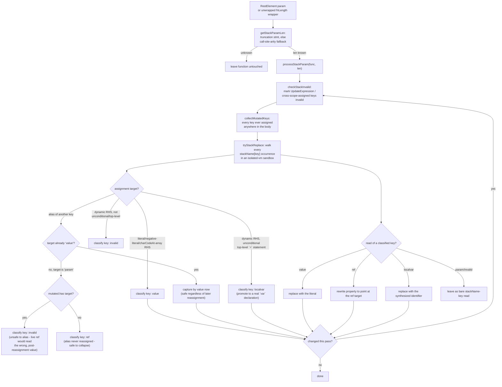

# jsconfuser/variable-masking.js + jsconfuser/function-length.js

## 1. Target

Reverses js-confuser's [VariableMasking](../../../js-confuser/transforms/variable-masking.md)
transform in two stages: `processStackParam` resolves what each slot *holds* (folding
literals, collapsing safe aliases, promoting an unconditional dynamic write to a local),
and `unmaskStack` then undoes the masking itself — the rest param becomes real
parameters again and every remaining slot becomes a real local variable.

## 2. Algorithm

**Learning the real original param count** (`getStackParamLen`) gates everything else,
since original params always occupy the leading `0..len-1` keys and must be left as bare
`stackName[i]` reads, never folded: primarily by scanning the body for the
`stackName["length"] = N` truncation statement the encoder inserts for non-"predictable"
functions; falling back, when no truncation statement exists (the common "predictable"
case), to inferring `len` from the function's own direct call sites — the maximum
argument count seen at any of them. The fallback is scoped to named `FunctionDeclaration`s
only and bails to `'unknown'` on any non-call reference, spread argument, or no calls
found — see Known Gaps for what this leaves unresolved.

**Folding** (`processStackParam`) loops `checkStackInvalid` + `tryStackReplace` (with the
shared `calculate-constant-exp` pass run between rounds) until nothing more folds,
reverting and retrying if a round turns out invalid partway through. Every
`stackName[key]` occurrence is walked in an `isolated-vm` sandbox and classified per key:
a literal/negated-literal/`charCodeAt`-array assignment folds to a **value**; an alias of
an already-classified key folds to a **ref** (only collapsed live if the aliased param is
never reassigned elsewhere — collapsing onto a reassigned param would read its
post-reassignment value instead of the value at the point of aliasing); a single
unconditional top-level dynamic assignment promotes to a **localvar** (a real `var`
declaration); anything else stays **invalid** (left as a raw array read/write, safe but
unpretty). **Identification is structural, never by name text** — every traversal here
resolves a match against the captured rest-param *binding*, not `.name` comparison, since
a nested masked function can be assigned the exact same rest-param name as its enclosing
function once `RenameVariables` runs, and a name-only match would misattribute the inner
function's own keys to the outer one.

**The stack is not always the rest param.** The encoder makes them the same binding
(`params = [restElement(stackName)]`); the copied-into-a-local form
`function (...rest) { var stk; [...stk] = rest; … }` is our own (item 4), and every slot
site then sits on that local. Both the truncation read and the un-masking resolve the stack
binding by following that copy when it is present, since reading the name off `params[0]`
there finds a binding whose only reference is the copy's right-hand side rather than a
member access, and declines. The copy is removed once real params are back. Two conditions
keep it unambiguous: the rest param must have exactly one reference (feeding the copy is its
only job — any other use means the array is still observable), and the alias binding's
single permitted write must be that copy.

**Un-masking** (`unmaskStack`) finishes what folding leaves standing, all-or-nothing per
function: rewrite the param list to `len` fresh identifiers, promote every remaining slot
key to a real local declared `var` at the top of the body, replace each access, and delete
the truncation statement. Gated on an **exact** length — the inferred call-site fallback is
never safe here, since an under-count would declare a real parameter as a local, which then
never receives its argument. `deVariableMasking` can only get one from the truncation
statement, but the requirement is exactness, not that source: a caller that knows the arity
structurally may supply it and drive `unmaskStack` directly, which is how a Dispatcher `fns`
entry (always zero-arity by its template) is un-masked despite never carrying a truncation
statement. **It deliberately does not consult `invalid`** — that marking exists to keep
*value substitution* safe, and promoting a slot to a real local needs none of it, so a slot
`checkStackInvalid` rejected (`stk[3]++`) un-masks perfectly well as `_local++`. Declines whenever the array
is observable as a value (a bare `stk` reference, a dynamic index, any `length` use beyond
the truncation write, an assignment to `stk` itself, or a body reading `arguments`, which
re-links to the params in sloppy mode with a named param list).

**A second un-masking route exists for the shape this decoder produces itself**
(`unmaskDestructuredRest`), where the two signals `unmaskStack` needs are both absent by
construction:

```js
function (...rest) { var a, b; [a, b] = rest; ... }  ->  function (a, b) { ... }
```

This shape is ours too (item 4): no `rest[i]` read survives it, there is no truncation
statement to read, and `resolveStackAlias` does not recognise it either — that accepts only
the single-`RestElement` form `[...stk] = rest`. **The pattern is its own exact param
count:** `len` plain `Identifier` elements with no `RestElement` tail bind exactly the
leading `len` slots, and the rest param having no other reference is what rules out an
unseen higher slot — so the signature is restorable without a length from anywhere else.
A declared-but-never-read original param is still dropped, changing `fn.length`, but a
function carrying a rest param already reports `0`, so restoring `len` can only move it
back toward the original. All-or-nothing like `unmaskStack`, and it declines on the same
`arguments` grounds.

**Two bounds on un-masking, neither of them closable.** Both used to sit under Known Gaps,
which framed a limit as outstanding work.

**A function the encoder judged "predictable" carries no truncation statement, and
`unmaskStack` has no other source of an exact length.** The gate is
`readTruncationLength(func) !== null`; `inferParamCountFromCallSites` feeds
`processStackParam` (folding) only and is deliberately never routed to un-masking, since an
under-count would declare a real parameter as a local that then never receives its argument.
So the un-maskable set is *every* predictable function, named or anonymous — not an
anonymous-function special case, and not something extending arity inference would close.
`unmaskDestructuredRest` does not reach these: it requires the slots to be *already* folded
away, and a function still carrying live `stk[i]` reads has, by that fact, a second reference
to the rest param and is declined.

`PREDICTABLE` is only set on named `FunctionDeclaration`s except where a transform marks a
function it emits, so a user-source anonymous function always keeps its truncation statement
and is un-maskable — the un-maskable set is not an "anonymous function" special case.

**`unmaskDestructuredRest` declines every element list that ends in a `RestElement`. This is
deliberate and load-bearing — not a gap — and the two censuses that settle it are worth more
than the decline itself.** `readFoldedElement` accepts `Identifier`, `ArrayPattern`/
`ObjectPattern` and `AssignmentPattern`; a `RestElement` falls past all three, so
`[a, b, ...c] = rest` is rejected at the element gate.

Under a breadcrumb the decline looks exactly like a gap, because the rejected sites clear
every *other* gate the function has — the rest-binding reference check, the assignment-shape
check and the non-empty-`ArrayPattern` check all pass, and the rejected element kind is
uniformly `RestElement` rather than a mixed population. Two censuses say otherwise, and both
were run only after a fix had been built and had to be reverted:

- **It costs no readability.** The residual-rest-masked-function census should read zero
  corpus-wide against a `.src.js` baseline of zero, and does. Every one of those declines is
  on an *intermediate* shape that no longer exists by the time output is generated — the
  tally measures the pipeline's interior, not its result
  ([encoder-decoder-method.md](../../../encoder-decoder-method.md) T6).
- **Accepting it breaks the decode wholesale.** Adding a `RestElement` branch to
  `readFoldedElement` (with the position and non-simple-parameter-list guards it needs)
  inflates decoded size by more than an order of magnitude, takes samples from
  runtime-correct to broken, and introduces indexed `arr[n]` reads against a baseline that
  had none. The shape is consumed by a later pass that needs it intact, so un-masking it
  early destroys the rest of the pipeline's input. Rebuild the branch and re-measure if that
  is ever doubted ([probes.md](../../probes.md)) rather than trusting a remembered figure.

So the surrounding comment's scoping — "`len` elements **with no `RestElement` tail**" — is
correct as written, and the exclusion it names is the reason the pass works. **Do not reopen
this from the site count**; it has already been paid for once.

## 3. Implementation

**Entry points** — either is enough to trigger a decode of the enclosing function: any
bare `RestElement` in a param list (`deVariableMasking`), or the shared
`{ph}_fnLength(fn, length)` wrapper (also produced by Dispatcher/RGF/Flatten under
`preserveFunctionLength`) — once unwrapped, the real `length` argument is handed directly
to `processStackParam`, a more reliable length signal than body-scanning when both apply.



**Dynamic-value promotion** (`processAssignLeft`/`tryStackReplace`), gated on the same
"runs exactly once, unconditionally, in place" precondition (`body_path.scope ===
father.scope` — a direct top-level statement, not nested inside an `if`/`for`/etc. — plus
a plain `=` operator): a single dynamic value's first (defining) occurrence rewrites the
whole `ExpressionStatement` into `var {uid} = <original RHS>;` (a fresh, scope-unique
identifier via `generateUidIdentifier`), evaluated exactly once at the original point;
every later occurrence references/reassigns `{uid}` directly. A destructured group of
locals (`[stackName[k1], stackName[k2], ...] = someArray;`, optionally ending in a
`RestElement`) is handled by `processArrayPatternAssign` and is all-or-nothing: it rebuilds
the pattern slot by slot, **recursing through nested `ArrayPattern` elements** — an original
parameter list like `(a, [b, c])` masks to a pattern of patterns — and any single element it
cannot resolve aborts the whole assignment rather than resolving the readable half, which
would split one slot into two spellings
([encoder-decoder-method.md](../../../encoder-decoder-method.md) W5). Three conditions
reject an element: a non-`stackName[key]` member, a key already marked invalid, and a key in
the leading `0..len-1` range, which is an original **parameter** — promoting one to a fresh
local silently changes the function's signature, a case a flat unpack line can never present
and a nested one can. When it matches, it's rewritten to a real `var [{uid1}, {uid2}, ...] =
someArray;` in one step. Both cases recrawl from
`getProgramParent()`, not just the function's own scope, after relocating the original
right-hand-side expression, since it can reference an outer-scope binding (a closed-over
variable, an enclosing function's own param) — a narrower `binding.scope.crawl()` would
leave that outer binding's reference count stale. `processAssignLeft`'s original
`if (right.isBinaryExpression())` early-invalidate branch was removed entirely so a
binary-expression right-hand side (`var x = a + b;`, arguably the single most common local
initialization shape in real code) falls through to this same fallback rather than being
invalidated on sight.

**`processArrayPatternAssign` rewrites the promoted slots' other references itself, in the
same call, rather than leaving them to the cache — and reports whether it rewrote.** Both
follow from `cache` being rebuilt by `initStackCache` on *every* `tryStackReplace` call: a
`localvar` registration made here does not survive into the next round of the enclosing
fixpoint loop, and by then the assignment that would re-register it has been replaced. The
member visitor in the same traversal only reaches sites it has not already walked past,
which excludes any inside a **nested function declared above the unpack line** — precisely
the references that would otherwise be left addressing a stack nothing populates any more.
Feeding the return value into the loop's `changed` flag is the other half: an iteration
whose only change was this rewrite would otherwise end the loop. Neither is visible from
reading the pass — both were found by diffing one decoded sample before and after, the
instrument [encoder-decoder-method.md](../../../encoder-decoder-method.md) T6 prescribes
for a pass that succeeds and emits wrong code.

**`unmaskDestructuredRest(func)`** runs first in the `RestElement` entry point and returns
early when it fires — the shape it handles has no slots left to fold, so nothing below it
can reach it. Its preconditions are all read off bindings rather than text: the rest param
must have exactly one reference and no `constantViolations`, that reference must be the
right-hand side of a top-level `[a, b] = rest` `ExpressionStatement` sitting directly in
the function body, every element must be a non-duplicate name read by `readFoldedElement`,
and every destructured name must bind to an initializer-less `VariableDeclarator` in this
function's own scope. Nothing may precede the destructuring except bare `var`
declarations — a read reaching one of those names ahead of it sees `undefined` today and
would see the argument afterwards. The rewrite sets the params, removes the destructuring
statement and the now-redundant declarators, then re-crawls from `getProgramParent()`
since a name can be read from a nested function.

**`readFoldedElement`** is why an element may be an `AssignmentPattern` and not only a
plain `Identifier`. A destructuring default and a parameter default fire on the same
condition — the value being `undefined` — so `[a, b = {}] = rest` and `(a, b = {})` mean
the same thing, and nothing runs before the destructuring for the difference in *when* the
default is evaluated to be observable (the preceding-statement rule above is what
guarantees that). Two things do not simply move, and are refused rather than relocated:

- **A default that reaches a binding declared inside the function.** A non-simple parameter
  list gets a parameter scope of its own, which cannot see the body's `var`s — so
  `[a, b = c] = rest` over a body-local `c` would silently start reading an outer `c`, or
  nothing. Every referenced identifier in the default is resolved and the element declined
  if one binds at or inside this function.
- **A body carrying a directive.** A non-simple parameter list is a `SyntaxError` in a
  function whose body opens with `"use strict"`, so the whole rewrite declines when any
  element has a default. Nothing about this can be spelled around.

Restricting elements to plain identifiers looked like the conservative reading and was not:
it declined the single population that most needed this rewrite, since the
[Dispatcher](dispatcher.md) template's fourth parameter carries an object default and every
dispatcher the [ControlFlowFlattening decode](control-flow.md) reconstructs therefore
arrives folded as `[a, b, c, d = {}] = rest`.

**`isOwnStackMember(path, stk_name, stkBinding)`** is the shared name-collision-safe
matcher every traversal in this file uses: it checks the name first (cheap early exit)
then resolves the actual binding at the match site (`path.scope.getBinding(stk_name)`) and
compares it against the binding captured once for the current function's own rest
param — by the bound identifier *node* (`binding.identifier`), not the `Binding` wrapper
object itself, since this file's own localvar/array-pattern promotion re-crawls the scope
mid-traversal, which rebuilds `Binding` objects for the same declaration.

**Un-masking mechanics.** `readSlotKey` deliberately does **not** use the shared
`safeGetName` helper: that helper reads a computed `stk[i]` as the key `"i"` — the
identifier's *name*, not the slot selected at runtime — which is only safe in the folding
paths above because they treat an unknown key as "leave alone" either way; trusting it
during un-masking would rewrite a dynamic access to a fixed variable. Negative-integer
mask keys (`UnaryExpression{-, NumericLiteral}`, one of the encoder's three random key
styles) are recognized via `safeGetName` delegating to `safeGetLiteral`, a shared helper
used across the jsconfuser visitors.

## 4. Upstream Effects

Both shapes item 2 has to un-mask *besides* the encoder's own come from the
[ControlFlowFlattening decode](control-flow.md), and the two scheduling dependencies below
are why this pass runs three times rather than once.

- **Every function that decode reconstructs gets a rest param, unconditionally** — so a
  function that the encoder never masked at all still arrives looking masked, and one it did
  mask arrives without either signal `unmaskStack` keys on. The fully-folded
  `[a, b] = rest` form is the same origin: the slots are resolved to plain locals fed by a
  single destructuring of that param, and that fold carries a **nested** element
  (`[a, [b, c]] = rest`) whenever the reconstructed function had a pattern parameter —
  `readFoldedElement` moves such an element into the parameter list unchanged, since it is
  the same destructuring performed one step earlier ([control-flow.md](control-flow.md) item
  4's emitted-shape table). Neither shape exists in encoder output, and reading
  the residue alone gets this backwards — the population was filed under the encoder's own
  no-length case and blamed on a masking quirk before it was measured
  ([encoder-decoder-method.md](../../../encoder-decoder-method.md) T1). The check that
  settles it is one count: absent in the `.obf.js`, present in the `.dec.js`, so it is ours.
- **The stack copied into a separate local**, `var stk; [...stk] = rest;`, has the same
  source and is why stack resolution follows a copy rather than reading `params[0]`. The
  copy arrives as *two* statements — a bare declaration and a separate assignment — so
  removing the copy is what makes the declaration dead, and removing that declaration is
  therefore this pass's job rather than a later cleanup's. `unmaskStack` deletes it
  reference-gated through `safeDeleteNode`, the same thing `unmaskDestructuredRest` already
  did for the declarators it consumes. Left standing it is not cosmetic: a bare
  zero-reference `var` at the head of every reconstructed masked function is a *statement*,
  and a sibling matcher keyed on a one-statement body declines on it
  ([global-concealing.md](global-concealing.md) item 4).
- **Mask keys can be spelled `stk[literals[4]]` until `duplicate-literal.js`'s late pass has
  run.** DuplicateLiteralsRemoval is encoder Order 22 and VariableMasking Order 20, so the
  array can hold this transform's own keys, and every such key reads as unmatchable — which
  fails the *whole enclosing function* closed, not just that slot. The early visits cannot
  see them; the third visit is scheduled after the array resolves for exactly this.
- **The program is inside the interpreter until the CFF decode runs**, so the early visits
  have almost nothing to match on a `high` sample. That is not a defect in them — they still
  fire on what is already at Program level — but it does mean a `+0` from an early visit says
  nothing about whether this pass works.
- **`unmaskDestructuredRest` reads the declaration *form* at two gates, and both sit on the
  split side** of [moved-declarations.md](moved-declarations.md) item 4's tables: the
  pre-destructuring scan requires every statement above the unpack to be an initializer-less
  declaration, and the name check requires each destructured name's declarator to carry no
  `init`. The second refusal is the one worth writing down, because **it is not protecting
  what it looks like it protects.** The rewrite removes the declarator, so keeping the
  initializer would silently drop a write the program makes — that much is real. But
  declining is not the only alternative: a **sole** declarator in a statement list is
  equivalent to the plain assignment it becomes once the name is promoted to a parameter, so
  the initializer can be *demoted* to an assignment rather than dropped. A **shared**
  declaration is different and still has to decline — splitting it would move declarators
  that are not this pass's to move. **Latent, and censusable rather than arguable:** the
  initialized-declarator case should read zero live sites across the unpack population,
  measured at the `duplicate-literal#2` cut ([probes.md](../../probes.md)). Worth the census
  rather than the argument, because the pass's own breadcrumb buckets stop at the element
  level and never break this check out, and "no pass of ours emits the joined spelling" says
  nothing about an author-written or encoder-written initialized declarator arriving here.

## 5. Known Gaps

None currently open. The two bounds that used to sit here — the predictable-function arity
limit and the `RestElement` decline — are in item 2: neither is incompleteness meant to
close, and framing a limit as outstanding work invites someone to "fix" it. The
`RestElement` one has already cost that once.

**The `fns`-entry population that also sat here is gone**, and both halves of it closed
without this file changing: the entries that stayed masked because their dispatcher declined
have no dispatcher left to decline ([dispatcher.md](dispatcher.md)), and the larger term —
entries `parseFnsEntry` reached and handed a `0` to, whose unpack line this pass then failed
to resolve — closed with `findUnpackLine`'s own fixes.

The standing check is item 2's axis, not a figure: the residual-rest-masked-function census
should read zero corpus-wide against a `.src.js` baseline of zero. **Re-run it rather than
quoting anything.** Every number this section used to carry went stale, and the last pair
survived two rounds of edits after it had stopped being true — which is why the numbers are
gone and the axis is what remains.

## Source

[`src/visitor/jsconfuser/variable-masking.js`](https://github.com/echo094/decode-js/blob/6c974fb5720518fac9c6b3d4cf558ba90ef9f8e7/src/visitor/jsconfuser/variable-masking.js) +
[`src/visitor/jsconfuser/function-length.js`](https://github.com/echo094/decode-js/blob/6c974fb5720518fac9c6b3d4cf558ba90ef9f8e7/src/visitor/jsconfuser/function-length.js), wired into
[plugin/jsconfuser.js](../../plugins/jsconfuser.md) — `variable-masking.js` runs
three times (before StringConcealing/Calculator; after, since resolving
concealed/split strings can unblock cache lookups that were previously
unreadable; and again after `duplicate-literal.js`'s late pass, since a mask key
extracted into that array is unreadable until it resolves), `function-length.js`
runs once, first.

## Fixtures

`test/visitor/jsconfuser/variable-masking/` — the folding classifier first (item 2's
value / ref / localvar split). **Un-masking is gated on an exact length, so a fixture without a
truncation statement folds but keeps its rest param:**

| fixture | what it pins |
|---|---|
| `alias-of-local-literal` | a literal slot folds to its **value**, and a slot aliasing it folds to that same value |
| `alias-of-param-predictable` | an alias of a param folds to a bare param read (**ref**); no truncation statement, so the signature is left masked |
| `alias-of-param-with-truncation` | the same source shape *with* the truncation statement — now un-maskable, so the rest param becomes a real one |
| `alias-of-reassigned-param-guard` | the alias is **not** collapsed onto a param reassigned later; it becomes a local holding the pre-reassignment value |
| `alias-copy-declaration` | the `var stk; [...stk] = rest;` copied-into-a-local form of item 2 |
| `negative-key-alias` | the `UnaryExpression{-, NumericLiteral}` mask-key style resolves like any other |
| `binary-expr-local-value` | a slot whose value is an expression over params is not constant, so it promotes to a **localvar** rather than folding |
| `dynamic-local-value` | a slot written from an opaque call promotes to a **localvar** |
| `params-only-predictable` | **declines** — a `PREDICTABLE` function carries no truncation statement, so no *exact* length exists and un-masking would risk declaring a real parameter as a local (item 2's first bound) |

Then un-masking, all-or-nothing per function:

| fixture | what it pins |
|---|---|
| `array-pattern-locals` | slots destructured from an array-pattern target become real `var` locals |
| `folded-nested-pattern` | `unmaskDestructuredRest` — a nested pattern element becomes a parameter in its own right |
| `unmask-nested-scope-slot` | a slot written in both arms of an `if` and then updated still promotes to one local |
| `unmask-dynamic-key` | **declines** — a dynamic index makes the array observable as a value (item 2's decline list) |
| `unmask-bare-stack-use` | **declines** — a bare `stk` reference, same reason |
| `unmask-arguments` | **declines** — a body reading `arguments` re-links to a named param list in sloppy mode |

`test/visitor/jsconfuser/function-length/` covers the other half of this doc's subject, the
`{ph}_fnLength(fn, length)` wrapper:

| fixture | what it pins |
|---|---|
| `named-function-declaration` | the wrapper's arity is read off the call's second argument |
| `default-length-omitted` | the omitted second argument, where the helper's own `length = 1` default supplies it |
| `inline-arrow-expression` | the wrapper around an arrow assigned to a variable, not a declaration |
| `rgf-shrunk-stub` | a target whose body RGF has already replaced, so the arity is all that is left to restore |
| `not-a-length-wrapper` | fails closed — a `defineProperty` helper with different descriptor flags |

`test/jsconfuser/rename-variables/variable-masking.*` covers the pass under renaming. The
standing check is item 2's axis rather than any fixture: the residual-rest-masked-function
census should read zero corpus-wide against a `.src.js` baseline of zero.
