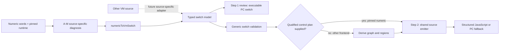

# VM switch boundary for reusable decoding

`decode-js-vm-switch.v1` is the in-memory handoff between a VM-specific frontend and the
shared source emitter. The pinned numeric `jsconfuser-vm` frontend now produces it. A separate
synthetic `source-switch` model exercises the same emitter without numeric wordcode. The
independent VM-2 benchmark has no source-derived adapter to this handoff.

## 1. Target

### Two-step VM decoding design

The decoder has two logical steps. The boundary between them is the **typed switch model**,
not generated JavaScript text. An executable switch-case rendering lets a person inspect
step one; step two consumes the same model directly, without parsing that rendering back.

| Step | Input and owner | Required result | What can remain |
|---|---|---|---|
| 1. VM-specific normalization | A frontend recognizes one encoder's interpreter, code, constants, storage, functions, transfers and handler semantics. | One typed case per admitted instruction, plus an executable PC-switch rendering with register variables. The rendering must preserve the encoded program's observable behavior under the admitted host conditions. | Encoder-introduced moves, register reuse, checks, calls, and effects stay visible. This step does not guess the original source structure. |
| 2. Shared recovery | The reusable backend reads typed cases and a qualified or inferred control plan. | Source-oriented JavaScript: structure branches and loops, remove proven redundant copies or unreachable code, and create narrower variables when data flow permits. | Explicit registers, PC dispatch, helpers, or checks remain wherever their removal or replacement is unproved. Original identifier names and exact lexical scopes are not recoverable in general. |

Each frontend chooses operations by the **actual VM handler semantics**. A handler using `**`
may lower to `**`; a handler using `Math.pow` retains that behavior unless equivalence has
been established for its admitted operands and host. The shared model needs to represent both
semantics without making either one a rule for all encoders. An unrepresentable operation
must decline rather than silently choose a similar JavaScript spelling. Step two may simplify
an encoder-introduced check or operation only after preserving its effects and failure behavior.

The arithmetic fixture demonstrates this split: its step-one rendering executes with the same
observed `window` effect as the encoded fixture under the same host bindings, while standalone
emission turns the branch into an `if`. It is a feasibility example, not proof that every
numeric input or another VM encoder is equivalent. The current standalone output still has
register variables, an explicit global check and `Reflect.set`; general dead-branch removal
and scoped-variable recovery are goals, not completed passes. The pinned numeric `EXP`
lowering still needs the semantic correction described below before it can support a general
step-one equivalence claim.

### Why a switch carrier

A VM has code, mutable storage, an entry, a location (usually a PC), operations, and transfers.
Binary bytes, numeric words, and JavaScript switch cases are different **source encodings** of
those concepts. A frontend resolves its encoding and runtime semantics into typed switch cases;
the backend consumes cases and storage without reading encoder opcodes or reparsing a rendered
switch string.

The explicit PC switch is the chosen executable review form: JavaScript handles dispatch and
native operations, while variables hold VM registers and cells hold captured state. It does
not assume that an encoder's original interpreter was itself written as a switch statement.



The solid paths are implemented for the pinned numeric baseline. The dashed arrow requires
its own source proof. The proposed [machine-IR contract](../vm2-machine-ir-contract.md)
describes the extra state a future VM-2 frontend may need; rendered switch text cannot
replace that proof.

The source and focused-test layout follows the two implemented responsibilities:

```text
src/vm/                 test/vm/
├── jsconfuser-vm/               ├── jsconfuser-vm/
│   ├── diagnose-standalone.js   │   ├── diagnose-standalone.test.js
│   ├── numeric-to-vm-switch.js  │   ├── numeric-to-vm-switch.test.js
│   └── decode-standalone.js     │   └── decode-standalone.test.js
└── switch/                      └── switch/
    ├── vm-switch-model.js           └── vm-switch-to-source.test.js
    ├── vm-switch-control.js
    └── vm-switch-to-source.js
```

The `jsconfuser-vm/` directory also owns container and wordcode analysis. The `switch/`
directory does not import that frontend. A future encoder gets its
own source-to-switch adapter and can reuse the model, control analysis, and source emitter.

## 2. Algorithm

The numeric frontend first validates container ownership, word widths, references, functions,
control, calls, captures, and completion through [standalone diagnosis](transforms/jsconfuser-vm/standalone-diagnosis.md).
`numericToVmSwitch` then maps each accepted instruction to one semantic case. It resolves
zero-key pool references to literal values or global names; converts call counts and the
`65535` spread sentinel into `fixed` or `array-register` argument records; converts register
arithmetic to native JS operator spellings; and keeps closure captures, handler operations,
and transfer targets explicit. The backend receives no serialized opcode or raw operand words.

A new frontend must perform the equivalent source-to-switch proof for its own code and storage.
It supplies a complete function/case census and typed operations with direct transfers. It may
also provide a qualified control plan when its own analysis has stronger control evidence. The
shared layer derives ordinary edges and structured regions from cases when the plan is omitted.
The validator checks the in-memory model's structure and references; it **does not** establish that
an arbitrary source program implements the supplied model. That source relation remains the
frontend's admission obligation. Unsupported source semantics must decline before publication.

The common emitter reads semantic operations, not the numeric opcode names. With no supplied
plan, `vm-switch-control.js` derives fallthrough, branch and completion edges, reachable cases,
unique branch reconvergence and natural loops. The structured emitter checks that every reachable
block can be emitted once with a complete exit. If the inferred shape cannot be represented, the
backend uses explicit PC dispatch; an indirect jump or handler stack selects that path directly.
The pinned numeric frontend retains its stronger Packet K qualified plan and its existing decline
behavior. The emitter applies the bounded adjacent-copy simplification, parses the fresh
JavaScript, and returns output plus a simplification record. The numeric wrapper separately checks
that its target's VM machinery identifiers are absent and publishes the existing frozen standalone
result. A failure at any step returns no partial output through that wrapper.

| Case shape without a supplied plan | Shared control decision | Output |
|---|---|---|
| Fallthrough and terminal completion only | Build one block per case; follow the rooted path. | Straight-line JavaScript. |
| Direct branch with one nearest reconvergence | Build a conditional region from both typed successors. | `if`/`else`, if complete structured emission succeeds. |
| Back edge to a dominating header with explicit exit | Build a natural-loop region. | `while`/`break`/`continue`, if complete structured emission succeeds. |
| Indirect jump or handler-stack operation | Select state-machine mode before structuring. | Explicit PC dispatch. |
| Other graph shape that fails complete structured emission | Discard the inferred structure and emit the typed cases in state-machine mode. | Explicit PC dispatch. |

## 3. Implementation

### In-memory model

This is an internal JavaScript object/`Map` contract, not a JSON transport or a source-derived
exact-machine proof. Schema changes require a new version. A caller cannot turn the synthetic
control into production evidence by changing `code.kind`.

| Field | Required shape | Consumer rule |
|---|---|---|
| `schemaVersion` | `decode-js-vm-switch.v1` | Exact equality. |
| `code` | `{kind, instructionCount, wordCount?}`; kind is `numeric-u32`, `binary`, or `source-switch` | `wordCount` is required for numeric code. The instruction census must match all cases. |
| `storage` | `{kind:'register-machine', functions:[{id,registerCount,captureCount}]}` | One unique storage identity per function, with counts equal to its frame record. |
| `functions.functions` | Ordered function records with numeric `id`, `startPc`, `regCount`, `paramCount`, `captureCount`, `hasRest` | Function zero is the root; entries and IDs are unique; parameters fit registers. |
| `instructionsByFunction` | `Map<functionId, case[]>`, each case `{pc,nextPc,operation}` | PC identities are unique, widths positive, and each entry has a case. Numeric source opcodes/words are absent. |
| `controlByFunction` | Optional `Map<functionId, control>` with `mode: structured | state-machine` | The shared planner derives this from cases when absent. A supplied structured plan includes blocks/leaves/edge references and shares each case's operation object with its leaf. |
| `structuredControl.edges` | Optional global edge inventory, supplied together with `controlByFunction` | The planner derives edges when absent. IDs are unique; structured block edges reference cases in their own function. |
| `instructionCount` | Total case count | Must equal `code.instructionCount` and the sum of function cases. |

`pc` is a case identity, not necessarily a byte or word offset. A binary or source-switch
frontend may assign stable numeric case IDs of its own. A directly targeted case must exist in
the same function; closure entry targets a function start; an operation with normal fallthrough
must have a `nextPc` case. An indirect jump must have a separately proven finite target relation
in the frontend's source-to-switch proof, even when the backend keeps PC dispatch.

### Operation and operand grammar

Register fields below are nonnegative integers below their function's `regCount`. Literal
values are JavaScript primitives (`undefined`, `null`, string, boolean, number, or bigint).
The validator allowlists native binary operators `+ - * / % ** & | ^ << >> >>> < > <= >= === !== == != in instanceof`
and unary operators `- + ! ~`. Operator text is never interpolated from unchecked input.

| Operation kind | Fields after `kind` | Semantic effect or transfer |
|---|---|---|
| `assign` | `destination`, `value` | Write one register. `value` is `literal`, `this`, `register(index)`, `binary(operator,left,right)`, `unary(operator,source)`, `typeof(source)`, or `undefined`. |
| `global-read`, `safe-typeof` | `destination,name` | Resolve a named global, or use the target's safe `typeof` rule. |
| `global-write` | `name,source` | Write a named global from a register. |
| `upvalue-read`, `upvalue-write` | `destination,index` or `index,source` | Access a captured cell. |
| `property-read`, `property-delete` | `destination,object,key` | JS property get or `Reflect.deleteProperty`. |
| `property-write` | `object,key,value` | `Reflect.set`, preserving operand order. |
| `call` | `mode,destination,callee,receiver,arguments` | `mode` is `apply` or `construct`; receiver is `{kind:'register',index}`, `{kind:'global'}`, `{kind:'null'}`, or `{kind:'none'}` for construction. `arguments` is `{kind:'fixed',registers:[...]}` or `{kind:'array-register',registers:[r]}`. |
| `closure` | `destination,entry,captures:[{kind,index}]` | Construct a closure with local or inherited upvalue cells. |
| `array`, `object` | `destination,elements:[r...]` or `destination,pairs:[{key,value}...]` | Ordered collection construction. |
| `accessor` | `accessor,object,key,callback` | Define a getter or setter, retaining the counterpart descriptor. |
| `for-in-setup`, `for-in-next` | `destination,source` or `destination,iterator,exit` | Create and advance an enumerable-key iterator. `for-in-next` writes only on its non-exit route. |
| `jump`, `branch`, `indirect-jump` | `target`; `condition,when,target`; or `source` | Transfer. `when` is `true` or `false`; branch fallthrough is `nextPc`. |
| `return`, `throw` | `source` | Function or abrupt completion. |
| `catch-setup`, `finally-setup`, `handler-pop` | Handler target and register fields, or none | Explicit handler-stack state. |
| `debugger` | none | Retained no-op in emitted output. |

The frontend supplies actual JavaScript semantics, not a familiar operation name guessed from
an opcode. The pinned numeric `EXP` lowering currently uses `**` while its runtime uses
`Math.pow`; the standalone result continues to report `finalJavaScriptSemantics:false`. A new
frontend must decline or add a checked semantic rule if its runtime differs from these forms.

### Validation and emission boundary

`validateVmSwitchModel` checks the envelope, function and storage identity, case census,
register ranges, operator allowlists, direct targets, closure entries, fallthrough, and any
supplied structured-leaf/edge consistency. `vm-switch-control.js` owns inferred control planning;
`vm-switch-to-source.js` owns source rendering, structured-region emission, state-machine
emission, copy proofs, and a fresh strict parse.
It does not import the numeric parser, diagnosis, or opcode table. The numeric wrapper owns its
additional residue scan and public frozen result schema.

A supplied structured plan's **semantic proof** is established before this handoff; in the numeric
path it comes from Packet K and the preceding A-M checks. An inferred plan is a control
transformation of typed cases, whose source meaning is still the frontend's obligation. The
validator's structural checks are not a substitute for a source-to-model proof, a complete
exceptional graph, or preserving ambient effects under the supported runtime scope.
The state-machine mode retains PC dispatch for a complete typed case relation when inferred
structuring cannot cover the graph. The frontend still proves that relation against the source,
including finite indirect targets and handler behavior. The shared emitter does not execute
source, helpers, or recovered output as part of decoding. State-machine emission includes its
handler stack and `try`/`catch` dispatch only when typed cases install a catch or finally
handler. A function without handler setup has a plain PC switch; a `handler-pop` case alone
still retains its stack.

### Inspecting the switch handoff

The [step-one renderer](../../decoder/decode-js/scripts/render-vm-switch.mjs) writes only
`switch-case.js` from an admitted numeric source. It emits one explicit PC case per typed
instruction, preserving operations introduced by encoding for later cleanup. The file contains
the recovered executable program, with no demo host shim or output logger. Run the command
from `decoder/decode-js`, using a fresh output directory:

```sh
node scripts/render-vm-switch.mjs \
  --source test/vm/jsconfuser-vm/fixtures/readability/arithmetic/encoded.js \
  --output-dir /tmp/decode-js-switch-review
```

The arithmetic example expects a `window` global. To run it in Node, supply that host
binding outside the generated file:

```sh
node --input-type=module -e 'globalThis.window = globalThis; await import("/tmp/decode-js-switch-review/switch-case.js"); console.log(globalThis.TEST_OUTPUT)'
```

The [script test](../../decoder/decode-js/test/scripts/render-vm-switch.test.js) executes the
encoded fixture and step-one output under the same host bindings and compares their `window`
effects. The `--emit-model` option also saves a portable `switch-model.json` for inspection;
`--model /path/to/switch-model.json` renders an existing one. The JSON uses `$type` tags to
retain JavaScript `Map`, `Set`, `BigInt`, `undefined`, and non-finite numeric values. Explicit
PC dispatch changes the presentation of the qualified control plan. It does not add a new
source proof or change the standalone decoder's published output. Host equivalence beyond
the exercised fixture remains subject to the frontend's admission contract.

## 4. Upstream effects and remaining gap

| Input path | Implemented handoff | Remaining admission work |
|---|---|---|
| Pinned numeric `jsconfuser-vm` | A-M diagnosis -> typed switch model -> shared validator/emitter -> numeric residue/publication wrapper. | Existing Phase-1 limits remain: visible numeric words/constants and supported control/semantics. |
| Synthetic source-switch test | Direct model with code/storage/cases -> shared control planner, validator and emitter, without numeric opcodes or a frontend region plan. | It proves the backend can construct linear, branch and loop output from cases; it is not a source extractor or production decoder. |
| Future independent VM-2 benchmark | No active frontend remains after removal of the private trial. | Source-derived machine validation, ordinary-runtime effect preservation, and a versioned adapter to this operation/graph domain are required. |
| Another encoder | Can implement source-to-switch without rewriting graph construction or emission if it fits this operation domain. | It must prove source ownership, effects, transfers and completion. New semantics require a versioned backend rule. |

A future adapter must project checked machine records to the typed switch contract; it cannot
reparse a review rendering to recover semantics. Code mutation and context/version partitions
exceed this v1 model and need an extended contract before use.

## 5. Known gaps

- No production source-switch or binary frontend exists. The synthetic source-switch test only
  checks the reusable emitter boundary.
- The v1 model represents an immutable register machine. Versioned code storage, multiple
  machine contexts, and arbitrary host operations are not expressible.
- Generic validation checks switch-model consistency, while each frontend owns source
  equivalence and qualification. The numeric wrapper retains the prior bounded success claim.
- Inferred structuring covers patterns accepted by the common emitter. Unsupported graph shapes
  retain explicit PC dispatch, so source-oriented output is not guaranteed for every encoder.

## Source

[numeric-to-vm-switch.js](../../decoder/decode-js/src/vm/jsconfuser-vm/numeric-to-vm-switch.js)
implements the numeric frontend adapter;
[vm-switch-model.js](../../decoder/decode-js/src/vm/switch/vm-switch-model.js)
implements the common schema and validator;
[vm-switch-control.js](../../decoder/decode-js/src/vm/switch/vm-switch-control.js)
derives control for a plan-free frontend;
[vm-switch-to-source.js](../../decoder/decode-js/src/vm/switch/vm-switch-to-source.js),
[vm-switch-copy-planning.js](../../decoder/decode-js/src/vm/switch/vm-switch-copy-planning.js),
and [vm-switch-structured-emitter.js](../../decoder/decode-js/src/vm/switch/vm-switch-structured-emitter.js)
implement common emission;
[render-vm-switch.mjs](../../decoder/decode-js/scripts/render-vm-switch.mjs)
provides the review artifact command; and
[decode-standalone.js](../../decoder/decode-js/src/vm/jsconfuser-vm/decode-standalone.js)
implements numeric publication.

## Fixtures

| Test or fixture | Claim pinned |
|---|---|
| [numeric-to-vm-switch.test.js](../../decoder/decode-js/test/vm/jsconfuser-vm/numeric-to-vm-switch.test.js) | Admitted numeric instructions become semantic cases without serialized opcodes or raw operands. |
| [vm-switch-to-source.test.js](../../decoder/decode-js/test/vm/switch/vm-switch-to-source.test.js) | Plan-free source-switch cases emit linear, branch and loop JavaScript; indirect transfer retains dispatch without an unrelated catch; typed handler setup retains catch dispatch; malformed operators, targets and case inventories decline. |
| [decode-standalone.test.js](../../decoder/decode-js/test/vm/jsconfuser-vm/decode-standalone.test.js) | The numeric adapter and shared emitter preserve the admitted corpus output and atomic decline. |
| [render-vm-switch.test.js](../../decoder/decode-js/test/scripts/render-vm-switch.test.js) | Source and saved-model rendering produce the same executable switch cases without an unrelated handler scaffold; encoded and step-one programs have the same arithmetic fixture `window` effect; an existing artifact is not overwritten. |
| [vm-copy-simplification.test.js](../../decoder/decode-js/test/vm/jsconfuser-vm/vm-copy-simplification.test.js) | Structured copy proofs preserve reaching-definition use identities. |
