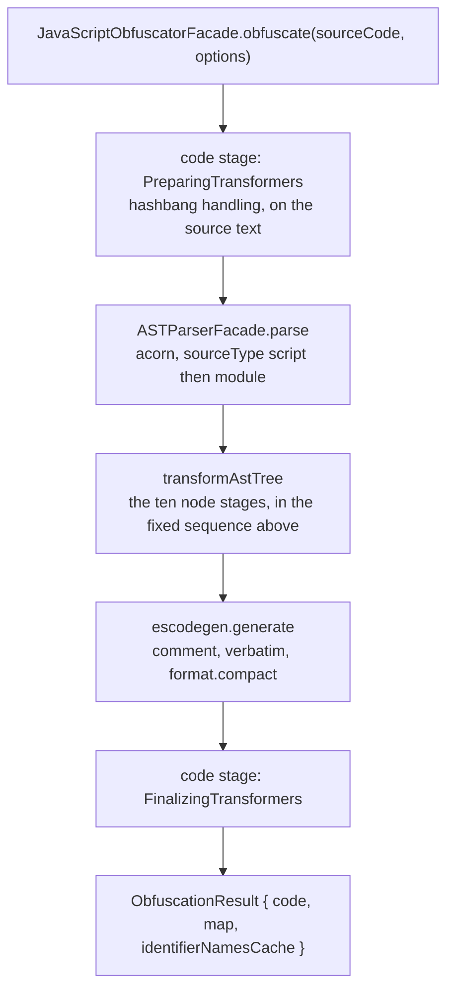
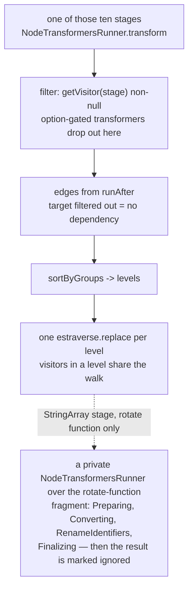

# javascript-obfuscator — Obfuscator Reference

Reference for the obfuscator vendored at `encoder/javascript-obfuscator` (submodule, pinned
`45ad03b` / tag `5.5.0`, upstream javascript-obfuscator/javascript-obfuscator).

**This package documents several eras, not one release.** Every version-dependent statement
cites an era ID from [versions.md](versions.md) and never an inline version range; the registry
is where a range, the tags it was read at, and their commit SHAs are stated together. Eras run
on **two levels** — one global `P-*` axis for the pipeline order, which this file covers, and
one `E-<component>-*` axis per transform for its own algorithm, which the transform docs cover
and which are not open yet. A statement cites the axis it is actually about. The pin, 5.5.0, sits in
`P-sorted-renameidents-3levels`. Where a claim is only true at some eras, it says so.

Upstream ships its own `CLAUDE.md` at the submodule root. It is third-party material aimed at
the obfuscator's own developers, it auto-loads whenever a tool runs with a working directory
inside the submodule, and it is **reference, not authority** — it states "Version: 5.0.0" while
the pin is 5.5.0, which is a fair summary of how much of it to trust without checking `src/`.
The hub's `SKILL.md` governs; on conflict `SKILL.md` wins.

Where a transform needs more detail than a doc here gives, upstream's `CHANGELOG.md` and the
`test/` tree (`functional-tests/`, `unit-tests/`, `runtime-tests/`, `fixtures/`) pin exact
before/after behaviour with concrete input/output.

## Skill Layout

Keyed on the components every obfuscator has — order, options, transforms, templates — not on
the submodule's directory tree. The crossing between the two is [source-map.md](source-map.md),
which is also where "which source file does no doc claim?" is answered.

```
skills/javascript-obfuscator/
├── javascript-obfuscator.md  this file — parser/generator foundation, the ten-stage
│                             pipeline and the execution flow
├── order.md                  how the execution order is assembled and how it has changed:
│                             what a level is at runtime, the three assembly mechanisms,
│                             the level structure per tag, the reproduction recipe.
│                             Infrastructure behind the pipeline above, not a transform
├── options.md                the option surface: which names exist at which release, their
│                             types and accepted values, and the two readings that establish
│                             them. Cross-cutting, so not under transforms/
├── presets.md                the four shipped complexity tiers — what each sets, how they
│                             nest, and where their contents move. A bundle of options, so it
│                             sits on top of options.md
├── corpus.md                 the encode recipe: version matrix x option sets x input
│                             fixtures, and the rules that make one build comparable to
│                             another. The harness itself is not tracked, only how to rebuild
│                             it
├── versions.md               the era registry: the global P-* axis and one E-<component>-*
│                             axis per transform — each ID's exact range and the commit its
│                             claims were read at. Cross-cutting, so not under transforms/
├── source-map.md             submodule source file → the doc that claims it, plus the
│                             exclusion rules that let a reverse lookup terminate
└── transforms/               one doc per transform or emitted shape, named for the shape and
    │                         never for a source file. Written as each unit is taken
    ├── escape-sequences.md          every string literal re-spelled with \xNN / \uNNNN, and
    │                                the verbatim channel that carries it to the output
    ├── statement-simplification.md  the trailing-run collapse and the seven `if` rewrites,
    │                                one doc because both share the collapse algorithm
    ├── statement-and-declaration-merging.md
    │                                adjacent same-kind siblings fused leftwards
    ├── directive-placement.md       "use strict" observed early, re-emitted at scope top
    ├── string-array.md              the array itself — membership, per-item encoding, the
    │                                order it is emitted in, and the use-site index arithmetic
    ├── string-array-rotate.md       the prepended IIFE that rotates the array back, and the
    │                                era where its trip count stops being stated in the file
    ├── string-array-calls-wrapper.md
    │                                the root accessor every use site calls, and its five
    │                                holder shapes
    └── string-array-scope-calls-wrapper.md
                                     the per-scope accessors that forward to it, their two
                                     emitted forms, and the padding that makes every argument
                                     look alike
```

**Four docs for one subsystem, because they are four components.** The array, the rotator, the
root calls wrapper and the per-scope calls wrappers change shape at *different* releases — no
release moves all four, and only `2.19.0` moves three — so each carries its own `E-sa-<part>-*`
axis in [versions.md](versions.md) and each gets its own doc.

**Planned, not yet written** — listed so the layout is legible as a whole and so
`source-map.md` has names to point at, not as a claim that anything is covered:

```
├── tests.md                  summary of encoder/javascript-obfuscator/test/ — layout and
                              where each transform's own cases live
├── templates/<name>.md       one per custom-code-helper template source file — the one
                              place source-tree mirroring applies, being a large flat
                              helper folder
└── utils/<name>.md           one per src/utils file that a transform doc needs to cite
```

**`transforms/` currently covers stages 2, 3, 4, 6, 8, 9 and 10.** What is left is stage 1
(`Initializing`, which emits no shape — it parentifies and attaches metadata) and stage 7,
`RenameIdentifiers`, which is irreversible by design and is therefore a census concern rather
than a transform to document. Stage 5, `RenameProperties`, remains undocumented as a full
transform, but the focused 5.4.0 release-note axes for private names and modern reserved names are
recorded in [versions.md](versions.md) as `E-renameprops-*`. Any file still unclaimed is reported
by `source-map.md`'s second question rather than left as silence.

**`templates/` and `utils/` do not exist yet**, and the layout above is where they would go if a
transform doc ever needs more template or helper detail than it can carry inline. The four
custom-code-helper templates are quoted directly in
[custom-code-helpers.md](transforms/custom-code-helpers.md) because they are short and there are
four of them; the rule that would split them out is bulk, not principle.

## Parser and Generator Foundation

javascript-obfuscator has no AST format of its own. It parses with **acorn** into a standard
**ESTree** tree, walks it with a vendored **estraverse**, and prints with a vendored
**escodegen**. Practically: every intermediate state in the pipeline is a valid ESTree program,
there is no bytecode or custom IR at any stage, and anything analysing the output can use the
same ESTree vocabulary rather than re-deriving one.

**Parsing** goes through
[`ASTParserFacade.parse`](https://github.com/javascript-obfuscator/javascript-obfuscator/blob/45ad03b8335bee095b17c0d29b0a78bff158c93a/src/ASTParserFacade.ts#L32-L48),
which tries
[`sourceType: 'script'` then `'module'`](https://github.com/javascript-obfuscator/javascript-obfuscator/blob/45ad03b8335bee095b17c0d29b0a78bff158c93a/src/ASTParserFacade.ts#L25)
and only reports an error if both fail. The caller's options
([`JavaScriptObfuscator.parseOptions`](https://github.com/javascript-obfuscator/javascript-obfuscator/blob/45ad03b8335bee095b17c0d29b0a78bff158c93a/src/JavaScriptObfuscator.ts#L38-L45))
set `allowHashBang`, `allowImportExportEverywhere`, `allowReturnOutsideFunction`, `locations`
and `ranges`;
[`parseType`](https://github.com/javascript-obfuscator/javascript-obfuscator/blob/45ad03b8335bee095b17c0d29b0a78bff158c93a/src/ASTParserFacade.ts#L56-L80)
then forces `allowReserved`, `allowSuperOutsideMethod` and `allowAwaitOutsideFunction: false`
over the top, and collects comments into `program.comments` via `onComment`.

Two consequences worth carrying: **a top-level `return` parses**, because
`allowReturnOutsideFunction` is on — so obfuscated output may legitimately contain one at
program level, and any tool that re-parses that output has to permit it too. And **the accepted
syntax level moves with the version**: `ecmaVersion` reads `12` at 2.9.6 through 2.12.0, `13`
at 2.15.3 through 5.4.3, and `2026` from 5.4.4 through the
[5.5.0 pin](https://github.com/javascript-obfuscator/javascript-obfuscator/blob/45ad03b8335bee095b17c0d29b0a78bff158c93a/src/constants/EcmaVersion.ts#L3).
The 5.4.3/5.4.4 change is output-relevant: the former rejects ES2025 RegExp inline modifiers,
while the latter accepts and preserves their pattern/flags. A focused adjacent-tag census pins the
exact acceptance and emitted forms.
These are parser acceptance eras, not claims about support in any runtime engine.

**Printing** is
[`escodegen.generate`](https://github.com/javascript-obfuscator/javascript-obfuscator/blob/45ad03b8335bee095b17c0d29b0a78bff158c93a/src/JavaScriptObfuscator.ts#L259-L282)
with
[`comment: true`, `verbatim: 'x-verbatim-property'`, `sourceMapWithCode: true`](https://github.com/javascript-obfuscator/javascript-obfuscator/blob/45ad03b8335bee095b17c0d29b0a78bff158c93a/src/JavaScriptObfuscator.ts#L50-L54)
and `format.compact` from the `compact` option. `verbatim` is the escape hatch a transformer
uses to emit a literal exactly as it wants it printed rather than as escodegen would re-derive
it — the mechanism behind any spelling in the output that ESTree alone does not explain.

The generator is also a release dependency, not just a printer implementation detail. In compact
output through `5.4.0`, `return`, `throw` and `typeof` could run into a following non-BMP
identifier; `5.4.1` updates escodegen so the required separator is retained. A focused
`5.4.0`/`5.4.1` comparison pins the old and fixed emitted forms. Through `5.4.4`, an arrow function containing `in` could be emitted
without the parentheses required when it appeared in a `for` initializer, producing an unparseable
program. `5.4.5` updates escodegen and opens `E-generator-arrow-noin-parentheses`, where that arrow
is parenthesized. The paired generator eras and their exact bounds are recorded in
[versions.md](versions.md).

**Traversal** is `estraverse.replace`. The pipeline never walks the tree once per transformer —
transformers are grouped into *levels*, and a level shares a single walk with its visitors
merged into one `enter` and one `leave`. What that means for what any given transformer sees is
the whole of [order.md](order.md)'s "What a level is at runtime", and it is the fact most likely
to make an otherwise-correct reading of a transform wrong.

## The Pipeline

Two kinds of transformer run: **code transformers** over the source text (hashbang handling
only) before parse and after generate, and **node transformers** over the ESTree AST in the ten
stages below. Everything that shapes the output is a node transformer.

The sequence below is the one in force from 1.12.1 onward, unchanged through the pin. It is
the *end* of a sequence that changed repeatedly below that — and even where the sequence holds,
the within-stage ordering and the gating keep moving, which is what the 23 `P-*` eras in
[versions.md](versions.md) record. How the order is built, why it moves without the sequence
changing, and what it looked like earlier are all in [order.md](order.md).

| # | Stage | Gated on | What it is for |
|---|---|---|---|
| 1 | `Initializing` | — | comment collection |
| 2 | `Preparing` | — | parentification, scope/metadata setup, obfuscating guards, **injection of every custom code helper** |
| 3 | `DeadCodeInjection` | `deadCodeInjection` | dead block injection |
| 4 | `ControlFlowFlattening` | `controlFlowFlattening` up to `P-sorted-deadcode-renameidents`; **ungated from `P-sorted-sa-controlflow` (3.2.0)**, where the transformers gate themselves instead | block- and function-level control-flow flattening |
| 5 | `RenameProperties` | `renameProperties` | property renaming |
| 6 | `Converting` | — | literal/expression/object/member rewriting, string splitting |
| 7 | `RenameIdentifiers` | — | identifier renaming |
| 8 | `StringArray` | — | the string array, its rotate function and its wrappers |
| 9 | `Simplifying` | `simplify` | statement and declaration merging, if-simplification |
| 10 | `Finalizing` | — | escape sequences, directive placement, eval-call handling |

Two facts that the sequence alone hides, and that a reader will otherwise get wrong:

- **The custom code helpers are injected at stage 2, not at the end.** `SelfDefending`,
  `DebugProtectionFunction`, `ConsoleOutputDisable`, domain lock and the string-array helpers
  all enter through `CustomCodeHelpersTransformer` during `Preparing`. Every later stage then
  obfuscates the helpers themselves, and their strings are candidates for the string array
  built at stage 8.
- **`Converting` (6) runs before `StringArray` (8).** Object-key extraction, member-expression
  rewriting, `SplitString` and numerical-expression conversion have all already happened by the
  time the array is built, so the array's contents are the *converted* strings.

## Execution Flow

Two diagrams, because the flow has two scales and drawing them as one produces a picture that
is mostly whitespace. The first is text-to-text; the second is what happens inside any one of
its ten stages. The ten stages themselves are not redrawn here — they are the table above,
which carries their gating and purpose besides.





## Source

- Parser and generator:
  [`src/ASTParserFacade.ts`](https://github.com/javascript-obfuscator/javascript-obfuscator/blob/45ad03b8335bee095b17c0d29b0a78bff158c93a/src/ASTParserFacade.ts),
  [`src/constants/EcmaVersion.ts`](https://github.com/javascript-obfuscator/javascript-obfuscator/blob/45ad03b8335bee095b17c0d29b0a78bff158c93a/src/constants/EcmaVersion.ts),
  [`src/JavaScriptObfuscator.ts`](https://github.com/javascript-obfuscator/javascript-obfuscator/blob/45ad03b8335bee095b17c0d29b0a78bff158c93a/src/JavaScriptObfuscator.ts)
  (read at 5.5.0).
- The stage sequence's own sources, and the assembly behind it: [order.md](order.md).

## Fixtures

The pipeline is primarily source-verified and transform-specific skills own their behavioral
fixtures. Focused adjacent-tag encoder comparisons cover the compact keyword-spacing and parser
boundaries at `5.4.0`/`5.4.1` and `5.4.3`/`5.4.4`. A focused `5.4.4`/`5.4.5` fixture additionally
output-verifies the generator's `NoIn` boundary.
