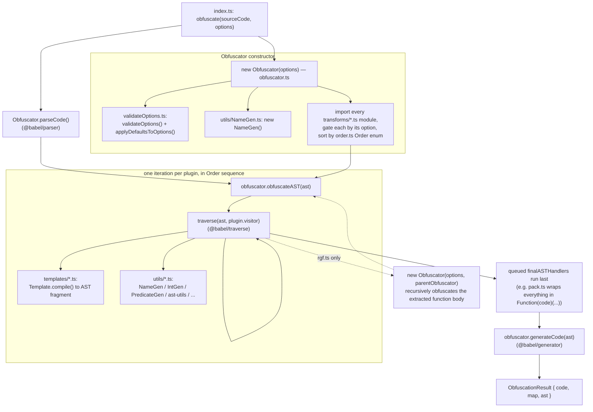

# js-confuser — Obfuscator Reference

Reference for the obfuscator vendored at `encoder/js-confuser` (submodule, pinned
`31c5a47` / package `js-confuser@2.1.3`, upstream MichaelXF/js-confuser).

When a transform's algorithm needs more detail than this reference provides, upstream's
`CHANGELOG.md` and the [test suite](tests.md) (`encoder/js-confuser/test/`, especially
each transform's own `transforms/*.test.ts` file) are good next places to look — the
tests in particular pin down exact before/after behavior with concrete input/output
examples.

## Babel Foundation

js-confuser is built entirely on [Babel](https://babeljs.io/) — it has no custom
parser, printer, or AST format of its own. Every transform in this reference is a
Babel-visitor-shaped plugin operating on a standard Babel AST:

- **`@babel/parser`** parses source into the AST (`Obfuscator.parseCode()`).
- **`@babel/traverse`** walks the AST and applies each transform's `visitor`
  (`NodePath`, `Scope`, and `Binding` — used throughout this reference for scope and
  reference tracking — are Babel's own abstractions, not anything js-confuser built).
- **`@babel/types`** (imported as `t` everywhere in source) constructs and type-checks
  AST nodes: `t.callExpression(...)`, `t.isIdentifier(...)`, etc.
- **`@babel/generator`** prints the final AST back to source text
  (`Obfuscator.generateCode()`).

Practically: every AST shape documented in this reference is valid, parseable
JavaScript at every intermediate pipeline stage — there's no custom bytecode or
intermediate representation — and any tooling built to analyze or reverse these
transforms can lean on the same Babel APIs (`NodePath`/`Scope`/`Binding`) rather than
re-deriving scope and reference information from scratch.

Only these four packages are runtime `dependencies` in `package.json` (pinned
`^7.28.x`); `@babel/cli` and the rest of `devDependencies` just build js-confuser's own
TypeScript source and aren't part of the obfuscation engine itself.

## Skill Layout

```
skills/js-confuser/
├── js-confuser.md        this file — Babel foundation, source/pipeline layout, and
                          execution flow: the core encode workflow and algorithm
├── options.md            the ObfuscateOptions surface — cross-cutting, not scoped to
                          a single transform, so it isn't under transforms/
├── validate-options.md   the validateOptions.ts entry point — runs once, so it isn't
                          under utils/ alongside the per-file helper docs
├── plugin-api.md         the transforms/plugin.ts scaffolding (me.*, {ph}) every
                          transform is built on
├── constants.md          the NodeSymbol flags and shared string constants referenced
                          throughout this reference
├── template-engine.md    the templates/template.ts base class every templates/*.ts
                          file (and most transforms directly) builds AST fragments from
├── result-profiling.md   the obfuscationResult.ts return-value types — not part of
                          the transform pipeline itself
├── tests.md              summary of encoder/js-confuser/test/ — Jest project structure,
                          directory breakdown, cross-links back into transforms/ + utils/
├── transforms/           AST pattern each transform produces, and (where
                          non-trivial) how one would go about inverting it — see
                          Pipeline Order below for the full list, in execution order
│   └── <name>.md
├── templates/            what one templates/*.ts file provides and which
                          transform(s) consume it (xorStringTemplate.ts and
                          getGlobalTemplate.ts are the two exceptions — covered
                          inline in the transform docs that consume them instead)
│   ├── buffer-to-string-template.md
│   ├── dead-code-templates.md
│   ├── integrity-template.md
│   ├── set-function-length-template.md
│   └── tamper-protection-templates.md
└── utils/                what one utils/*.ts file provides and which transform(s)/
                          sections consume it
    ├── ast-utils.md
    ├── function-utils.md
    ├── gen-utils.md
    ├── int-gen.md
    ├── name-gen.md
    ├── node.md
    ├── object-utils.md
    ├── predicate-gen.md
    └── static-utils.md
```

## Source Layout (`encoder/js-confuser/src/`)

```
src/
├── constants.ts
├── index.ts
├── obfuscationResult.ts           return-value types for index.ts's entry points
├── obfuscator.ts
├── options.ts
├── order.ts                       Order enum — drives pipeline sequence
├── presets.ts                     low / medium / high built-in presets
├── validateOptions.ts
├── templates/                     reusable AST-fragment generators (Template class)
│   ├── template.ts
│   ├── bufferToStringTemplate.ts
│   ├── deadCodeTemplates.ts
│   ├── getGlobalTemplate.ts
│   ├── integrityTemplate.ts
│   ├── setFunctionLengthTemplate.ts
│   ├── tamperProtectionTemplates.ts
│   └── xorStringTemplate.ts
├── transforms/                    one file (or subfolder) per pipeline stage
│   ├── astScrambler.ts
│   ├── calculator.ts
│   ├── controlFlowFlattening.ts
│   ├── deadCode.ts
│   ├── dispatcher.ts
│   ├── finalizer.ts
│   ├── flatten.ts
│   ├── minify.ts
│   ├── opaquePredicates.ts
│   ├── pack.ts
│   ├── plugin.ts                  shared plugin scaffolding, not a transform itself
│   ├── preparation.ts             shared plugin scaffolding, not a transform itself
│   ├── renameLabels.ts
│   ├── rgf.ts
│   ├── variableMasking.ts
│   ├── extraction/
│   │   ├── duplicateLiteralsRemoval.ts
│   │   └── objectExtraction.ts
│   ├── identifier/
│   │   ├── globalConcealing.ts
│   │   ├── movedDeclarations.ts
│   │   └── renameVariables.ts
│   ├── lock/
│   │   ├── integrity.ts
│   │   └── lock.ts
│   └── string/
│       ├── encoding.ts
│       ├── stringConcealing.ts
│       ├── stringEncoding.ts
│       └── stringSplitting.ts
└── utils/                         name/int generators, opaque-predicate generation,
    ├── IntGen.ts                  and Babel AST helpers used across transforms
    ├── NameGen.ts
    ├── PredicateGen.ts
    ├── ast-utils.ts
    ├── function-utils.ts
    ├── gen-utils.ts
    ├── node.ts
    ├── object-utils.ts
    ├── random-utils.ts
    └── static-utils.ts
```

## Pipeline Order (`encoder/js-confuser/src/order.ts`)

Transforms run in this fixed order; later stages see the output of earlier ones:

| # | Transform |
|---|-----------|
| 0 | [Preparation](transforms/preparation.md) (always on — AST normalization + safety tagging, not user-configurable) |
| 1 | [ObjectExtraction](transforms/object-extraction.md) |
| 2 | [Flatten](transforms/flatten.md) |
| 3 | [Lock](transforms/lock-integrity.md) |
| 4 | [RGF](transforms/rgf.md) |
| 6 | [Dispatcher](transforms/dispatcher.md) |
| 8 | [DeadCode](transforms/dead-code.md) |
| 9 | [Calculator](transforms/calculator.md) |
| 12 | [GlobalConcealing](transforms/global-concealing.md) |
| 13 | [OpaquePredicates](transforms/opaque-predicates.md) |
| 16 | [StringSplitting](transforms/string-splitting.md) |
| 17 | [StringConcealing](transforms/string-concealing.md) |
| 20 | [VariableMasking](transforms/variable-masking.md) |
| 22 | [DuplicateLiteralsRemoval](transforms/duplicate-literals-removal.md) |
| 24 | [ControlFlowFlattening](transforms/control-flow-flattening.md) |
| 25 | [MovedDeclarations](transforms/moved-declarations.md) |
| 27 | [RenameLabels](transforms/rename-labels.md) (cosmetic, pure renaming) |
| 28 | [Minify](transforms/minify.md) |
| 29 | [AstScrambler](transforms/ast-scrambler.md) |
| 30 | [RenameVariables](transforms/rename-variables.md) (cosmetic, pure renaming) |
| 35 | [Finalizer](transforms/finalizer.md) |
| 36 | [Pack](transforms/pack.md) |
| 37 | [Integrity](transforms/lock-integrity.md) |

Presets (`src/presets.ts`) just toggle/weight which of these run — `low` enables the
lightest subset (calculator, deadCode, dispatcher, duplicateLiteralsRemoval, identifier
renaming, movedDeclarations, objectExtraction, stringConcealing, astScrambler);
`medium`/`high` add controlFlowFlattening, globalConcealing, opaquePredicates,
stringSplitting, stringEncoding, variableMasking, and `pack`. `renameVariables` and
`renameLabels` are cosmetic (pure renaming) — never worth reversing, just re-run a
minifier/pretty-printer over the result. For the full option surface (individual knobs,
not just presets), see [options.md](options.md).

By far the most involved transform is
[ControlFlowFlattening](transforms/control-flow-flattening.md) (~1900 lines in
`transforms/controlFlowFlattening.ts`) — everything else in the pipeline is comparatively
mechanical (string/array manipulation, identifier substitution, or simple wrapping).

## Execution Flow (`encoder/js-confuser/src/obfuscator.ts`)



Supporting infrastructure referenced throughout the transform docs — none of it a
pipeline stage on its own — is documented outside this file (see [Skill
Layout](#skill-layout) above for the full index): option bootstrapping in
[validate-options.md](validate-options.md), the shared `me.*` API in
[plugin-api.md](plugin-api.md), the `NodeSymbol` flags in [constants.md](constants.md),
helper modules under [utils/](utils/), the AST-fragment builder in
[template-engine.md](template-engine.md) and its consumers under
[templates/](templates/), and the return-value/profiler types in
[result-profiling.md](result-profiling.md).
