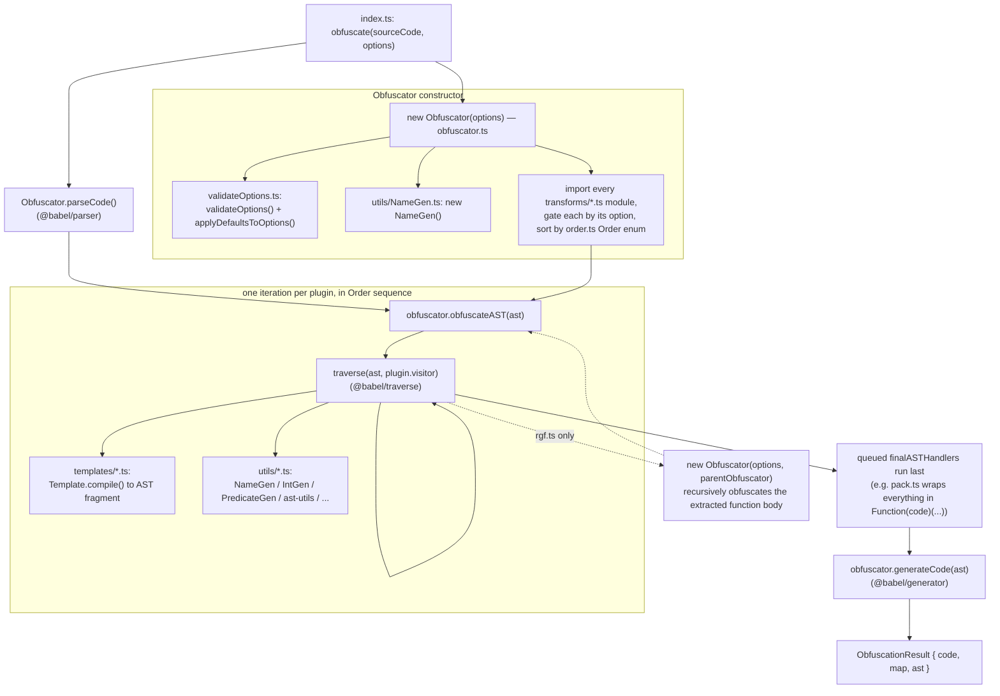

# js-confuser — Obfuscator Reference

Reference for the obfuscator vendored at `encoder/js-confuser` (submodule, pinned
`31c5a47` / package `js-confuser@2.1.3`, upstream MichaelXF/js-confuser).

## Skill Layout

```
skills/js-confuser/
├── js-confuser.md    this file — index: pipeline order + links to each transform
└── transforms/
    └── <name>.md      AST pattern the transform produces, and (where non-trivial)
                        how one would go about inverting it
```

## Source Layout (`encoder/js-confuser/src/`)

```
src/
├── constants.ts
├── index.ts
├── obfuscationResult.ts
├── obfuscator.ts
├── options.ts
├── order.ts                       Order enum — drives pipeline sequence
├── presets.ts                     low / medium / high built-in presets
├── validateOptions.ts
├── templates/                     reusable AST-fragment generators (Template class)
│   ├── template.ts
│   ├── bufferToStringTemplate.ts
│   ├── deadCodeTemplates.ts
│   ├── getGlobalTemplate.ts
│   ├── integrityTemplate.ts
│   ├── setFunctionLengthTemplate.ts
│   ├── tamperProtectionTemplates.ts
│   └── xorStringTemplate.ts
├── transforms/                    one file (or subfolder) per pipeline stage
│   ├── astScrambler.ts
│   ├── calculator.ts
│   ├── controlFlowFlattening.ts
│   ├── deadCode.ts
│   ├── dispatcher.ts
│   ├── finalizer.ts
│   ├── flatten.ts
│   ├── minify.ts
│   ├── opaquePredicates.ts
│   ├── pack.ts
│   ├── plugin.ts                  shared plugin scaffolding, not a transform itself
│   ├── preparation.ts             shared plugin scaffolding, not a transform itself
│   ├── renameLabels.ts
│   ├── rgf.ts
│   ├── variableMasking.ts
│   ├── extraction/
│   │   ├── duplicateLiteralsRemoval.ts
│   │   └── objectExtraction.ts
│   ├── identifier/
│   │   ├── globalConcealing.ts
│   │   ├── movedDeclarations.ts
│   │   └── renameVariables.ts
│   ├── lock/
│   │   ├── integrity.ts
│   │   └── lock.ts
│   └── string/
│       ├── encoding.ts
│       ├── stringConcealing.ts
│       ├── stringEncoding.ts
│       └── stringSplitting.ts
└── utils/                         name/int generators, opaque-predicate generation,
    ├── IntGen.ts                  and Babel AST helpers used across transforms
    ├── NameGen.ts
    ├── PredicateGen.ts
    ├── ast-utils.ts
    ├── function-utils.ts
    ├── gen-utils.ts
    ├── node.ts
    ├── object-utils.ts
    ├── random-utils.ts
    └── static-utils.ts
```

## Execution Flow (`encoder/js-confuser/src/obfuscator.ts`)



## Pipeline order (`encoder/js-confuser/src/order.ts`)

Transforms run in this fixed order; later stages see the output of earlier ones:

| # | Transform |
|---|-----------|
| 0 | Preparation (internal setup, not a user-visible transform) |
| 1 | [ObjectExtraction](transforms/object-extraction.md) |
| 2 | [Flatten](transforms/flatten.md) |
| 3 | [Lock](transforms/lock-integrity.md) |
| 4 | [RGF](transforms/rgf.md) |
| 6 | [Dispatcher](transforms/dispatcher.md) |
| 8 | [DeadCode](transforms/dead-code.md) |
| 9 | [Calculator](transforms/calculator.md) |
| 12 | [GlobalConcealing](transforms/global-concealing.md) |
| 13 | [OpaquePredicates](transforms/opaque-predicates.md) |
| 16 | [StringSplitting](transforms/string-splitting.md) |
| 17 | [StringConcealing](transforms/string-concealing.md) |
| 20 | [VariableMasking](transforms/variable-masking.md) |
| 22 | [DuplicateLiteralsRemoval](transforms/duplicate-literals-removal.md) |
| 24 | [ControlFlowFlattening](transforms/control-flow-flattening.md) |
| 25 | [MovedDeclarations](transforms/moved-declarations.md) |
| 27 | RenameLabels (cosmetic, pure renaming) |
| 28 | [Minify](transforms/minify.md) |
| 29 | [AstScrambler](transforms/ast-scrambler.md) |
| 30 | RenameVariables (cosmetic, pure renaming) |
| 35 | [Finalizer](transforms/finalizer.md) |
| 36 | [Pack](transforms/pack.md) |
| 37 | [Integrity](transforms/lock-integrity.md) |

Presets (`src/presets.ts`) just toggle/weight which of these run — `low` enables the
lightest subset (calculator, deadCode, dispatcher, duplicateLiteralsRemoval, identifier
renaming, movedDeclarations, objectExtraction, stringConcealing, astScrambler);
`medium`/`high` add controlFlowFlattening, globalConcealing, opaquePredicates,
stringSplitting, stringEncoding, variableMasking, and `pack`. `renameVariables` and
`renameLabels` are cosmetic (pure renaming) — never worth reversing, just re-run a
minifier/pretty-printer over the result.

By far the most involved transform is
[ControlFlowFlattening](transforms/control-flow-flattening.md) (~1900 lines in
`transforms/controlFlowFlattening.ts`) — everything else in the pipeline is comparatively
mechanical (string/array manipulation, identifier substitution, or simple wrapping).
