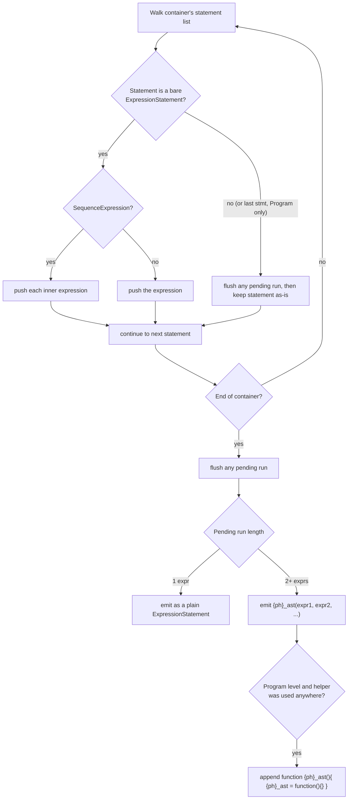

# AstScrambler

Source: [`transforms/astScrambler.ts`](https://github.com/MichaelXF/js-confuser/blob/31c5a47a79f97e4b4c2d4b2a8552c11a8b548fb0/src/transforms/astScrambler.ts) — `Order.AstScrambler = 29`, one of the last
stages to run (only `RenameVariables`, `Finalizer`, `Pack`, and `Integrity` run later).

## 1. Target

Obscure statement boundaries without changing program behavior at all: merge every run of
consecutive bare expression statements into one no-op call, so a reader can no longer tell
where one original statement ended and the next began. A purer obfuscation than a
transform like `Minify` that changes the AST's actual semantics-preserving-but-different
shape — this one doesn't alter structure so much as hide where the original boundaries
were.

## 2. Algorithm

A single `exit` visitor on the `Block|SwitchCase` alias (matches `Program`,
`BlockStatement`, and `SwitchCase` bodies alike) walks each container's statement list and
merges every run of consecutive bare `ExpressionStatement`s into a single call expression,
using one shared no-op helper function for the whole `Program`:

```javascript
// before
a = 1;
a++;
a++;
if (a > 0) {
  a *= 2;
}

// after
{ph}_ast(a = 1, a++, a++);
if (a > 0) {
  a *= 2;
}
function {ph}_ast() {
  {ph}_ast = function () {};
}
```

Since JavaScript evaluates call arguments strictly left-to-right, folding `a; b; c;` into
`{ph}_ast(a, b, c)` preserves every side effect and their original order exactly — the
call itself does nothing observable (the helper immediately reassigns itself to an empty
no-op function on its first invocation, so subsequent runs of the same helper elsewhere in
the file are all separately no-ops too).

Scheduled deliberately late in the pipeline (`Order.AstScrambler = 29`, after nearly every
other optional transform), so its per-container merge also sweeps up statements those
earlier transforms inserted — a [ControlFlowFlattening](control-flow-flattening.md) goto's
assignment sequence, a [Lock](lock-integrity.md) guard, a
[Dispatcher](dispatcher.md)-generated statement — into the same no-op call, indistinguishably
from user code.

## 3. Implementation

`SequenceExpression`s are flattened into the same argument list rather than kept nested,
and a lone leftover expression is emitted as a plain `ExpressionStatement` rather than
wrapped in a size-1 call. At `Program` level specifically, the very last statement is
never folded in even if it's a bare expression — its completion value is observable, which
is exactly why it's exempted.



`callExprName` (the shared helper's name) is declared once, outside the returned visitor
object, so every merge point across the whole file shares the same helper. Only
`ExpressionStatement`s are ever merged — directives such as `"use strict"` don't parse as
one, and declarations/control flow aren't expressions at all.

## 4. Downstream Effects

- **`RenameVariables` (Order 30)** renames the shared no-op helper's name, with no
  functional or structural effect — nothing about this transform's own output is
  identified by name anywhere downstream (see the decoder doc's Algorithm).

## 5. Known Quirks

None currently documented.
