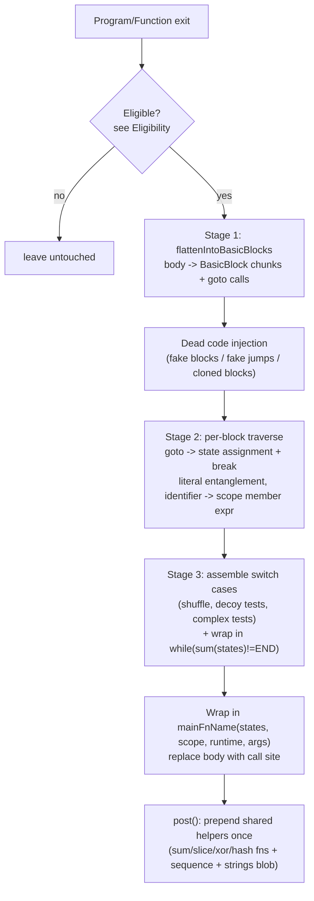

# ControlFlowFlattening

Source: [`transforms/controlFlowFlattening.ts`](https://github.com/MichaelXF/js-confuser/blob/31c5a47a79f97e4b4c2d4b2a8552c11a8b548fb0/src/transforms/controlFlowFlattening.ts)
(1914 lines, by far the most complex transform in the pipeline) — `Order.ControlFlowFlattening = 24`.

Upstream docs: [`docs/ControlFlowFlattening.md`](../../../encoder/js-confuser/docs/ControlFlowFlattening.md)
(good intuition-level walkthrough of the goal; this file covers the actual mechanics
verified against source).

## 1. Target

Convert straight-line control flow into an opaque state machine: every eligible
`Program`/`Function` becomes a `switch`/`while` interpreter loop driven by a shared state
vector, so control flow, literal values, and identifier names all become indirect through
that vector — a static reader can no longer follow which statement runs next, what a
literal's real value is, or which variable a reference names, without symbolically
executing the machine.

## 2. Algorithm

Every `Program` and every `Function` is visited independently on `exit`, and each one that
qualifies (see Eligibility, Implementation) gets rewritten **independently** into its own
self-contained state machine — a nested function doesn't become a case inside its parent's
machine, it becomes a separate re-entrant call into a **new** state machine with its own
state-vector space.

Three stages, per eligible function: **Stage 1** splits the body into basic blocks
connected by goto calls (optionally injecting dead-code blocks/jumps that no real edge
ever reaches). **Stage 2** walks each block and entangles every literal, identifier, and
goto through the shared state vector — a real jump becomes a state-vector assignment plus
`break`, a boolean/number/string becomes an arithmetic or XOR expression over the vector's
current values, and every local variable becomes a member access on a shared scope object.
**Stage 3** assembles the blocks into shuffled `switch` cases (with decoy tests and
"complex" tests standing in for the literal discriminant) inside a `while` keyed on a sum
of the state vector. A shared set of Program-level helpers (the sum/slice/xor/hash
functions, plus the packed sequence and string blobs) is prepended once per Program.

## 3. Implementation

### Eligibility (`cffMain`)

[`controlFlowFlattening.ts#L165-L246`](https://github.com/MichaelXF/js-confuser/blob/31c5a47a79f97e4b4c2d4b2a8552c11a8b548fb0/src/transforms/controlFlowFlattening.ts#L165-L246)
skips a function/program body if any of:

- Previously flagged `CFF_UNSAFE` (see below) — e.g. contains `this`, bare
  `arguments`, `super`/`new.target`/`await`/`yield`.
- Inside a `"use strict"`-enforcing block.
- Body has fewer than 3 statements.
- Fails the user's `controlFlowFlattening` probability threshold.
- Is `async`/generator (functions only).
- Has an illegal node: the *same* binding name is defined by two different
  binding identifiers directly inside this function (would collide once locals
  become member expressions on one shared scope object — see Stage 2).

`CFF_UNSAFE` is set by a handful of standalone visitors that run alongside `cffMain`
in the same plugin: `ThisExpression`, a `VariableDeclaration` with more than one
declarator, `arguments`/the variable-masking placeholder identifier, and
`Super|MetaProperty|AwaitExpression|YieldExpression`
([`controlFlowFlattening.ts#L1832-L1852`](https://github.com/MichaelXF/js-confuser/blob/31c5a47a79f97e4b4c2d4b2a8552c11a8b548fb0/src/transforms/controlFlowFlattening.ts#L1832-L1852)).
It marks the *entire enclosing function or program*, so one disqualifying node
anywhere inside skips CFF for that whole scope (nested functions are still each
judged independently against their own contents).

### Stage 1 — Flatten into Basic Blocks

[`flattenIntoBasicBlocks`](https://github.com/MichaelXF/js-confuser/blob/31c5a47a79f97e4b4c2d4b2a8552c11a8b548fb0/src/transforms/controlFlowFlattening.ts#L653-L943)
walks the statement list and builds a `Map<label, BasicBlock>`
([`BasicBlock` class, L438-L594](https://github.com/MichaelXF/js-confuser/blob/31c5a47a79f97e4b4c2d4b2a8552c11a8b548fb0/src/transforms/controlFlowFlattening.ts#L438-L594)).
A `BasicBlock` is a virtual `NodePath<BlockStatement>` plus:

- `label` — the placeholder string key in `basicBlocks`.
- `totalState` — a random int from `stateIntGen` (unique per block).
- `stateValues` — a full vector over every `stateVars[i]`, 90% copied
  positionally from the shared `sequence` array, the rest (`dynamicIndexes`,
  8-12 random slots) randomized, with exactly one dynamic slot corrected so
  `sum(stateValues) === totalState` (`L560-L579`).

"goto" is a real call expression to a magic function name
(`GOTO__{ph}__IF_YOU_CAN_READ_THIS_THERE_IS_A_BUG`) inserted during Stage 1 and
only turned into a state-assignment + `break` during Stage 2
([`GotoControlStatement`, L618-L625](https://github.com/MichaelXF/js-confuser/blob/31c5a47a79f97e4b4c2d4b2a8552c11a8b548fb0/src/transforms/controlFlowFlattening.ts#L618-L625)).

Per-statement handling in the walk ([L664-L942](https://github.com/MichaelXF/js-confuser/blob/31c5a47a79f97e4b4c2d4b2a8552c11a8b548fb0/src/transforms/controlFlowFlattening.ts#L664-L942)):

- **`import`** — hoisted verbatim to `prependNodes`, never flattened (L668-671).
- **`function` declarations** (if `flattenFunctionDeclarations`, not
  async/generator/unsafe/strict) — outlined into their own basic-block chain and
  replaced at hoist point by `var fnName = function(){...}` wrapping a call into
  this function's *own* state machine (see "Outlined nested functions"). If
  illegal to flatten, it's still converted to a `var` function-expression
  assignment (not flattened) so re-declaration semantics survive being hoisted
  (L700-716, referencing encoder Test #43/#44 in comments).
- **`if` statements** with block consequent/alternate — replaced with an
  `if(test) goto consequent; else goto alternate;` pair, and the consequent/
  alternate bodies become their own basic blocks chained back to a shared
  `afterPath` label (L804-860). Non-block consequents/alternates are **not**
  flattened by this transform (left as normal statements, possibly still inside a
  block that is itself a basic block). Recursion into nested statement lists
  only happens for an `if`'s own consequent/alternate — `flattenIntoBasicBlocks`
  is never called on a loop or `switch`'s body, so an `if` nested inside a
  `for`/`while`/`switch` is untouched too (verified empirically: a plain
  `if/else` nested inside a `for` loop survives with its structure fully
  intact, entangled contents aside). Combined with the loops/switches
  discrepancy noted below (Known Quirks), **the only `if` statements this
  decoder needs to fold back are ones that were directly in the flattened
  function/program's top-level statement sequence** (or nested inside another
  such `if`'s own branches) — any `if` sitting inside a loop or `switch` body
  was never converted in the first place and needs no decoder attention at all.
- **Last top-level expression statement** — converted to a `return` (only at
  `Program` level, for REPL/`eval()`-style final-expression-value semantics,
  L862-873).
- **Chunk splitting heuristic** — after every statement, `chance(50 +
  currentBlock.body.length)` may end the current block and start a new one once
  it already has 2+ statements (L875-883) — this is *not* driven by real control
  flow, purely a randomized chunk-size choice.
- **`/* @js-confuser-assert */` comment** — a niche escape hatch: hashes a
  user-asserted numeric value via the shared `HashFunction` (L45-89) so later
  mangled-literal math can reference "a value I can prove is `X` at runtime"
  instead of only referencing other state vars (L885-937, L1396-1420). Marks the
  block with `.assertions`.

**Dead code injection** (after Stage 1, still before Stage 2), three independent
mechanisms, only if `addDeadCode`
([L955-L1039](https://github.com/MichaelXF/js-confuser/blob/31c5a47a79f97e4b4c2d4b2a8552c11a8b548fb0/src/transforms/controlFlowFlattening.ts#L955-L1039)):

1. **Fake unreachable chunks** (2-6x) — a new `BasicBlock{impossible:true}` whose
   only content is `goto <random existing label>`. Nothing ever jumps *to* this
   block's own label, so it's dead by construction.
2. **Fake jumps spliced into real blocks** (3-6x) — `if(<false predicate>){ goto
   <random label> }` inserted into an existing real block, before its real
   `goto` call so Minify won't strip it. The predicate is built from
   `createFalsePredicate()` (comparing a real `stateVars[i]` against a value that
   is statically known — at obfuscation time — not to match, `L482-538`), so it's
   provably-false but only if you already know that block's `stateValues`.
3. **Cloned-but-unreachable chunks** (1-4x) — deep-clones an existing block's
   statements into a new `impossible:true` block (skipped if the original
   contains a `Declaration`, to avoid duplicate bindings). Like (1), nothing
   jumps to its label.

`impossible` blocks still get a switch case and a slot in the shuffled case list —
they just have no real incoming edge.

### Stage 2 — goto resolution, literal entanglement, scope flattening

For each `BasicBlock`, one Babel `Visitor` traverses just that block's body
([L1049-L1468](https://github.com/MichaelXF/js-confuser/blob/31c5a47a79f97e4b4c2d4b2a8552c11a8b548fb0/src/transforms/controlFlowFlattening.ts#L1049-L1468)),
closing over that block's own `stateValues` (`currentStateValues`):

- **`CallExpression` (goto → state update)**
  ([L1335-L1464](https://github.com/MichaelXF/js-confuser/blob/31c5a47a79f97e4b4c2d4b2a8552c11a8b548fb0/src/transforms/controlFlowFlattening.ts#L1335-L1464)) —
  for each `stateVars[i]` whose value differs between the current block and the
  jump target, emit an assignment. If `addRelativeAssignments`, it's not
  `stateVar = newValue` but `stateVar += (newValue - oldValue)`, and that diff
  itself is further mangled as `anotherStateVar - (anotherStateVar's current
  value - diff)` (`mangledNumericLiteral`, L1378-1395) — optionally routed
  through the assertion hash instead of a plain state var
  (`mangledAssertion`, L1397-1420) if the target block carries an assertion.
  All these assignments for one jump are packed into a single
  `SequenceExpression`, followed by a real `break <switchLabel>;` (L1454-1461).
- **`BooleanLiteral`** ([L1097-L1131](https://github.com/MichaelXF/js-confuser/blob/31c5a47a79f97e4b4c2d4b2a8552c11a8b548fb0/src/transforms/controlFlowFlattening.ts#L1097-L1131)) —
  100% chance by default. Replaced with `stateVars[i] == X` or `!=` X, chosen so
  the comparison evaluates (at that block's known `stateValues[i]`) to the
  original boolean.
- **`NumericLiteral`** ([L1133-L1176](https://github.com/MichaelXF/js-confuser/blob/31c5a47a79f97e4b4c2d4b2a8552c11a8b548fb0/src/transforms/controlFlowFlattening.ts#L1133-L1176)) —
  50% chance, integer-only, `|value| <= 100_000`. Replaced with
  `stateVars[i] + (value - stateValues[i])`.
- **`StringLiteral`** ([L1178-L1252](https://github.com/MichaelXF/js-confuser/blob/31c5a47a79f97e4b4c2d4b2a8552c11a8b548fb0/src/transforms/controlFlowFlattening.ts#L1178-L1252)) —
  100% chance, length 3-5000. XOR-encrypted with a random key `num`
  (`xorEncodeString`), the ciphertext (plus 0-5 random decoy chars on each side)
  appended to one shared `{ph}_strings` blob string, and the literal replaced
  with `xorFn(stateVars[i] + (num - stateValues[i]), offset, length)` — i.e. the
  XOR key is itself entangled the same way a bare number would be, and the
  offset/length pair addresses this block's ciphertext slice within the shared
  blob.
- **`Identifier` → scope member expression**
  ([L1255-L1313](https://github.com/MichaelXF/js-confuser/blob/31c5a47a79f97e4b4c2d4b2a8552c11a8b548fb0/src/transforms/controlFlowFlattening.ts#L1255-L1313)) —
  every `var`/`let`/`const` binding local to the flattened function gets
  renamed and rewritten as `scopeVar["propName"]["memberName"]`, where
  `propName` names *which lexical scope* owns it (one `ScopeManager` per Babel
  `Scope`, chained via `.parent` back to ancestor scopes still inside this same
  flattened function) and `memberName` is the (re-generated) variable name
  inside that scope. A direct-call identifier callee gets wrapped
  `(1, X.Y.Z)()` to preserve non-`this`-bound call semantics.
- **`ReturnStatement`** ([L1316-L1332](https://github.com/MichaelXF/js-confuser/blob/31c5a47a79f97e4b4c2d4b2a8552c11a8b548fb0/src/transforms/controlFlowFlattening.ts#L1316-L1332)) —
  top-level returns (inside the flattened function itself, not a nested real
  function) are rewritten to `(didReturnVar = true, returnArgument)` so the
  outer call site (Stage 3/wiring) can tell "the state machine hit a real
  `return`" apart from "the state machine reached its end label normally."

**Key reversal-relevant fact:** every mangled literal's correcting constant
(`value - stateValues[i]`, or the XOR key's diff, or the boolean's comparison
value) is computed from **that specific block's** `stateValues` vector — the
same source-level number produces a different obfuscated expression in every
block it appears in. There is no way to undo literal entanglement without first
knowing each block's full state vector.

### Stage 3 — Switch/While assembly

[L1470-L1634](https://github.com/MichaelXF/js-confuser/blob/31c5a47a79f97e4b4c2d4b2a8552c11a8b548fb0/src/transforms/controlFlowFlattening.ts#L1470-L1634):

- Any `ScopeManager` that is used, not yet initializing-required-false, and
  isn't the entry block's own scope gets an explicit
  `scopeVar["propName"] = {}` prepended to its `initializingBasicBlock`
  (L1477-1486) — this is what makes a scope-object's shape (which properties
  exist) block-position-dependent, not just function-position-dependent.
- Blocks are **shuffled** (`addFakeTests`, L1490-1492) before becoming
  `SwitchCase`s — case order in the source has no relationship to execution
  order.
- Each case's test (`L1499-1589`):
  - 50% chance (`addComplexTests`) of a **complex test**: instead of the literal
    `totalState`, emit `stateVars[j] - diff` for some other slot `j`, with extra
    `&&`-chained `stateVars[k] != otherTotalState` clauses added whenever another
    block's total state would otherwise numerically collide with this expression
    for a *different* `stateVars[j]` value (clash avoidance, `L1513-1548`).
  - 50% chance (`addFakeTests`) of **decoy duplicate case labels**: 1-3 extra
    `case <random unused state int>:` entries with empty bodies stacked
    (fallthrough-style) in front of the real case, then the whole test list
    shuffled — so a real block's case can be preceded by cases that share no
    code with it.
- **Discriminant**: `{sumFnName}(statesVar)` — literally "sum the states array"
  (prepended once per program, `L1866-1872`). The `while` condition is
  `discriminant !== endTotalState` (`L1623-1633`).
- The whole thing is a labeled statement (`switchLabel: switch(...) {...}`)
  inside the `while`, so `break switchLabel` (emitted in Stage 2) exits one
  iteration and lets the `while` re-evaluate the sum.

**Outlined nested functions.** Each function that got outlined in Stage 1 becomes,
after Stages 2-3 build its *own* switch/while, a `FunctionExpression` wrapping a
call into a **shared** per-`Program`/per-outer-function `mainFnName`
([L1645-L1685](https://github.com/MichaelXF/js-confuser/blob/31c5a47a79f97e4b4c2d4b2a8552c11a8b548fb0/src/transforms/controlFlowFlattening.ts#L1645-L1685)) —
important correction to the naive mental model: **there is one `mainFnName`
per CFF application (one per originally-eligible Program/Function), not one per
outlined nested function.** All chunks belonging to that Program/Function
— including chunks from its outlined nested `function` declarations — live in
the *same* `basicBlocks` map and the *same* `while`/`switch`. An outlined
function's "body" is simply the state vector that lands you at its own entry
label; calling it means invoking `mainFnName` again, re-entrantly, with that
label's `stateValues` as the initial state (plus the current `scope` object
chain and packed arguments).

- `createCallExpression(stateValues, argNodes)` builds
  `mainFnName(getSpreadArray(stateValues), ...argNodes)`.
- `getSpreadArray` ([L1729-L1769](https://github.com/MichaelXF/js-confuser/blob/31c5a47a79f97e4b4c2d4b2a8552c11a8b548fb0/src/transforms/controlFlowFlattening.ts#L1729-L1769))
  compresses a state vector for printing: runs of ≥2 values that positionally
  match the shared `sequence` array become `...{ph}_cff_slice(i, j)` spread
  elements; everything else prints as a literal number.
- Parameters are always `(states, scope = {startScopeObject}, runtime, ...args)`
  in that fixed order (`argVar` param dropped entirely if never used,
  L1703-1706); the entry call site for the *original* body omits the ellipsis
  args and instead default-initializes `scope` to the entry block's own
  captured scope object (L1687-1701).

### Program-level wiring (`post`)

Once per Program (not per CFF application), if any CFF application in that
program happened at all
([L1823-L1912](https://github.com/MichaelXF/js-confuser/blob/31c5a47a79f97e4b4c2d4b2a8552c11a8b548fb0/src/transforms/controlFlowFlattening.ts#L1823-L1912)),
four things get prepended to the program body once:

1. `{ph}_cff_sum(array)` — plain reduce-sum, this is the shared discriminant fn.
2. `{ph}_cff_slice(min, max)` — `sequence.slice(min, max)`, backs the
   `getSpreadArray` compression.
3. The XOR string-decode function (`xorDecodeStringTemplate`, from
   `templates/xorStringTemplate.ts`) plus the packed `{ph}_strings` blob
   literal and the `{ph}_cff_sequence` numeric array literal.
4. `{ph}_cff_hash(int)` — the `HashFunction` template (`L45-66`), only actually
   *called* if the `@js-confuser-assert` escape hatch was used anywhere.

Every function this pass modified is marked `UNSAFE` afterward
(`functionsModified`, `L1825-1827`) — later transforms in the pipeline won't
touch the flattened bodies.

## 4. Downstream Effects

- **`RenameVariables` (Order 30)** reassigns *every* identifier — including CFF's own
  runtime helper names (`_cff_sum`, `_cff_slice`, `_cff_xor`, `_strings`,
  `_cff_sequence`, and the entry function's own name) — to random strings, with zero
  functional effect. Any identification of these helpers keyed on name text (rather than
  structure or a captured binding) breaks completely once this stage runs.
- **`Minify` (Order 28)** rewrites this transform's own output in three ways: strips the
  `BlockStatement` wrapper from a single-statement `while` body
  (`while(x)switch(y){...}` instead of `while(x){switch(y){...}}`); rewrites a
  scope-member chain's bracketed string key (`a["k"]`) to bare dot notation (`a.k`)
  whenever the key is a valid identifier name (which this transform's randomly-generated
  scope-object placeholder names almost always are); and prints this transform's
  `return undefined;` block terminator as a bare `return;`.
- **`MovedDeclarations` (Order 25)** can rewrite the entry-harness `var` slots
  (`didReturn`/`result`) into bare assignments, with the declaration hoisted to the block
  top or packed into the enclosing function's parameters — and can parameter-pack the
  `_main` `FunctionDeclaration` itself into the enclosing function's own parameter list
  (plus a prepended `if (!X) { X = function… }` guard), so it is no longer directly
  visible as a top-level `FunctionDeclaration` at all.
- **`AstScrambler` (Order 29)** merges consecutive `ExpressionStatement`s into one no-op
  call, spreading any `SequenceExpression` — including this transform's own
  goto-assignment sequence — into the flat argument list. This dissolves the
  single-statement partition this transform prints every goto as; the original partition
  can't be recovered (the merge is many-to-one), only inferred.

## 5. Known Quirks

**Discrepancy from the upstream doc, verified against the pinned source:** the
upstream doc claims CFF "is able to flatten" `If`, `For`, `While`/`DoWhile`, and
`Switch` statements alike. The pinned source's `flattenIntoBasicBlocks`
([L664-L942](https://github.com/MichaelXF/js-confuser/blob/31c5a47a79f97e4b4c2d4b2a8552c11a8b548fb0/src/transforms/controlFlowFlattening.ts#L664-L942))
only has dedicated goto-conversion logic for `if` statements with block
consequent/alternate; there is no `ForStatement`/`WhileStatement`/`SwitchStatement`
handling at all (the one loop-related hook, `excludeLoops`, is dead/commented-out
code, L168-172). Confirmed empirically by obfuscating a plain `for`, `while`, and
`switch` with only `controlFlowFlattening: true`: all three survive as complete,
structurally-untouched native JS nodes embedded whole inside one switch `case` —
only literals/identifiers *inside* them get entangled by Stage 2, same as anywhere
else. This is likely a stale doc left over from an earlier version of the
transform; treat the upstream page's "Flattening Control Structures" section as
inapplicable to this pinned commit.
