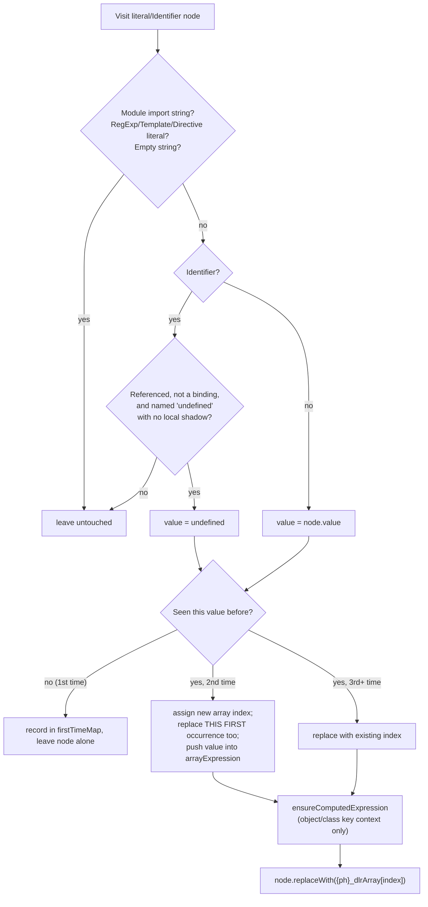

# DuplicateLiteralsRemoval

Source: [`transforms/extraction/duplicateLiteralsRemoval.ts`](https://github.com/MichaelXF/js-confuser/blob/31c5a47a79f97e4b4c2d4b2a8552c11a8b548fb0/src/transforms/extraction/duplicateLiteralsRemoval.ts) — `Order.DuplicateLiteralsRemoval = 22`.

## 1. Target

Break the link between a repeated literal value and its syntactic context: every literal
that appears more than once in the program collapses onto one shared array slot, so a
static scan or diff against the source no longer sees which occurrences shared a value —
only indexed reads into a data array that carries no naming or context of its own.

## 2. Algorithm

A single whole-program scan visits every literal-shaped node — strings, booleans, numbers,
null, and one specific identifier case (a referenced, unshadowed `undefined`) — and any
value seen more than once (including its first occurrence, retroactively) gets extracted
into one shared array; every occurrence becomes an indexed read into that array instead.

```js
// before
var a = 5;
var b = 5;

// after
const {ph}_dlrArray = [5];
var a = {ph}_dlrArray[0];
var b = {ph}_dlrArray[0];
```

Scheduled deliberately late in the pipeline (`Order.DuplicateLiteralsRemoval = 22`, after
almost every other optional transform) so its one whole-program scan also sweeps up
literals other transforms happened to leave behind — a [Calculator](calculator.md)
dispatch function's operator-key string, a [StringConcealing](string-concealing.md) decode
helper's loop-counter constants, and so on — indistinguishably from any other duplicated
literal.

## 3. Implementation



Key points, all confirmed against the pinned source (not inferred):

- **A value only earns an array slot on its *second* sighting** — the first
  occurrence is provisionally recorded in `firstTimeMap`
  ([`duplicateLiteralsRemoval.ts#L110-L132`](https://github.com/MichaelXF/js-confuser/blob/31c5a47a79f97e4b4c2d4b2a8552c11a8b548fb0/src/transforms/extraction/duplicateLiteralsRemoval.ts#L110-L132))
  and left as a plain literal until (if ever) a duplicate shows up. A value used
  exactly once anywhere in the program is never touched.
- **`Identifier` nodes are only ever collected for one specific case**: a
  referenced (non-binding) `undefined` with no local binding shadowing it
  ([`duplicateLiteralsRemoval.ts#L61-L81`](https://github.com/MichaelXF/js-confuser/blob/31c5a47a79f97e4b4c2d4b2a8552c11a8b548fb0/src/transforms/extraction/duplicateLiteralsRemoval.ts#L61-L81)).
  Every other identifier (variable names, property-key identifiers, etc.) is
  skipped outright — this pass never touches ordinary variable references.
- **Negative numbers never appear as array elements.** Babel parses `-7` as
  `UnaryExpression{-, NumericLiteral(7)}`, and the node-type selector above only
  matches the inner `NumericLiteral` (always non-negative as Babel represents
  it) — the surrounding unary minus is invisible to this pass and is left
  wrapping whatever the inner node currently is, original literal or
  `{ph}_dlrArray[i]` alike. `createLiteral`'s own negative-number branch
  ([`utils/node.ts#L28-L37`](https://github.com/MichaelXF/js-confuser/blob/31c5a47a79f97e4b4c2d4b2a8552c11a8b548fb0/src/utils/node.ts#L28-L37))
  is therefore dead code from this transform's point of view — confirmed
  empirically (obfuscating `var a = -7; var b = -7;` produces
  `const {ph}_dlrArray=[7]; var a=-{ph}_dlrArray[0]; var b=-{ph}_dlrArray[0];`,
  never a stored `-7`).
- **Excluded node shapes**: `RegExpLiteral`/`TemplateLiteral`/`DirectiveLiteral`
  (already normalized away or structurally unlike the other four by the time
  this stage runs), module-import string specifiers, and empty strings
  (`""` is deliberately kept inline, never deduplicated
  — [`duplicateLiteralsRemoval.ts#L107-L108`](https://github.com/MichaelXF/js-confuser/blob/31c5a47a79f97e4b4c2d4b2a8552c11a8b548fb0/src/transforms/extraction/duplicateLiteralsRemoval.ts#L107-L108)).
- **Object/class member keys are eligible too**, since by the time this stage
  runs (`Order.DuplicateLiteralsRemoval = 22`), `Preparation`'s own
  unconditional `MemberExpression`/`Property|Method` exit visitors
  ([`preparation.ts#L222-L247`](https://github.com/MichaelXF/js-confuser/blob/31c5a47a79f97e4b4c2d4b2a8552c11a8b548fb0/src/transforms/preparation.ts#L222-L247) —
  `console.log` → `console["log"]`, `{ key: 1 }` → `{ "key": 1 }`, always, for
  every js-confuser output regardless of which optional transforms are
  enabled, `constructor` excepted) have already turned every non-computed
  member access and object/class-method key into a plain `StringLiteral` in
  computed position. `ensureComputedExpression`
  ([`ast-utils.ts#L59-L69`](https://github.com/MichaelXF/js-confuser/blob/31c5a47a79f97e4b4c2d4b2a8552c11a8b548fb0/src/utils/ast-utils.ts#L59-L69))
  only has real work left to do for `ClassProperty` (class field) keys, which
  `Preparation`'s `Property|Method` visitor doesn't cover.
- If no value ever repeats, `arrayExpression.elements.length === 0` and nothing
  is inserted at all
  ([`duplicateLiteralsRemoval.ts#L144`](https://github.com/MichaelXF/js-confuser/blob/31c5a47a79f97e4b4c2d4b2a8552c11a8b548fb0/src/transforms/extraction/duplicateLiteralsRemoval.ts#L144)).

## 4. Downstream Effects

Three later encoder stages reshape this transform's own output before the file is done:

- **[Minify](minify.md) (Order 28)** re-spells two of the four element shapes: `undefined`
  prints as `void 0`, and `true`/`false` print as `!0`/`!1`. The array's other element types
  (`StringLiteral`, `NumericLiteral`) are unaffected.
- **[ControlFlowFlattening](control-flow-flattening.md) (Order 24)** can rewrite this
  array's own already-placed reference sites to route through its own state array
  (`literals[state[0x45] + 0x377]` instead of `literals[12]`) — the index is opaque until
  CFF's own state-vector arithmetic has been resolved. The share of reference sites
  affected varies by sample.
- **[MovedDeclarations](moved-declarations.md) (Order 25)** can rewrite the array's
  single-declarator `var arrayName = [...]` into a hoisted bare `var arrayName;` plus a
  separate `arrayName = [...]` assignment — two different spellings for the same
  declaration.

## 5. Known Quirks

None currently documented.
