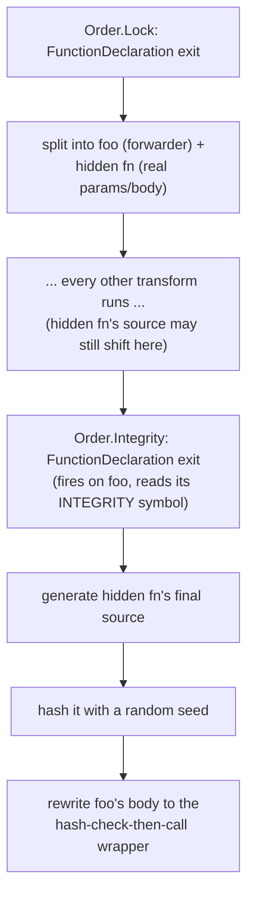

# Lock / Integrity / Tamper Protection

Source: [`transforms/lock/lock.ts`](https://github.com/MichaelXF/js-confuser/blob/31c5a47a79f97e4b4c2d4b2a8552c11a8b548fb0/src/transforms/lock/lock.ts)
(`Order.Lock = 3`), [`transforms/lock/integrity.ts`](https://github.com/MichaelXF/js-confuser/blob/31c5a47a79f97e4b4c2d4b2a8552c11a8b548fb0/src/transforms/lock/integrity.ts)
(`Order.Integrity = 37`, the encoder's **last** stage — "must run last as any changes to
the code will break the hash")

Upstream docs: [`docs/Countermeasures.md`](../../../encoder/js-confuser/docs/Countermeasures.md),
[`docs/Integrity.md`](../../../encoder/js-confuser/docs/Integrity.md),
[`docs/TamperProtection.md`](../../../encoder/js-confuser/docs/TamperProtection.md)

Optional (off by default in all three built-in presets) — six mostly-independent
sub-features sharing one `lock` options object and one `countermeasures` dispatch
mechanism.

## 1. Target

Make the program resistant to running outside its intended environment or after being
modified: date/domain gating, anti-debugging, a self-defense tripwire against code
reformatting, tamper-response countermeasures, and — via Integrity — a runtime
self-check that re-hashes a protected function's actual source immediately before
calling it, so any change to that source (by hand, or via an incomplete
deobfuscation) is detected and can be made to misbehave instead of run.

## 2. Algorithm

**`customLocks`** — five of the six features compile to one of five guard templates
(date comparison, domain regex, a `debugger;` statement, or a self-`toString()`-checking
IIFE), and one random template is prepended to each block in the program, per-block,
independently — not one prepended guard per enabled feature.

**Countermeasures dispatch** — every guard's `{countermeasures}` placeholder compiles to
one of: nothing (disabled), an infinite loop (default), or a call to a shared,
once-only `invokeCountermeasures()` wrapper around a user-supplied function.

**`tamperProtection`** — two independent pieces prepended to `Program`: a strict-mode
detector (triggers on a `delete arr["length"]` throwing, since Tamper Protection itself
needs non-strict-mode `eval`) and a native-function checker (verifies a function's
`toString()` still contains `"[native code]"` and has no faked `toString` override) —
the latter is what [GlobalConcealing](global-concealing.md) wraps every native call site
in when tamper protection is on.

**Integrity** is two-pass, split across two transforms because the hash must cover the
*final* generated source of the function it protects: **selection** happens early
(`Order.Lock`) — an eligible function is split into a hidden function (the real
params/body) plus a same-named forwarder — and **hashing** happens dead last
(`Order.Integrity`), once nothing else can still change the hidden function's code. The
forwarder is rewritten to gate its call on a live re-hash, memoized per-function via a
`cacheSlot` property stashed directly on the function object.

## 3. Implementation

### customLocks (`Order.Lock`)

Four of the six features are pushed onto one array, `me.options.lock.customLocks`
([`lock.ts#L37-L134`](https://github.com/MichaelXF/js-confuser/blob/31c5a47a79f97e4b4c2d4b2a8552c11a8b548fb0/src/transforms/lock/lock.ts#L37-L134)),
as `{ code, percentagePerBlock }` template entries:

| option | inserted code |
|---|---|
| `startDate` | `if (Date.now() < TIMESTAMP) { {countermeasures} }` (or the `new Date().getTime()` variant, picked at random) |
| `endDate` | same shape, `>` instead of `<` |
| `domainLock` | `if (!new RegExp(REGEX).test(window.location.href)) { {countermeasures} }` — one entry per regex if an array is given |
| `selfDefending` | a self-`toString()`-checking IIFE, see below |
| `antiDebug` | a bare `debugger;` statement |

A single `Block: { exit }` visitor
([`lock.ts#L239-L246`](https://github.com/MichaelXF/js-confuser/blob/31c5a47a79f97e4b4c2d4b2a8552c11a8b548fb0/src/transforms/lock/lock.ts#L239-L246))
picks one random entry from `customLocks` per block (every block gets *a* chance, not
every enabled feature) and `unshiftContainer`s its compiled code onto the block — so in
real output, any of the five shapes above can appear prepended to *any* block in the
program, repeated (bounded by `maxCount`, default 25 per lock, `-1` disables the limit).

**selfDefending**'s IIFE
([`lock.ts#L102-L125`](https://github.com/MichaelXF/js-confuser/blob/31c5a47a79f97e4b4c2d4b2a8552c11a8b548fb0/src/transforms/lock/lock.ts#L102-L125)):

```js
(
  function () {
    // Breaks any code formatter
    var namedFunction = function () {
      const test = function () {
        const regExp = new RegExp('\n');
        return regExp['test'](namedFunction);
      };

      if (test()) {
        {countermeasures}
      }
    };

    return namedFunction();
  }
)();
```

Its `test` closure re-`toString()`s the enclosing `namedFunction` and checks for a
literal newline — any code formatter/pretty-printer that reflows the function body onto
multiple lines trips the check. Purely a tripwire; no other runtime effect.

### countermeasures dispatch

`createCountermeasuresCode()`
([`lock.ts#L148-L159`](https://github.com/MichaelXF/js-confuser/blob/31c5a47a79f97e4b4c2d4b2a8552c11a8b548fb0/src/transforms/lock/lock.ts#L148-L159))
decides what every `{countermeasures}` placeholder above (and Integrity's own, below)
actually compiles to:

- `lock.countermeasures === false` → nothing (an empty statement list — `else {}`).
- `lock.countermeasures` unset → `while(true){}` (a hang).
- `lock.countermeasures` names a user function → a call to a generated
  `invokeCountermeasures()` wrapper, inserted once at `Program` level
  ([`lock.ts#L290-L313`](https://github.com/MichaelXF/js-confuser/blob/31c5a47a79f97e4b4c2d4b2a8552c11a8b548fb0/src/transforms/lock/lock.ts#L290-L313)):

  ```js
  var hasInvoked = false;
  function invokeCountermeasures() {
    if (hasInvoked) return;
    hasInvoked = true;
    userCountermeasuresFn();
  }
  ```

  The `hasInvoked` guard means the user's function only ever actually runs once, no
  matter how many separate lock triggers fire.

### tamperProtection (`Order.Lock`, `Program: exit`)

When `lock.tamperProtection` is set, two things prepend to `Program`
([`lock.ts#L248-L288`](https://github.com/MichaelXF/js-confuser/blob/31c5a47a79f97e4b4c2d4b2a8552c11a8b548fb0/src/transforms/lock/lock.ts#L248-L288)),
and the encoder **errors out** if a `"use strict"` directive is present (Tamper
Protection needs local-scope `eval`, a non-strict-mode feature):

1. `StrictModeTemplate`
   ([`tamperProtectionTemplates.ts#L10-L27`](https://github.com/MichaelXF/js-confuser/blob/31c5a47a79f97e4b4c2d4b2a8552c11a8b548fb0/src/templates/tamperProtectionTemplates.ts#L10-L27))
   — an IIFE that triggers strict-mode detection via `delete arr["length"]` (throws only
   in strict mode); on detection, runs countermeasures and clobbers the
   native-function-check name so it becomes a no-op.
2. `NativeFunctionTemplate`
   ([`tamperProtectionTemplates.ts#L57-L86`](https://github.com/MichaelXF/js-confuser/blob/31c5a47a79f97e4b4c2d4b2a8552c11a8b548fb0/src/templates/tamperProtectionTemplates.ts#L57-L86))
   — declares `nativeFunctionName(fn)` / the two-arg `nativeFunctionName(obj, prop)`
   form: verifies `("" + fn).indexOf("[native code]") !== -1` and that `fn` has no own
   `toString` property descriptor (a common way to fake the native string), using a
   hand-rolled `indexOf` (`IndexOfTemplate`) instead of the real
   `String.prototype.indexOf` so the check doesn't itself depend on a hookable builtin.
   This is the function [GlobalConcealing](global-concealing.md) wraps native call sites
   in when tamper protection is on.

The hash algorithm (`cyrb53`) is cataloged in
[integrity-template.md](../templates/integrity-template.md); the native-function
`toString()` check and strict-mode detector are in
[tamper-protection-templates.md](../templates/tamper-protection-templates.md).

### Integrity (`Order.Lock` first pass + `Order.Integrity` second pass)

**Pass 1 — selection (`Order.Lock`, `FunctionDeclaration: exit`,
[`lock.ts#L341-L415`](https://github.com/MichaelXF/js-confuser/blob/31c5a47a79f97e4b4c2d4b2a8552c11a8b548fb0/src/transforms/lock/lock.ts#L341-L415)):**
for each eligible top-level function (not async/generator, not the countermeasures
function itself, gated by `computeProbabilityMap(lock.integrity, functionName)`), the
original function is split in two:

```js
// original: function foo(a, b) { body }

function {ph}(a, b) {      // new hidden function - untouched original params/body
  body
}
function foo() {           // original name, now just a forwarder
  return {ph}(...arguments);
}
```

`Program: exit` (same pass) also prepends the hashing utilities when
`lock.integrity` is on
([`lock.ts#L315-L334`](https://github.com/MichaelXF/js-confuser/blob/31c5a47a79f97e4b4c2d4b2a8552c11a8b548fb0/src/transforms/lock/lock.ts#L315-L334)):
`{ph}_hash(fnObject, seed)` (strip whitespace/punctuation from `fnObject.toString()` via
a sensitivity regex, then hash), which itself calls a low-level `{ph}` cyrb53 hasher
built on `Math.imul` (or an inlined ES5 polyfill) — see
[integrity-template.md](../templates/integrity-template.md).

**Pass 2 — hashing (`Order.Integrity`, dead last,
[`integrity.ts#L41-L117`](https://github.com/MichaelXF/js-confuser/blob/31c5a47a79f97e4b4c2d4b2a8552c11a8b548fb0/src/transforms/lock/integrity.ts#L41-L117)):**
generates the hidden function's *final* source, hashes it with a random seed, and
rewrites `foo` (the forwarder, not the hidden function) to gate the call on a live
re-hash:

```js
function foo() {
  var h = foo.cacheSlot || (foo.cacheSlot = {ph}_hash({ph}, SEED));
  if (h === EXPECTED_HASH) {
    return {ph}(...arguments);
  } else {
    {countermeasures}
  }
}
```

`foo.cacheSlot` (a property stashed directly on the function object, name from a
separate `NameGen`) memoizes the hash so it's only computed once per function, not once
per call.



## 4. Downstream Effects

**Lock (`Order.Lock = 3`) runs early, but most of its output turns out immune to later
reshaping.** `lock.ts`'s own `Block: exit` visitor calls `path.skip()` on every
`customLocks`-inserted statement immediately after inserting it, and Babel's `NodePath`
cache is keyed by node identity — the same path object gets reused across every later
transform's own separate `traverse()` call, so that `.skip()` shields
dateLock/domainLock/antiDebug/selfDefending's contents from every later pass for the
rest of the pipeline. Naively, one would expect Calculator/GlobalConcealing/
StringConcealing/OpaquePredicates/ControlFlowFlattening/RenameVariables to reshape these
templates' literals and identifiers; in practice none of them do.

`tamperProtection`'s own prelude (`StrictModeTemplate`/`NativeFunctionTemplate`) is the
exception: it's inserted via plain `prependProgram`, not `applyLockToBlock`, so it is
*not* skip-protected.
[**GlobalConcealing** (Order 12)](global-concealing.md) does reach into it, wrapping
every native call site in a call to the `NativeFunctionTemplate` checker.

**Integrity (`Order.Integrity = 37`) has no downstream effects** — it is the encoder's
last stage; nothing runs after it, so its own output is never reshaped.

## 5. Known Quirks

None currently documented.
