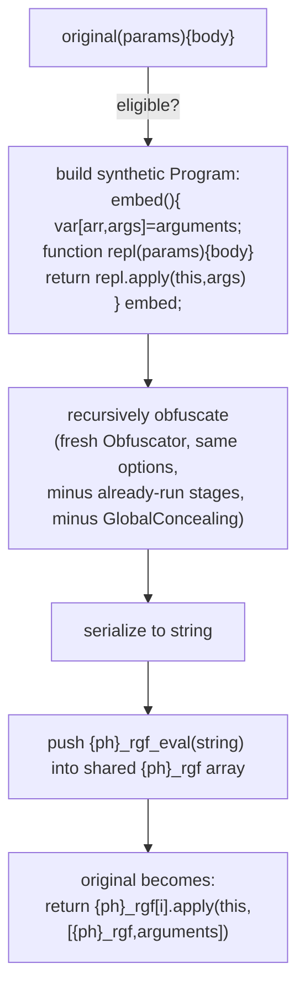

# RGF (Runtime-Generated Functions)

Source: [transforms/rgf.ts](https://github.com/MichaelXF/js-confuser/blob/31c5a47a79f97e4b4c2d4b2a8552c11a8b548fb0/src/transforms/rgf.ts) — `Order.RGF = 4`.

Upstream docs: [`docs/RGF.md`](../../../encoder/js-confuser/docs/RGF.md)

## 1. Target

Hide a function's real implementation entirely from static source: move its params/body
into a synthetic sub-program, recursively obfuscate that sub-program with (almost) the
entire pipeline, serialize it to a string, and reconstruct it only at runtime via `eval` —
so nothing about the function's real logic exists as parseable source at all until the
program actually runs.

## 2. Algorithm

An eligible function's `params`/`body` are moved into a throwaway sub-program that
reconstructs a function taking `(rgfArray, args)` and returns
`replacement.apply(this, args)`. That sub-program is recursively obfuscated by a
**fresh, nested `Obfuscator` instance** running every transform whose `Order` hasn't
already run on the *outer* program yet (except `GlobalConcealing`, explicitly excluded),
serialized to a string, and pushed into one shared, Program-level array of
`{ph}_rgf_eval(code)` calls. The original function shrinks to a thin forwarder indexing
into that array and applying with `arguments`.

RGF runs early (`Order.RGF = 4`, right after `Flatten`), so a function that was
`Flatten`-eligible is captured in its *already-flattened* shape — RGF has no idea Flatten
ran, it just moves whatever function is in front of it.

## 3. Implementation

**Eligibility** ([`rgf.ts:100-172`](https://github.com/MichaelXF/js-confuser/blob/31c5a47a79f97e4b4c2d4b2a8552c11a8b548fb0/src/transforms/rgf.ts#L100-L172)):
skips async/generator functions, nested functions once an enclosing function is already
selected, and any function that references a variable bound *outside* itself (checked by
walking every identifier and comparing its binding's scope against the function's own).

For an eligible function, the encoder builds:

```js
function {embedded}() {
  var [{rgfArray}, {args}] = arguments;
  function {replacement}(/* original params */) {
    /* original body */
  }
  return {replacement}.apply(this, {args});
}
{embedded};
```

The trailing bare `{embedded};` reference (not a call) is the completion value `eval`
returns — the sub-program evaluates to *the function itself*, not its result.

`Preparation` always reruns inside the nested `Obfuscator` regardless (its
`order == Order.Preparation` check is unconditional,
[`rgf.ts:241-264`](https://github.com/MichaelXF/js-confuser/blob/31c5a47a79f97e4b4c2d4b2a8552c11a8b548fb0/src/transforms/rgf.ts#L241-L264)),
which is why the sub-program's own `.apply`/`.length` etc. member accesses come out in
`["apply"]`-style bracket form just like the outer program's
([`preparation.ts:221-229`](https://github.com/MichaelXF/js-confuser/blob/31c5a47a79f97e4b4c2d4b2a8552c11a8b548fb0/src/transforms/preparation.ts#L221-L229)).

The serialized code is wrapped as `{ph}_rgf_eval(code)`:

```js
function {ph}_rgf_eval(code) {
  if ({ph}_rgf_eval_integrity) {
    return eval(code);
  }
}
var {ph}_rgf = [{ph}_rgf_eval("..."), {ph}_rgf_eval("..."), ...];
```

`{ph}_rgf_eval_integrity` is a real variable (not inlined by constant folding, since it's
a function-call result): a no-op `(flag = true) => flag` unless
[`lock.tamperProtection`](lock-integrity.md) is also enabled, in which case it's a genuine
tamper check. Either way it's irrelevant to static decoding — nothing is ever executed.

The original function shrinks to:

```js
function original() {
  return {ph}_rgf[i]["apply"](this, [{ph}_rgf, arguments]);
}
```

with `params` emptied (using `arguments` instead) and, if `preserveFunctionLength` is set,
a further `{ph}_fnLength(original, originalLength)` wrap applied afterward.



## 4. Downstream Effects

None of RGF's own inserted nodes (the array, the eval-wrapper function, the call site) are
`path.skip()`-protected, unlike [Lock's](lock-integrity.md) — so they're exposed to every
later encoder stage's reshaping the same way [Flatten](flatten.md)'s output is:

- **`Calculator` (Order 9)** can fold the call site's array-index literal into an
  arithmetic expression.
- **`Minify` (Order 28)** can flip the `["apply"]` bracket access to dot form (`.apply`),
  since `"apply"` is a valid identifier name.

## 5. Known Quirks

None currently documented.
