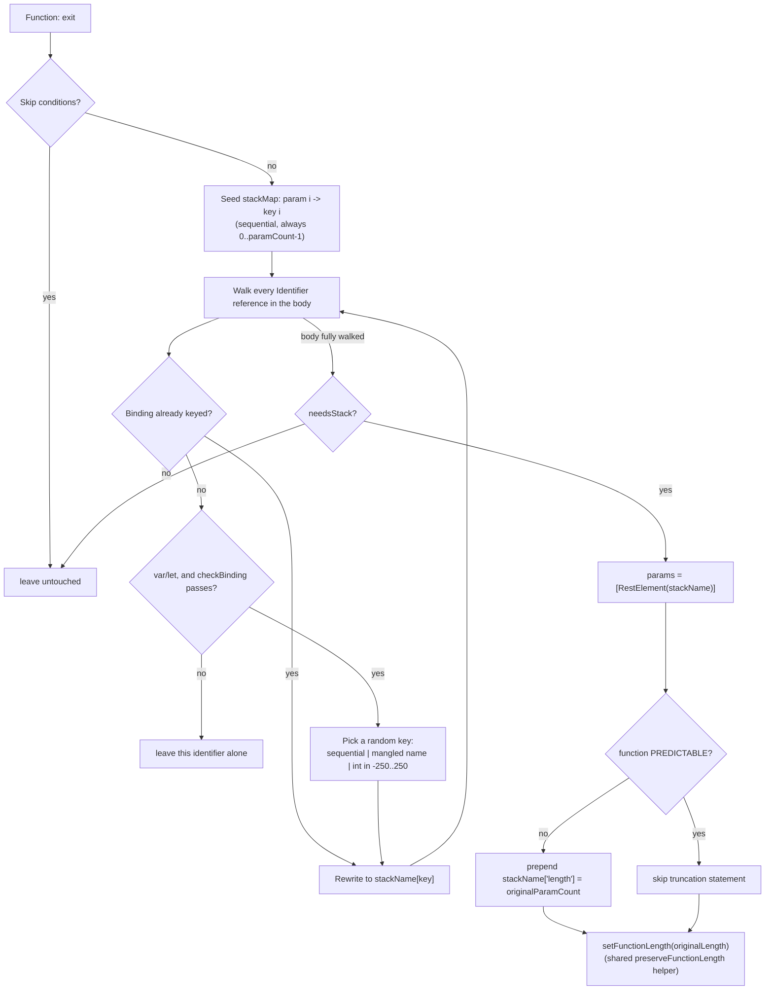

# VariableMasking

Source: [`transforms/variableMasking.ts`](https://github.com/MichaelXF/js-confuser/blob/31c5a47a79f97e4b4c2d4b2a8552c11a8b548fb0/src/transforms/variableMasking.ts) — `Order.VariableMasking = 20`.

## 1. Target

Hide a function's real parameter/local structure: collapse every parameter into one rest
array, and route every local variable's reads and writes through a keyed slot in that same
array, so a static reader can no longer tell which array index corresponds to which
original variable, nor even how many real parameters the function declared.

## 2. Algorithm

Runs per-function. Seed a key map with the original parameters first (sequential,
`0..paramCount-1`) so their keys are always the leading integers and can never collide
with a local's key. Walk every identifier reference in the body; an eligible `var`/`let`
binding not yet in the map gets a randomly-chosen key (a sequential index, a mangled
name, or a random integer in `[-250, 250]`) and every occurrence — read or write —
becomes `stackName[key]`. Collapse the whole parameter list into one rest param.
Optionally truncate the rest array to the true parameter count via a `stackName["length"]
= N` statement — skipped when the function is statically "predictable" (every call site
is a direct, non-spread call whose argument count never exceeds the declared param count),
since the truncation would then be redundant. Optionally wrap the whole function in the
shared `setFunctionLength` helper to fake `.length` back to the real value.

## 3. Implementation

Skipped entirely for getter/setter object/class methods, async/generator functions,
functions with any non-`Identifier` param (already rest/destructured), `'use strict'`
functions, and anything marked `UNSAFE`, plus the usual `variableMasking` probability gate
([`variableMasking.ts#L38-L69`](https://github.com/MichaelXF/js-confuser/blob/31c5a47a79f97e4b4c2d4b2a8552c11a8b548fb0/src/transforms/variableMasking.ts#L38-L69)).

1. **Seed the map with original params first** — param 0 -> key `"0"`, param 1
   -> key `"1"`, etc., in declaration order
   ([`variableMasking.ts#L141-L152`](https://github.com/MichaelXF/js-confuser/blob/31c5a47a79f97e4b4c2d4b2a8552c11a8b548fb0/src/transforms/variableMasking.ts#L141-L152)).
2. **Walk every identifier reference in the body**
   ([`variableMasking.ts#L154-L211`](https://github.com/MichaelXF/js-confuser/blob/31c5a47a79f97e4b4c2d4b2a8552c11a8b548fb0/src/transforms/variableMasking.ts#L154-L211)).
   A binding not yet in the map is only masked if it's a `var`/`let` (not a
   function declaration — hoisting semantics would break if converted) and
   passes `checkBinding`
   ([`variableMasking.ts#L79-L139`](https://github.com/MichaelXF/js-confuser/blob/31c5a47a79f97e4b4c2d4b2a8552c11a8b548fb0/src/transforms/variableMasking.ts#L79-L139)):
   rejects a `this`-reading function value being stored/assigned (masking would
   break its `this` binding), a `VariableDeclaration` with more than one
   declarator, and any reference through the `__JS_CONFUSER_VAR__` escape
   hatch.
3. **Pick a random key** for a newly-masked local:
   `choice([stackMap.size, propertyGen.generate(), getRandomInteger(-250, 250)])`,
   retried until non-falsy and not already taken
   ([`variableMasking.ts#L184-L194`](https://github.com/MichaelXF/js-confuser/blob/31c5a47a79f97e4b4c2d4b2a8552c11a8b548fb0/src/transforms/variableMasking.ts#L184-L194))
   — a sequential index, a mangled string name, or a random integer in
   `[-250, 250]` (never `0`, since `!index` rejects it and retries).
4. **Collapse all params into one rest param**:
   `function f(...{ph}_varMask){...}`
   ([`variableMasking.ts#L218`](https://github.com/MichaelXF/js-confuser/blob/31c5a47a79f97e4b4c2d4b2a8552c11a8b548fb0/src/transforms/variableMasking.ts#L218)).
5. **Truncate extraneous arguments, but only if the function isn't
   "predictable"** — `stackName["length"] = originalParamCount`
   ([`variableMasking.ts#L220-L229`](https://github.com/MichaelXF/js-confuser/blob/31c5a47a79f97e4b4c2d4b2a8552c11a8b548fb0/src/transforms/variableMasking.ts#L220-L229)).
   The check is a **`PREDICTABLE` node-symbol read**, not a call-site analysis run
   here — this transform only tests the flag and then clears it
   ([`variableMasking.ts#L232`](https://github.com/MichaelXF/js-confuser/blob/31c5a47a79f97e4b4c2d4b2a8552c11a8b548fb0/src/transforms/variableMasking.ts#L232)),
   so the function is no longer predictable to any later stage. Preparation sets
   the flag on a `FunctionDeclaration` when every reference to it is a direct,
   non-spread call and the declared param count is `>=` the largest argument
   count seen at any call site (call sites *can* under-supply arguments —
   predictability doesn't require an exact match); when that holds, the rest
   array can never end up longer than the true param count from a real call
   alone, so the truncation statement is unnecessary and skipped. **Other
   transforms also set the flag on functions they emit**, so the set of
   functions reaching Order 20 flagged is wider than Preparation's own rule —
   including anonymous ones — see [preparation.md](preparation.md)'s
   `PREDICTABLE` entry for the full writer/clearer list.
6. **`setFunctionLength`** optionally wraps the whole function in the shared
   `{ph}_fnLength(fn, length)` helper if `preserveFunctionLength` is set — the
   same helper Dispatcher/RGF/Flatten can also emit.

## 4. Downstream Effects

- **`DuplicateLiteralsRemoval` (Order 22)** extracts a mask key into its own shared array
  wherever it repeats, so a slot reads `stk[arr[4]]` instead of `stk["length"]` — including
  the truncation statement itself.
- **`ControlFlowFlattening` (Order 24)** can route a key through its own state array
  (`stk[state[3] + 8]` instead of a plain literal key).

## 5. Known Quirks

None currently documented.
