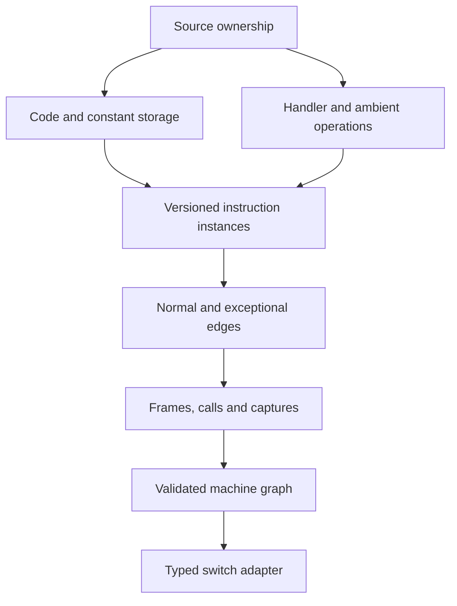

# Versioned VM machine model contract

This is the proposed intermediate model for a future source-derived VM-2 frontend. The
private trial implementation was removed. No active decoder constructs or validates this
model. The [recovery transform](decode-js/transforms/jsconfuser-vm/exact-inner-recovery.md)
sets its source and publication obligations; the [shared switch boundary](decode-js/vm-switch-boundary.md)
is the eventual consumer after a versioned adapter is proved.

## Model and dependency graph

Every record carries an input identity, model revision, structural ID, source provenance,
and IDs of the records it consumes. Source spans locate evidence; they are not identity.
An instruction is keyed by `(machine, function, context, codeVersion, pc)`. Equal PCs under
different versions or call contexts remain different instances.

| Record | Minimum fields | Validation |
|---|---|---|
| Machine | entry, interpreter, dispatch, code, constants, storage, ambient effects | One live ownership graph; no competing write or escaping alias changes an admitted role. |
| Code version | parent version, patch site, changed words, resulting digest | Every write and derived instruction uses the correct predecessor version; patch chains cannot silently merge. |
| Instruction | identity, word interval, selector, ordered operand fetches, operation template, next-PC rule | Width, operand domain, function ownership and code version agree. Instructions and data do not overlap. |
| Operation | typed reads/writes, receiver, call form, effect order, possible throw, completion | Derived from the actual handler and helper bodies, including native JavaScript semantics. |
| Edge | source/target instance, guard, completed operation prefix, normal/exceptional kind | All reachable transfers are represented; target version, frame and handler state agree. |
| Frame and closure | allocation identity, register bank, caller continuation, arguments, captures, lifetime | Calls, returns, captured cells and teardown preserve ownership and order. |
| Completion | return/throw/break/continue state, handler stack, finally route | Every abrupt route is either modeled or declined; a catch only receives throws enclosed by its source try. |
| Disposition | reachable instruction, proven unreachable instruction, data, unresolved | Dead code removal needs rooted reachability and effect proof. `unresolved` forbids publication. |

## Validation and projection

1. Validate schema and identity references before any semantic inference. Reject duplicate
   structural IDs, missing predecessors, cycles not covered by an explicit fixed point, stale
   input digests and inconsistent code versions.
2. Reconstruct the source operation order for each handler invocation. Retain the completed
   prefix of a throwing path; do not route a throw into a handler catch if the source try did
   not enclose that operation.
3. Check instructions, edges, frames, captures and completion as one graph. A complete
   instruction census alone is insufficient when call/return or exceptional routes are open.
4. Prove rooted reachability per context and version. Unknown targets and dynamic patching
   beyond bounded analysis decline; labels and familiar opcode values are not proof.
5. Project validated operations, storage and transfers into a versioned typed switch model.
   The JavaScript switch rendering is a review artifact produced from that model. It is never
   reparsed to recover semantics or used as validation evidence.
6. Publish output only after fresh parse, residue, bounded behavior and exact rollback checks.
   A failed gate returns the original input unchanged.

This design does not require reconstruction of one historical host state. Ambient reads, calls,
writes and exceptions remain runtime operations under ordinary Node/browser hosts. It also
does not assert that all machine states fit `decode-js-vm-switch.v1`: code mutation and multiple
active contexts may require a versioned extension.

## Relation to the current decoder

The numeric frontend has a different, implemented source proof: visible numeric words,
constants and the pinned handler set. Its validated model flows to the existing typed switch
backend. A future independent VM-2 case is a separate performance benchmark. General support for
`js-confuser-vm` must be evaluated on fresh outputs from the encoder, across features,
options and seeds.

## Source

No implementation of this proposed model remains in `decode-js`. The current
[typed switch validator](../decoder/decode-js/src/vm/switch/vm-switch-model.js) and
[source emitter](../decoder/decode-js/src/vm/switch/vm-switch-to-source.js) define the
implemented downstream boundary.

## Fixtures

No VM-2 fixture currently exercises this proposed model. Generate a provenance-backed
benchmark input alongside its decoder test when this work begins. The
[numeric switch tests](../decoder/decode-js/test/vm/switch/vm-switch-to-source.test.js)
exercise only the current shared backend.
